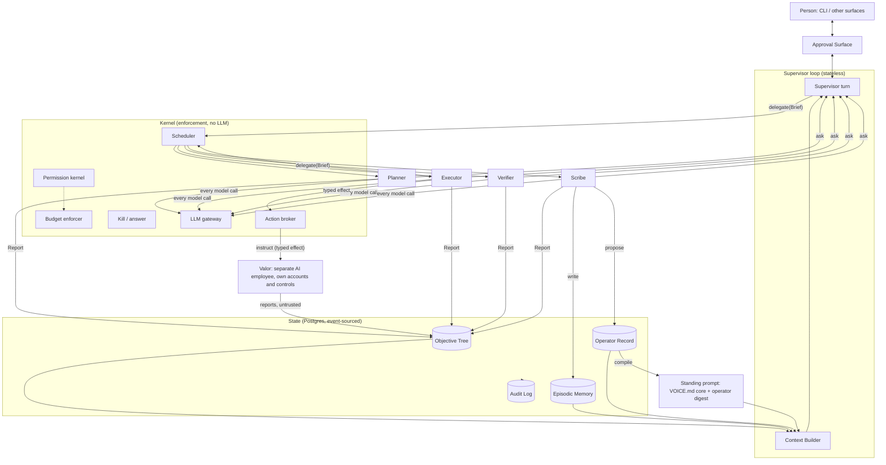

# Cori: Harness and Memory Architecture

This document says what Cori is made of and why each part exists. The README states the manifesto and the research it rests on. The companion [tech stack](tech-stack.md) says what the parts are built from.

**Provenance.** This design descends from an earlier architecture written for a different system. Cori is greenfield, so nothing was inherited as canon. Every decision below was reassessed for Cori and carries a status:

- **KEEP**: assessed and holds for Cori as stated.
- **REVISED**: kept with a change, and the change is explained.
- **OPEN**: a real unknown. The section names the spike or the decision that closes it.
- **ADDED**: absent from the source; decided with the architect on 2026-09-19.
- **PATCHED**: added by the blind-spot review of 2026-09-19 ([record](reviews/2026-09-19-blind-spots.md)).
- **COMMITTED**: an option was closed in favor of one direction by the commit pass of 2026-09-19 ([record](reviews/2026-09-19-commit-pass.md)).
- **DEFERRED**: designed, kept in this document as a paragraph, and built when a real objective needs it. Nothing deferred has a milestone.
- **DROPPED**: listed at the end with the reason.

Citations in brackets point to [REFERENCES.md](../REFERENCES.md).

## Assessment summary

| Decision | Status | Note |
|---|---|---|
| The forcing case is an unbounded objective | COMMITTED | it shaped the design and is kept as prose; the median task is what gets built, and the forcing case is run when there is a reason to |
| The supervisor is a control loop, not a session | KEEP | |
| The unit of work is an Objective node in a tree in the store | KEEP | |
| Nothing executes without a committed budget | KEEP | |
| Authority lives in the kernel, not the prompt | KEEP | this is the README's premise |
| Memory is evidence, not instruction | KEEP | |
| Cori acts as the person; Valor is a separate principal | ADDED | from the architect: personal tokens for Cori, Valor for larger independent work |
| Every context has a space | ADDED | from the architect: one human, client spaces bounded by NDA, personal as one more space |
| Memory layer is popoto on Redis, partitioned by space | COMMITTED | memory has no authority, so two stores is fine |
| Episodic memory ingests raw turns with no extraction step | ADDED | popoto's measurement [20] |
| The operator record holds goals, not only preferences | ADDED | from the architect: the system exists to understand what the person is trying to achieve and how it shifts |
| Context slice caps | REVISED | placeholders until measured; budget scoped to the triggering event |
| Objective states | REVISED | two states folded into others with a typed reason |
| Assumptions carry numeric confidence | REVISED | status and a falsification test instead; numbers wait for calibration labels |
| Brief and Report as the only delegation primitive | KEEP | |
| Four delegated agent classes: Planner, Executor, Verifier, Scribe | COMMITTED | framing is the supervisor's own turn; Researcher, Synthesizer, Adjudicator, and Paraphraser arrive with the structures that need them |
| A worker may ask mid-task | ADDED | the `ask` tool replaces escalation rules and open questions; a brief no longer has to pre-empt every ambiguity |
| Scribe forks the supervisor's context; others get a brief | ADDED | brief where the boundary is deliberate (data class, blindness), fork where it is not |
| Stop is fence, revoke, and compute stop; lossless means durable state | REVISED | token revocation alone leaves sandbox processes running |
| Three execution records | ADDED | gateway log, tool log, effect ledger; the Verifier reads the last two |
| Verifier seat screened against fixtures | ADDED | age is a default, not evidence |
| One norms document, a paragraph per seat | ADDED | VOICE.md is the shared prior; classes are kernel facts |
| One structure: one Executor per leaf | COMMITTED | the structure library, jury independence, contract and workspace nodes are DEFERRED as one paragraph in §3.2 |
| Structure selection by bandit over the ledger | DROPPED | needs a volume of verified outcomes and a structure library, neither of which exists |
| The Scribe as a delegate preset | KEEP | |
| Effect classes `read`, `propose`, `act` | REVISED | 2026-09-20, from the architect: named, never numbered; the old classes 1 and 2 collapse into `propose`, and whether to ask before a reversible effect leaves the space is the supervisor's judgment; "blast radius" stays retired |
| Budget is money, set per objective | REVISED | 2026-09-20, from the architect: runaway spend is the one purpose of a budget; tokens, wall clock, tool calls, descendants, and attention are retired as consumables; effect class, deadline, and data class stay as ceilings |
| Verifier in a separate context and a fresh sandbox | KEEP | |
| Verifier is an independent model, never the executor's snapshot | COMMITTED | today the previous generation of the same family, the nearest independent model on one provider; independence is the property, weakness is a cost; a second family is a TODO triggered by the audit sample |
| Paraphrase before review | DEFERRED | built when a collusion measurement says so [15] |
| Criteria hidden from the executor | DEFERRED | costs quality on honest work; decided from audit labels when they exist |
| Human audit sample and skip-level verification | KEEP | load-bearing |
| Three memory stores with three trust models | KEEP | |
| Beliefs carry numeric confidence | REVISED | source class, status, and supporting events in v1 |
| Standing prompt compiled per turn | COMMITTED | part of the deterministic render; recorded in the context manifest |
| Metrics logged from day one, computed at volume | COMMITTED | raw events now; dashboards when a hundred outcomes exist |
| Typed approval cards, kernel-rendered | KEEP | |
| A space is a typed manifest, not a directory | PATCHED | effect ceiling, targets, connectors, retention, secrets; the standing budget was removed 2026-09-20 |
| Space isolation is a database fact | PATCHED | row-level security keyed per render; the Context Builder stays outside the trust boundary |
| Belief scope inherits the originating space; global is an explicit act | PATCHED | closes the cross-space write channel |
| Source class ceiling is derived from the author of the evidence | PATCHED | the Scribe cannot label an inference `direct` |
| Cross-space views are kernel-composed from per-space summaries | PATCHED | morning brief, inbox counts |
| Inbound items are routed to a space by declared rules | PATCHED | unassigned items are header-only until assigned |
| Ending a space deletes its rows | COMMITTED | a migration under the migrator role and a tombstone event; encryption returns if a client's agreement asks for it |
| The supervisor's turns are recorded, never budgeted | REVISED | 2026-09-20: the per-space standing budget is retired; a turn is bounded by the render cap and by one trigger per event |
| Away state | PATCHED | presence from the read cursor; pauses effects that leave the space |
| Verification by artifact kind | PATCHED | deterministic checks recorded before the Verifier reads prose |
| Understanding is measured | PATCHED | the metric the whole project is for; computed at volume |

## The forcing case

The design is tested against an objective whose premise is broken, whose scope is unbounded, and whose decomposition would fill any context window. "Solve world hunger" is the reference example. Every component below has to survive that case.

**Assessment: COMMITTED.** The forcing case is the right stress test and the wrong thing to build first. A system tuned for the pathological objective can be heavy for the ordinary one, and most of Cori's days will be ordinary. The milestones in the tech stack build for the median task: one client engagement, code and correspondence. The forcing case stays here as the argument behind the shape of the tree, the budgets, and the escalation to a decision, and is run when someone wants to see it run, not as a gate on each milestone. A component that exists only for the forcing case waits until then.

## The five decisions

1. **The supervisor is a control loop, not a session.** It is stateless compute over a stateful store. Its context is rendered each turn from the store and never accumulated. This is how a large context window stays mostly empty, and it is what makes a kill lossless.
2. **The unit of work is an Objective node in a tree, and the tree lives in the store.** No agent holds the plan. Every agent sees its own node, a compressed path to root, and nothing else.
3. **Nothing executes without a committed budget.** Budgets are hierarchical and conserved. Only a person raises the root.
4. **Authority lives in the kernel, not the prompt.** The supervisor reads everything, writes nothing to the objective tree or the world, delegates anything, and talks to the person. Memory is a separate capability family (`memory.*`) that the supervisor holds and may delegate to a Scribe; "writes nothing" is about effects and the tree. Corrigibility is a tested property of the kernel, and it is measured by killing the supervisor [2, 4].
5. **Memory is evidence, not instruction.** Three stores with three trust models. The operator record is the most valuable database in the system and is defended like one.
6. **Every context has a space.** A space is a directory or repository. A client engagement is a space bounded by its NDA; personal life is a space. Every conversation, objective, sandbox, and retrieval is scoped to exactly one space. The person's goals cross spaces; a space's data never does.
7. **Cori acts as the person; Valor acts as himself.** The system's outward identity is the person's, reached through a few personal access tokens. Larger independent work is instructed to Valor, a separate AI employee with his own accounts, machine, and controls. Cori's kernel enforces nothing on Valor's side of that boundary, so an instruction to Valor is an effect, a report from Valor is untrusted evidence, and verification of Valor's work is mandatory at every class.

**Assessment: KEEP the first five, ADDED the sixth and seventh.** The first five are the README's commitments restated as engineering decisions. The sixth came from the architect and reshapes the operator record, the Context Builder, and the sandbox profiles below. Decision 4 is what makes the drive to understand safe to act on when the understanding is wrong.

## System overview



Two components are in the kernel box that were absent from the source design: the LLM gateway, through which every model call passes, and the action broker, through which every effect leaves the system. Both are explained in the tech stack. They exist because the kernel can only enforce what it mediates.

## 1. The supervisor as a control loop

Each turn is triggered by an event: a message from a person, a report landing, a budget breach, a verifier failure, a timer. The Context Builder assembles a bounded working set:

| Slice | Source | Placeholder cap |
|---|---|---|
| Voice core | VOICE.md core + operator digest | ~8k |
| Active thread | last N turns + rolling summary | ~20k |
| Objective roll-up | tree summarized to depth 2 from any active node | ~30k |
| Inbox | pending reports, escalations, open questions | ~20k |
| On-demand reads | anything else, fetched by tool, evicted after use | ~40k |

Every slice is rendered for exactly one space. Global beliefs enter every render; space-scoped beliefs, episodic memory, objective roll-ups, the active thread, and the inbox enter only the render for their own space. The inbox for other spaces appears as one count-only line. A space switch seals the current thread to its space and starts a new one, so a summary written in one space is never rehydrated in another. A turn with no space is refused.

The space filter is a database fact rather than a Context Builder fact: every space-partitioned table carries row-level security keyed to a per-render session variable that only the kernel can set (tech stack §3). The Context Builder can be wrong in code and still cannot read across spaces.

Corrections render by relevance, not in full. Global corrections are tagged by task class, space corrections render only in their space, and a small always-on set the person marks as standing renders everywhere. The compiled prompt records which corrections were rendered, so an omission is a lookup.

When a thread exceeds its cap, the Scribe compresses the older half into episodic memory and the thread is rehydrated from summary plus recent turns. The supervisor never remembers a conversation. It re-reads a summary of it.

Consequence: the supervisor can be killed and restarted mid-task with nothing durable lost. That is the corrigibility test, and it runs nightly. Durable means events in the store, artifacts on a retained sandbox disk, and effects the broker confirmed; a worker's process memory is not durable and a stop discards it. Stopping a worker is three things in one transaction: its generation is incremented so every later request carrying the old one is refused, its gateway token is revoked, and its sandbox compute is stopped with the disk kept (tech stack §4). Spike 02 ran it: 146 of 146 SIGKILLed runs converged, resuming in 35 ms median. Two lessons came with the number. A lossless log gives exactly-once effects only when every effect carries an idempotency key the broker can query the target with (tech stack §7). And a loop is only as lossless as its projection: the first version advanced by a step counter rather than by the effects already in the log, re-ran completed effects after recovery, and the chaos test caught it on its first run.

**Assessment: REVISED.** The caps are guesses and are labeled as such. Two changes. First, the context budget is scoped to the triggering event: a "report landed" turn needs the node, its parent, and the report, and pays for nothing else. Second, the render is deterministic (same store state in, byte-identical context out) and ordered by volatility, so the cache does the work. The measurement that replaces the placeholders is the cache run on the real loop at M0 (tech stack §14).

## 2. The Objective Tree

```
Objective
  id, parent_id, depth
  space              # inherited from the parent; the root's is assigned at the conversation
  premise            # what we believe the requester wants, in our words
  non_goals[]        # explicit
  success_criteria[] # falsifiable; what a Verifier checks
  assumptions[]      # { statement, falsification_test, status: open | supported | challenged | refuted }
  budget             # see section 4
  budget_consumed
  max_effect_class   # read | propose | act, ceiling for every descendant
  deadline           # absolute; children may not exceed it
  state              # FRAMED | AWAITING_APPROVAL | APPROVED | RUNNING | VERIFYING
                     # | SUCCEEDED | FAILED | PAUSED | CANCELLED
  approved_revision  # the contract revision the person said yes to, or null
  task_class         # ledger key
  owner_agent        # current Brief id
  reports[]          # structured, size-capped
  evidence[]         # links to artifacts, never narratives
  children[]
```

Every node goes through three stages.

**Frame.** The supervisor interrogates the premise in its own turn. What does the person mean, what is within reach, what would count as progress, which of several plausible readings is being asked for. Output is a rewritten premise, explicit assumptions each with a falsification test, and a proposed objective set, each objective with an estimate in dollars and the basis for it (§4). Framing turns are charged to the objective they open. Under the cooperative framing [3], the job is to find the cheapest question that most reduces uncertainty about what the person wants, and ask it.

Framing is the supervisor's work rather than a delegated agent's because it is the one place the operator record meets a live request, and the supervisor already holds the operator digest, the thread, and the goals in its rendered context. Handing that to a Framer meant rebuilding the same context in a Brief and then reading a Report of it back. The earlier design had a Framer class; the source of the change is the observation that a brief exists to compensate for lost context, and here nothing is lost.

TODO, when a framing outgrows a turn: a delegated Framer Brief that forks the supervisor's rendered context (it holds the same data class), for the forcing case or any premise whose interrogation needs tools and time. Not built until a real objective needs it.

**Commit.** The Approval Surface presents objectives, success criteria, budget, effect ceiling, and stop conditions. The person approves, edits, or rejects. The supervisor cannot self-approve an `act`. At `read` and `propose` it self-approves and tells the person the estimate, so an objection is a correction and a revision (§4), and it asks first, on a Commit card, when it judges the person would want to be asked (§7). The approved budget is the objective's root, and an approval on a card is the person saying what the work is worth. The approval record stores the person's literal message as provenance and the contract revision it approved. Any later revision of the contract clears the approval.

**Execute.** An objective that one Executor can complete in one session is its own leaf and goes straight to an Executor. Otherwise a Planner decomposes it. Decomposition cuts along the seams wanted in the deliverable, by outcome rather than by agent specialty [13]. Children inherit budget by allocation, and the kernel enforces that the sum of child budgets never exceeds the parent's remaining budget. Delegation carries an estimating step: the Planner (or the supervisor, for a leaf it delegates directly) states each child's cost in dollars against the seat prices in its context, and the kernel checks the sum against the parent's remaining. The step exists to encourage decomposition rather than to bound it. A model is disinclined to split work past the point where a piece is too small to hand off, so depth has a natural limit; the failure seen in practice is the opposite, work kept in one expensive seat that a cheaper split would serve, and an estimate per child is what makes the split visible. How much of an objective a given kind of work deserves is decided per objective: visual design is part of the deliverable for a presentation, a nice-to-have on a user flow, and absent from backend work, so no ratio between kinds of work is fixed in the kernel. A node is a leaf when one Executor can complete it in one session inside its budget with a faithful context that fits one working set. A Planner that cannot produce leaves reports that the objective is awaiting a decision, with the reason. That is an escalation, never a retry.

**Scope drift is a state transition.** A report whose assumption deltas challenge an assumption on the path to root moves the nearest ancestor holding that assumption to AWAITING_APPROVAL, revokes the grants of every process in that ancestor's subtree, and cancels them, in one store transaction. Unrelated branches keep running. Re-approval is cheap. Silent drift is expensive.

A challenge is priced. It must name the assumption and carry evidence references; it spends the caller's budget; and an unsupported challenge feeds the caller's own calibration record. A careless or misaligned agent can raise one, and it costs that agent, not its siblings.

**Assessment: REVISED.** Three changes from the source. BLOCKED is folded into AWAITING_APPROVAL with a typed reason, which is what the person sees anyway. ABANDONED is folded into CANCELLED with a typed cause, since a timeout is a cancellation. Assumptions carry a status and a falsification test instead of a numeric confidence, for the reason given in section 6. Two additions: `non_goals`, `deadline`, `max_effect_class`, and `approved_revision` are on the node, so the kernel can refuse a stale approval or an over-class action without reading free text.

## 3. Delegation

`delegate` is the one action tool. A delegation is a spawn: one agent, one Brief, one Report back into the tree. Conway's observation [13] is that a deliverable mirrors the communication structure that produced it, which is why decomposition cuts by outcome and why, when several agents ever work one objective together, the structure between them will be chosen deliberately (§3.2).

### 3.1 Brief and Report

```
Brief
  objective_id
  space              # the objective's; bounds context_slice, memory hits, and sandbox mounts
  agent_class        # Planner | Executor | Verifier | Scribe
  harness            # pydantic_ai | valor (tech stack, section 5)
  generation         # incremented on stop; the kernel and broker refuse requests carrying an old one
  context_slice      # Planner, Executor, Verifier: node + compressed path to root + relevant memory hits for this space
                     #   + the active corrections for this space and agent class in a labeled block; nothing else
                     # Scribe: the supervisor's rendered context for this turn, forked as is (section 3.5)
  max_data_class     # Planner, Executor, Verifier, and Scribe are capped at PROJECT in what they may put in an artifact;
                     # only the supervisor and the Scribe see OPERATOR slices, and the Scribe writes only to the store
  budget             # carved from the objective's remaining budget
  capabilities[]     # kernel-issued, never a superset of the issuer's
  sandbox_profile    # issued from the node's effect ceiling (tech stack, section 6)
  model_ref          # kernel-assigned from the seat file; gateway-enforced
  gateway_token      # per-Brief; revocation starts the kill
  report_schema      # what "done" looks like as a struct

Report
  artifact_refs[]    # files, PRs, docs. Never inline blobs.
  evidence[]         # test output, diffs, measurements
  budget_consumed
  assumption_deltas[]
  summary            # hard cap ~500 tokens
```

A Brief carries no escalation rules and a Report carries no open questions, because a worker that is unsure asks while it is running. The `ask` tool (tech stack §5) emits a question, blocks the worker, and the supervisor answers or relays it to the person as a card. The question and its answer are tool-log events. This replaced the earlier design's rule that an ambiguous task ends the Brief and moves the node to AWAITING_APPROVAL, which forced Briefs to pre-empt every ambiguity and made every unforeseen one a restart.

Rules the kernel enforces:

- Fan-out and depth are bounded by money and the leaf criterion, never by a count. Every child costs at least one model call, so conservation bounds the tree without a descendants axis.
- An agent's capabilities are a subset of its issuer's [11]. Subset means the covers relation on (name, effect class, scope), with space on the scope axis. The kernel refuses a request it cannot meet in full rather than clipping it. Spike 05 states this as four properties (issue never widens, clip never widens, a three-child relay stays within every ancestor, issue is all-or-nothing) and passed 2,000 examples of each. The supervisor holds no write capability, so nothing it spawns directly has one. Executors get write capability only on an APPROVED node, issued by the kernel from the node's effect ceiling; a Planner requests it for the leaves it creates, and until the Planner exists the kernel issues it for the leaf the supervisor delegates directly.
- Reports are written to the tree, never returned to the caller's context. The caller gets a notification and reads the summary. This stops report inflation up the tree.
- Every Brief and Report is an immutable audit event.
- A Planner, Executor, or Verifier never receives a global goal or an operator digest, so a PR description or a message draft cannot carry OPERATOR data to an outside audience. The supervisor, which does hold OPERATOR slices, writes the contract those agents work from. Every card for an effect that leaves the space shows the destination's audience (private repo, external recipient) beside a readable summary of the payload, a diff summary for a repo effect, as a second lock. The supervisor self-approves at `propose`, so a contract may carry text derived from OPERATOR slices; that is a stated limit. The gates before anything leaves the space are the PROJECT cap on every agent that writes an artifact, the Verifier's `no_operator_content` check on a message, and the supervisor's judgment about when to ask.

TODO, if the audit sample ever finds OPERATOR-derived text in an artifact: classification propagation by rule, where generated text inherits the highest class of its inputs and only the person releases it. Costs attention on every contract; not built on speculation.

**Assessment: KEEP, agent classes COMMITTED.** `confidence` was removed from the Report. A self-reported confidence from the agent being verified is the wrong instrument; the Verifier's calibrated `predicted_failure` (section 5) is the right one. Fields were added to the Brief so that model choice, harness, sandbox profile, and kill are kernel facts rather than harness conventions. The source named nine agent classes; five are built. Researcher, Synthesizer, Adjudicator, and Paraphraser each exist to serve a multi-agent structure, and arrive with it (§3.2).

### 3.2 Structures, deferred

One structure is built: one Executor per leaf, reporting to its parent, with the Planner as the only thing that ever fans out. Every objective Cori will meet in its first months fits it.

The source designed more: a library of six patterns (pipeline, fan-out with a Synthesizer, jury with an Adjudicator, proposer and critic [19], expert panel, hierarchy), each a graph of parameterized nodes and edges with a known failure mode, a kernel check that a jury's jurors fail independently rather than being one opinion sampled N times [14], contract nodes written before siblings are spawned so that peers communicate through the tree and never directly, workspace nodes for shared artifacts, and a bandit over the ledger to choose among structures per task class. All of it is sound and none of it is needed until an objective arrives that one Executor per leaf cannot serve. The ledger records `(task_class, verified_outcome, budget_consumed)` from day one so the data exists if the question is reopened. When a structure beyond the default is first needed, the design is recovered from the git history and built for that objective, and the seams between siblings are written down before the siblings are spawned, because that is the part Conway [13] says matters.

**Assessment: DEFERRED.** The commit pass replaced two sections of design with this paragraph. The bandit is DROPPED rather than deferred: it needs a volume of verified outcomes per task class that a single-operator system will not produce for a long time, and a bandit over a thin ledger is a random number generator.

### 3.4 Delegating to Valor

Valor is a Worker adapter with weaker guarantees, and the docs say which ones. `Brief.harness = valor` sends the Brief as an instruction through the broker (it is a `propose` effect: reversible in that an instruction can be withdrawn, external in that it leaves the system) and streams Valor's reports back as trace events.

What holds across the boundary and what does not:

| Guarantee | Inside the kernel | Across the Valor boundary |
|---|---|---|
| Budget | enforced | a request in the Brief; the objective's deadline bounds the wait |
| Kill | lossless, gateway revoke | best effort: a stop instruction; the kernel marks the node CANCELLED and stops reading |
| Trace | gateway-attested | Valor's own account; treated as narrative, never as evidence |
| Effect ceiling | enforced by kernel and broker | a request; Valor's effects are governed by Valor's controls and the person's approvals there |
| Verification | mandatory for anything that leaves the space and for every `act`, sampled for sandbox-only work | mandatory at every class, in a fresh `verify` sandbox, against artifacts the Verifier fetches itself |
| Space | row-level security | the Brief carries only its space's slice at PROJECT class or below; Valor's project for that space is in `allowed_targets` |

The laundering case is stated so it can be tested: an objective whose ceiling is `propose` cannot obtain an `act` outcome by instructing Valor to merge, send, deploy, or pay. The Brief to Valor carries the objective's ceiling, the instruction is recorded as an effect with that ceiling, and a report from Valor that describes an effect above it is a `scope_finding` for the Verifier and a card for the person, because the person approved it, if at all, on Valor's surface and Cori's ledger has to say so.

**Assessment: ADDED.** From the architect. This is the first place the system meets another agent with its own authority, and the honest design is a port with a table of what stops at the edge.

### 3.5 The Scribe

Someone has to write the prose the system runs on: thread summaries, decision records, assumption-delta narratives, digests for the person, memory proposals. That is the Scribe. It is a `delegate` preset, never a second tool or a standing agent.

```
delegate(
  agent_class   = Scribe,
  context_slice = <what the supervisor saw this turn>,
  instruction   = "<natural language>",
  budget        = kernel-set from the size of the fork at the summarizer seat's price; carved from the turn's objective when there is one,
  capabilities  = [episodic.write, operator_record.propose, read.*]
)
```

**Shape.** Stateless. Runs after the supervisor's reply, writes, exits. An accumulating scribe is a second supervisor that drifts. Its context is the supervisor's rendered context for the turn, forked as is: the Scribe holds the same data class as the supervisor, so nothing has to be withheld and no brief has to rebuild what the supervisor already saw. The instruction is the only thing added.

**Where its output goes.** The store and the person's surface, and nowhere else. Summaries, decision records, memory proposals, and digests for the person are Scribe work. A draft for an outside audience is Executor work at PROJECT, because the Scribe's context carries OPERATOR slices and an artifact that leaves the space must never have been written from one. "Draft the reply to the client" is an Executor Brief. "Summarize what was decided" is the Scribe.

**Division of labor.** The kernel writes structured records deterministically: Briefs, Reports, approval records, budget lines, state transitions, ledger rows. An LLM never writes the ledger. The Scribe writes what needs language.

**Two triggers.** Implicit: the kernel fires a Scribe at every turn boundary with no instruction, for the standing paperwork. Explicit: the supervisor's natural-language ask for ad-hoc work.

**Fixed report schema.** What was written and where, what was proposed to the operator record, what it could not do.

**Trust boundary.** The kernel ingests raw turns and reports into episodic memory deterministically; the Scribe writes summaries and decision records with provenance links and never extracted facts (§6). It only proposes to the operator record. A proposal inherits the space of the turn it came from and can never carry global scope; the kernel derives its source class ceiling from who authored the evidence it cites (§6), so a proposal citing only agent-authored or retrieved content lands quarantined as `inferred` whatever the Scribe wrote. The Scribe is the agent most likely to over-infer a preference from a passing remark, so it is the agent that needs the boundary most.

**Effect ceiling.** The Scribe never holds capability above `propose`, whatever the supervisor asks, and its writes are to the store only.

**Assessment: KEEP.** The source specified the Scribe as a fork of the supervisor's cached prompt prefix. That is a good optimization on one vendor's caching and a poor thing to put in the architecture. The context slice is "what Cori saw this turn" and how the Worker adapter obtains it cheaply is the adapter's business.

## 4. Budgets and effect classes

A budget exists for one reason: to bound runaway spend. It is the most money a piece of work may cost before something outside the agent stops it. Everything else that once lived under the word (decomposition depth, human attention, tool calls) is a measure, a ceiling, or a judgment, and is named as such below.

**One unit.** A budget is money, `usd_micros`, an integer. Tokens are what the gateway meters; money is what the tree conserves. The seat file's price for the resolved model converts one to the other, so a budget in dollars becomes a token allowance per call at the gateway, and every usage row becomes a ledger line in dollars. Prices differ by seat, and that difference is an input to delegation (§2, §3), never a second budget.

**Per objective.** The root of conservation is the objective. At framing the supervisor estimates what the objective will cost and states the basis in a sentence: which seats, roughly how many turns, what verifying that artifact kind costs. The estimate becomes the node's budget at Commit, and from there the rule is the one spike 01 proved: children are carved from the parent's remaining, the sum never exceeds it, and only a person raises the root. There is no daily allowance, no per-space pool, and no ceiling on what the supervisor may estimate. At `read` and `propose` it self-approves and tells the person the figure, or asks on a Commit card when it judges the person would want to be asked; an `act` always goes to the person on the Commit card.

Why per objective: the return on the system is productivity, work completed against what it cost, and value is judged per piece of work. At first the person is the judge, and an approved budget is the person saying what the work is worth. The ledger records estimate, actual, and verified outcome per task class from day one, so that the judgment can move from the person to the record as the record earns it. The person is a proxy for value, and a transitive one. From the architect.

Why no more than this: a guardrail is added when the system's behavior shows the need for one, and the ledger is what would show it. A self-approval ceiling per space, a daily allowance, and a cap on the estimate were each considered and left out until an objective's actual spend gives a reason. From the architect.

**Time is a ceiling.** `deadline` bounds every node and every child. A hung tool spends no tokens, so time is the one runaway that money cannot see, and the deadline catches it. A wall-clock budget on a task is a deadline set at delegation.

**Overrun is a card.** A Brief that reaches its reservation ends, the node moves to FAILED with reason `budget_exhausted`, its disk is retained as after any stop, and the supervisor issues a `budget_increase` card with what was spent, what was produced, and what it asks for. A grant raises the objective's budget, which is the person raising the root, re-approves the node, and delegates again. The call that crossed the line still answers and is charged what it cost, and the overrun is recorded as an incident (README). Exhaustion is never silence.

**The supervisor's own turns are recorded, never budgeted.** A turn is one model phase at the render cap, triggered once per event, so it is bounded without a ledger node. Its gateway token carries a kernel-set cap for that one phase, and its usage rows name the conversation and the objective the turn regards. The implicit Scribe is a Brief carved from the turn's objective when there is one and its own kernel-set root when there is none. Standing turns (the morning brief, M1) are treated the same way.

**Ceilings**, never summed, never exceeded by a child: **effect class**, **deadline**, and **data class** (whether an agent may see OPERATOR slices or only PROJECT ones; §3.1).

**Measured, and not a budget.** Human attention: the kernel records cards per objective, median time to decision, and approve-without-edit rate, and a rising rubber-stamp rate is an escalation of its own. Whether and when a card goes to the person is the supervisor's judgment from urgency, the deadline, and the person's presence (§7); exhausting the person's patience never lowers an approval requirement, and neither does any number in the ledger. Decomposition: depth and fan-out are bounded by the leaf criterion and by money; nothing counts descendants. Tool calls: each leads to a model call and is already in the money.

Effect classes are the README's, named and ordered:

| Class | Meaning | Approval |
|---|---|---|
| `read` | read, no effect | the grant |
| `propose` | reversible: sandbox writes, branches, drafts, and effects that can be withdrawn (a PR, a posted message draft, a calendar hold) | the grant; the supervisor asks first when it judges the person would want to be asked before something leaves the space (§7) |
| `act` | irreversible or money (merge, send, pay, deploy) | a person, per action |

The kernel refuses any action whose class exceeds the node's approved ceiling. Whether an effect stays in the sandbox or leaves the space is a fact about its route, since everything that leaves goes through the broker (tech stack §7), and the route decides what is verified and what the card shows; the class decides who may authorize it. The RICE mapping that explains what this can and cannot achieve is in the README [1].

**Assessment of the classes: REVISED, 2026-09-20, from the architect.** The classes were numbered 0 to 3 and are now named. The old 1 (sandbox writes) and 2 (reversible external effects) were one property, reversibility, split by route, and the split put a mandatory card on every reversible effect that left the space. Consent is the supervisor's judgment, so the two collapse into `propose` and the kernel keeps one hard rule: an `act` always needs a person.

**Assessment: REVISED, 2026-09-20, from the architect.** The previous version carried six consumables (tokens, money, wall clock, tool calls, descendants, attention) and a per-space daily standing budget, and two of its three headline numbers had no source. The architect's ruling: runaway spend is the one purpose of a budget; decomposition is a practice, and in practice the failure is too little of it, which an estimating step at delegation corrects; attention and consent are social judgments the supervisor makes from urgency and availability. So the budget is money, set per objective by the supervisor and committed by the person, and the other five axes are retired as consumables. The daily allowance went with them, because a loss bound per day says nothing about what any piece of work is worth, and a self-approval ceiling per space was considered in its place and left out: complexity is removed until the system's behavior justifies a guardrail, and the ledger of estimate against actual is what would justify one. "Blast radius" stays retired in favor of "effect class" so the README, the docs, and the code share one word. Data class stays a ceiling because a `read` with a network is a leak, and the ordinal alone did not model confidentiality. The person who receives fifty cards a day still rubber-stamps them; that is now caught by measurement and by the supervisor's judgment rather than by a counter.

## 5. Verification as a separate class

Verifiers get the success criteria, the artifact, and the kernel-authored effect ledger. They never get the Executor's narrative. Verification is mandatory for anything that leaves the space through the broker and for every `act`, and sampled for work that stays in the sandbox.

A verifier is itself a model, so it can be gamed by a more capable executor, and a model grading its own outputs shows measurable self-preference [16]. The answers adopted:

- **Independent judge.** The verifier seat is never the executor's snapshot, because copies of one model can collude across an evaluation boundary and a model grading its own outputs prefers them [16]. What the seat needs is independence and adequacy: a different model, a blind context, a fresh sandbox, and artifacts and tests rather than the executor's narrative. Weakness is not a property the seat wants. A weaker judge underestimates the executor by construction and loses accuracy [18]; the only thing it buys is cost. With one provider, the seat is filled by the previous generation of the same family, which is the nearest independent model available, and the fixture screen (tech stack §4.1) says whether it is adequate. The ideal seat is blind, equally strong, and from a different family. AI Control [4] trusts a monitor for being unlikely to scheme, and Cori keeps that argument where it applies: the previous generation is trusted for being distinct from the executor, not for being weaker.

TODO, when the audit sample shows the Verifier passing work a stronger judge would fail: a second provider for the Verifier seat, which is the commit pass's one-provider rule reopened by evidence (tech stack §4).
- **Fresh sandbox.** The verifier re-executes evidence in a sandbox that was never the executor's. A poisoned test fixture in a reused sandbox is the cheapest attack on the whole layer.
- **Three records, not one.** The gateway log holds what the model asked for; the tool log holds what the kernel invoked, with exit status and output hashes; the effect ledger holds what the broker did to the world (tech stack §4). The Verifier reads the tool log and the effect ledger, never the gateway log, so it sees what happened and not what the Executor said. Tool results are still reported from inside a sandbox and can be falsified there, which is why the Verifier re-executes.
- **Human audit sample.** A random fraction of passed verifications at each effect class goes to the person, weighted toward work that left the space and toward every `act`, plus a smaller fraction of failures and abstentions, because a sample of passes alone cannot measure false rejection. A verification failure is already a card, so its audit costs nothing extra. Calibration is scored against these, never against self-report [17]. Each sampled verdict records the probability it was sampled with, so a day the supervisor holds cards back shrinks the sample without corrupting it.
- **Skip-level verification.** A sample of leaf outcomes is checked against the root premise and criteria, not the leaf's local criteria. This catches decomposition drift.

Objectives produce more than code. Verification is defined per artifact kind:

| Artifact kind | Deterministic checks the kernel runs first | What the Verifier judges |
|---|---|---|
| code | build, tests, lint in the `verify` sandbox from a kernel-built image; dependencies from a lockfile through an allowlisted registry, never from the Executor's environment | criteria met; scope findings |
| document (brief, spec, research) | citations resolve; required sections present; length caps | claims supported by the cited evidence; criteria met |
| message (email, post, reply) | recipient in the space's audience (its manifest lists addresses and domains, sourced from the client's directory README in the work vault) or a `mailto:` target; length; no OPERATOR-class content | says what the contract says, to the audience the contract names |
| decision brief | options and recommendation present; each option has a stated cost | the recommendation follows from the evidence; the alternatives are real |

Deterministic results are recorded before the Verifier reads any prose, so an artifact that says "all tests pass" is judged against the kernel's own record of whether they did.

A verdict is typed: pass, fail, or abstain, with a `predicted_failure` probability and a result per criterion. Every verdict and every audit label is recorded from the first verification. Calibration is computed, once there are enough of them, as false accept, false reject, Brier score [12], and sample size per task class. Raw pass rate is never reported alone. A change of model or prompt in the verifier starts a fresh series.

Autonomy moves in one direction automatically. A degrading series lowers the highest class the system may commit without a person. Raising it is a person's decision, recorded as a standing grant. The destination is broad autonomy: the system running routine operations with the person reviewing samples and exceptions. That is why verdicts and labels are recorded from the start and per task class, since every lane the system is later trusted in is a lane where the numbers earned it.

**Assessment: KEEP, with two items DEFERRED.** Paraphrase-before-review breaks steganographic signaling between executor and verifier [15]. It is built when a measured collusion case exists, or when the human sample shows passes that should have failed. Hiding the criteria from the executor reduces teaching to the test and costs quality on honest work; it is decided from audit labels when there are enough to compare shown against hidden, and until then criteria are shown.

## 6. Memory: three stores, three trust models

### Operator record

What the system believes about the person: what they are trying to achieve, how those goals have shifted, and how they want work done. This is the center of gravity of the system, which exists to understand the person, and this record is that understanding made inspectable. Not a trained model of preferences. It borrows two things from the cooperative framing [3]: beliefs carry explicit provenance and uncertainty, and a low-confidence belief relevant to an active objective generates a question rather than an assumption.

```
Belief
  statement          # "wants the platform profitable before hiring" / "prefers PRs under 400 lines"
  kind               # goal | preference
  scope              # global (the person's own) | a space id (knowledge that belongs to a client or to personal life)
  domain
  source_class       # direct | correction | decision | inferred
  supporting_events[] # sequence numbers in the audit log
  status             # ACTIVE | QUARANTINED | RETIRED | SUPERSEDED
  supersedes         # for goals: the earlier goal this one replaced, so the shift is a trail and not an edit
  last_confirmed_at
  test               # the cheapest question that would confirm or refute it
```

Goals and preferences differ in two ways. A goal shifts, so a changed goal is a new belief that supersedes the old one, and the trail of supersessions is how Cori sees where the person is heading. And a goal has a scope: the person's own goals are global and travel into every space, while what Cori learns about a client's situation is scoped to that client's space and never rendered anywhere else. The framing turn (§2) is where this record meets a live request: the supervisor reads the active goals for the space, tests the request against them, and asks when they disagree.

Source classes: `direct` (the person said it, in a place the person was present), `correction` (the person contradicted a prior action), `decision` (the person approved or rejected a concrete proposal), `inferred` (an agent derived it). Anything from a document, a web page, a third party, or an unverified chat is episodic and never carries a source class [7].

The corrections ledger the README describes is this record filtered to source class `correction`. There is one store, not two.

**Who assigns the source class.** The kernel derives a ceiling from the author of the supporting events. An event authored on the person's authenticated surface may support `direct`, `correction`, or `decision`, and the proposer chooses among those and cites the event. A belief whose supporting events are not person-authored is `inferred` regardless of what the proposer wrote. Corrections and approvals are kernel-typed utterances on the surface, so they arrive with their class rather than as prose a Scribe has to recognize.

**Who sets the scope.** A belief inherits the space of the turn it came from. Global scope is written only from the personal space, or through an explicit card that says the belief will render in every space and the person confirms. No agent writes global scope. A global goal spoken inside a client space is proposed space-scoped and offered for promotion on a card.

Defenses, because this is the highest-value attack surface in the system:

- Append-only event log; the belief table is a materialized view. Poisoning is a diff you can find.
- Inferred beliefs start QUARANTINED and are promoted only by a `direct` or `decision` belief that supports them, or retired by one that contradicts them. Contradictions are kept side by side.
- A digest of belief changes goes to the person on a standing turn. Anomalous changes block until acknowledged.
- Beliefs render in a labeled block the prompt treats as observations. The security boundary is the capability chain, which never reads memory. The red-team test is that a quarantined belief phrased as a command changes no grant.

**Assessment: REVISED and ADDED.** Goals, scope, and supersession are added from the architect's direction. The source gave each belief a numeric confidence. Without a likelihood model a weight is a heuristic, and a heuristic wearing a decimal point invites the exact misuse the record exists to prevent. In v1 a belief carries its source class, its supporting events, and its status. Numeric hypotheses arrive when the calibration table has labels to calibrate them against.

### Measuring understanding

The project exists to make the system understand the person better over time, so that is measured, per space and per task class, from records the kernel already keeps:

- **Corrections per completed objective**, trending down within a task class.
- **Framing acceptance**: the fraction of contracts approved without edit, trending up, read together with the rubber-stamp rate so that a person who stops editing is distinguished from framing that stopped needing edits.
- **Question value**: of the questions the supervisor asks, the fraction whose answer changed the plan, against the fraction that only confirmed it. Too many confirmations means it is asking when it should decide; too few means it is deciding when it should ask.
- **Goal-trail stability**: how often a goal is superseded and then reverted, which marks over-inference.
- **Question kinds**: what workers ask through `ask`, grouped. Repeated questions of one kind mark a decomposition that cut through a shared dependency, and the fix is a different cut rather than a faster answer.

Every event these draw on is recorded from the first turn. The metrics themselves are computed when there are on the order of a hundred completed objectives to compute over, and then reported beside verifier calibration in the standing digest (tech stack §9). None of them expands authority; they are the argument the person reads when deciding to.

### Episodic memory

Objective tree history, reports, conversation summaries, decisions and their outcomes. Queryable by structure first and vector second. Retention by importance decay. Nothing here has authority.

Episodic memory ingests raw turns and reports. There is no LLM extraction step in front of it. Popoto's own measurement [20] found that extraction prompts discard a large share of the turns holding the evidence a later question needs, so raw ingestion beat every extraction arm on judged accuracy. The Scribe still writes summaries and decision records, which are additions with provenance links, never replacements for the turns they compress.

**Assessment: KEEP, with the no-extraction rule ADDED.**

### The memory layer: popoto

Episodic memory and the operator record are built on [popoto](https://popoto.io) [20], the in-house memory system: an ORM with memory primitives as fields. Decay, evidence-driven confidence, supersession with typed conflict replies, associations between things mentioned together, lexical and vector retrieval, and a context assembler that packs to a token budget. Cori uses it as a library inside the kernel's trust boundary rather than as a service, on a local Redis.

Three rules bind it to this architecture:

- **Every model is partitioned by space.** `space` is a key field on every memory model, decay and ranking partition by it, and every retrieval names one space. Global beliefs live in a reserved global partition that every render reads. There is no query that spans partitions.
- **Supersession is popoto's.** The goal trail in the operator record (`supersedes`) is popoto's validity and supersession protocol, so a superseded goal stays readable and the shift is a query.
- **Confidence is observed, never authoritative, in v1.** Popoto carries a Bayesian confidence field with capped evidence. It may run and be recorded. Rendering, quarantine, and authority read source class and status only, until the calibration table has labels to check the numbers against (§6, operator record assessment).

**Assessment: ADDED, backend COMMITTED.** Popoto runs on Redis, and Cori runs it there. Memory has no authority, so the memory store and the Postgres system of record never need a joint transaction, and the "no Redis" rule in the tech stack is about queues and says so.

### Procedural memory

Skills, playbooks, agent-class prompts, verifier checklists, the seat file. Versioned in git, changed by review, tested. This is the only memory that carries instructions, and it changes through the same process as code.

VOICE.md is the one shared norms document, and every agent class reads it. A class prompt is a paragraph on top of it saying what this seat is for and what it may not do, not a role definition. The classes exist as kernel facts, capabilities, seat, data class, and sandbox profile, and those are enforced whatever the prompt says; the prompt's job is the prior for how to work, and one prior shared by every seat is simpler to review and harder to drift than five.

**Assessment: KEEP, with the norms rule ADDED.** The source had a full prompt template per role. One document plus a paragraph per seat replaces them.

### Standing prompt compilation

`VOICE.md` is hand-written, small, and slow to change. The rest of the supervisor's standing prompt is a build artifact: the operator digest (active beliefs by source class and recency), open uncertainties (beliefs relevant to active objectives with weak provenance), and standing corrections. The compiled prompt is recorded in the context manifest for every turn, so "why did it think that" is a lookup.

**Assessment: COMMITTED.** The source rebuilt nightly and on any high-confidence belief change, and the first Cori draft left the cadence to measurement. The render is already deterministic from store state, so the standing prompt is compiled as part of every turn's render and the cache absorbs the cost when nothing changed. There is no separate compile step to schedule.

## 7. Approval surface

The person talks to the system in a conversation, and a conversation is always in one space. Inside it, anything that changes authority is a typed card rather than prose: approvals, corrections, decisions, and answers to Cori's questions are kernel-typed utterances. The kernel authenticates the channel and mints every approval record itself; an adapter renders cards and relays replies over a session the kernel owns, so no adapter code can create an approval.

Escalation types: question, budget increase, scope change, effect class elevation, verification failure, unknown outcome, ethics flag. Each renders as a compact card with the minimum needed to decide, carries the id of the item it regards, and offers two or three concrete options with a recommendation. The reply is recorded as an approval record with the raw message attached. No answer means no new authority.

Cards are rendered by the kernel from structured fields. Agent-authored prose is a persuasion channel aimed at the one person who can raise budgets, so free text from agents appears only in a marked, length-capped note region, never in the fields that state what is being approved.

The supervisor may batch the proposals it asks about and never batches an `act`. A batch never spans spaces. A card carries an expiry tied to its objective's deadline; an unanswered card expires into a typed CANCELLED, never an indefinite wait.

How many cards reach the person, and when, is the supervisor's judgment: the urgency of the item, the objective's deadline, the person's presence (the away state below), and what else is already waiting. Attention is a social fact the supervisor navigates, never a counter it spends (§4). The kernel measures the result, cards per objective, time to decision, and approve-without-edit rate, and a rising rubber-stamp rate is an escalation of its own.

**Away state.** The surface's read cursor is a presence signal. Past a threshold with no reads, or on a standing grant the person declares, the kernel enters away state: effects that would leave the space and every `act` pause, standing turns reduce to the digest, and deadlines hold instead of expiring. Return clears it.

Every card names its space. A conversation with the person always has a space assigned, and switching space is an explicit act on the surface, never an inference from content.

**Assessment: KEEP, with the space rule ADDED.**

TODO, once the ordinary path has run for a while: a fast path for routine work. A task template is a standing grant the person issues for a narrow, recurring kind of task, fixing its space, targets, capabilities, budget, required inputs, success criteria, and verification policy. An objective that instantiates a template skips the framing turn and the Commit card, because the grant already said yes; it keeps the Objective node, the budget reservation, the tool log, and the verification policy unchanged. A missing input or a challenged assumption drops it back to the ordinary path. An agent may nominate a template and can never widen one. Framing acceptance and question value are recorded as not applicable for such runs rather than as successes. Built only after the ordinary path has shown which tasks recur; the risk it answers is Cori spending tokens carefully and the person's attention extravagantly.

## 8. Failure points and where each is caught

| Failure | Caught by |
|---|---|
| Broken or ambiguous premise | Frame stage; assumptions with falsification tests |
| Decomposition too deep | leaf criterion; every child costs at least one call, so money bounds the tree; awaiting-decision is an escalation |
| Decomposition too shallow: work kept in one expensive seat | the estimating step at delegation, with seat prices in the Planner's context |
| Context overflow | stateless supervisor; tree in the store; on-demand reads evicted |
| Report inflation up the tree | summary caps; reports land in the tree |
| Executor claims success | mandatory Verifier with separate context, fresh sandbox, and its own calibration |
| Silent scope drift | challenged assumptions move ancestors to AWAITING_APPROVAL and revoke the subtree |
| Runaway spend | kernel budget enforcer in money; the objective's root is set at Commit and only a person raises it; overrun is a card and the deadline catches what money cannot see |
| Irreversible action without consent | effect class enforced in the kernel and again in the action broker |
| Memory poisoning | source classes; quarantine; event-log diff; digest to the person; memory is not a term in authority |
| Unearned confidence | verifier calibration governs the autonomous commit ceiling |
| Dead objectives | state timeouts; CANCELLED with a typed cause; revival is an escalation |
| The supervisor cannot be stopped | statelessness makes kill lossless for durable state; chaos-tested in CI |
| A worker keeps running after its token is revoked | generation fence refuses its writes and effects; sandbox compute is stopped; disk retained |
| A worker guesses on an ambiguous task | the `ask` tool; a question blocks the worker until the supervisor or the person answers |
| Executor's account of a tool result is the only record | the tool log, written by the kernel before and after every invocation; the Verifier reads it, never the gateway log |
| An older Verifier is trusted for being older | fixture screen before a seat judges real work; a newer model may take the seat after the same screen |
| Scribe writes OPERATOR-derived text into an artifact | Scribe output goes to the store and the person's surface only; drafts for outside audiences are Executor work at PROJECT |
| Executor games or colludes with Verifier | positional trusted monitor; fresh sandbox; trace review; human audit sample |
| Leaf outcomes drift from root intent | skip-level verification |
| Deliverable mirrors an accidental structure | decomposition by outcome; one Executor per leaf until a structure is chosen deliberately (§3.2) |
| Prose records inconsistent or missing | kernel-fired Scribe at every turn boundary |
| Scribe over-infers preferences | operator record writes are quarantined proposals |
| Scribe used as a side door for action | same `delegate` primitive; class capped at 1 in the kernel |
| Person rubber-stamps cards | the supervisor's judgment on urgency and presence; the rubber-stamp rate is measured and is itself an escalation |
| Approval replayed with changed arguments | approval bound to argument digest and contract revision; consumed once |
| Kill lands between an effect's intent and its outcome | broker reconciles by idempotency key against the target before re-running; `unknown outcome` card when the target cannot be queried |
| Loop advances by counter instead of projected state | chaos test in CI kills at random points and asserts convergence |
| Space-scoped belief promoted to global by an agent | scope inherits the originating space; global is written only from the personal space or a confirmed card |
| Scribe labels an inference as the person's words | source class ceiling derived by the kernel from the evidence author |
| Context Builder bug renders another space | row-level security keyed per render; the code cannot read what the grant withholds |
| OPERATOR data leaves in an artifact | Executor, Verifier, Scribe capped at PROJECT; the Verifier's `no_operator_content` check; a card, when one is issued, shows the destination audience |
| Unsupported challenge halts siblings | challenge priced against the caller; touches only the nearest holding ancestor |
| Client asks for deletion of their data | rows deleted by a person under the migrator role; tombstone event with counts |
| The supervisor's own turns burn with no budget | a turn is one model phase at the render cap, once per trigger, with a kernel-set cap on its gateway token; its cost is recorded against the conversation and the objective it regards |
| Person unavailable | away state pauses effects that leave the space and every `act`, and holds deadlines |
| An `act` outcome laundered through an instruction to Valor | the Brief carries the ceiling; a report describing an effect above it is a scope finding and a card |
| Valor's report taken as evidence | reports from Valor are narrative; the Verifier fetches artifacts itself in a fresh sandbox |
| Client data leaks across engagements | every context, sandbox, and retrieval is scoped to one space; space-scoped beliefs never render elsewhere |

## 9. Spaces

A space is a typed manifest the kernel reads, not a directory. The directory or repository is one field of it.

```
Space
  id, kind                 # client | personal | company
  roots[]                  # directories and repositories
  max_effect_class         # ceiling for every objective in the space
  allowed_targets[]        # GitHub orgs, calendars, payment accounts effects may touch, and the Valor project for this space;
                           # the sending identity is always the person's
  retention                # how long episodic memory and artifacts live
  connectors[]             # inbound sources with routing rules (below)
  secrets[]                # kernel-injected, class-labeled; never readable by a sandbox as a file
  audience                 # addresses and domains an outbound message may be sent to; sourced from the client's README
```

The blind-spot review gave a space a provider allowlist and a sandbox locality so a client with a stricter AI policy had somewhere to be expressed. No client has expressed one, so both fields wait for the client that does (tech stack §4, §6).

**Connectors and inbound routing.** Mail, calendars, and messaging arrive on shared surfaces that belong to no space. Each connector in a space manifest carries a deterministic routing rule (sender domain, label, folder, calendar) that the kernel applies at ingestion. Items no rule claims land in a reserved `unassigned` space where Cori may read headers and ask which space, and may do nothing else. Explicit assignment stays the law; the rule is the explicit act, made once. Credentials for connectors are held by the broker, keyed by space, and a read through a connector is a `read` action performed outside the sandbox.

**Effects are keyed by space.** Broker credentials are keyed by space and target. Every action payload carries its space, and the broker refuses a target absent from the space's `allowed_targets`. The credentials are the person's own personal access tokens, deliberately few; the system has no identity of its own outward. Work that needs accounts the person has not delegated is instructed to Valor (§3.4).

**Cross-space views.** The morning brief, the inbox summary, and the attention report are person-level and span spaces. They are composed by the kernel from per-space sections, each generated by a Scribe run inside its own space and returned as a typed summary. No model context ever holds two spaces; composition is deterministic concatenation with space labels.

**Cost.** Every gateway usage row and every effect carries its space, so spend is attributable per client.

**Ending a space.** A person runs a migration under the `migrator` role, the only role with DELETE, that removes every row carrying the space id across events, memory, artifacts, and sandbox snapshots, and appends a `space.destroyed` event with the counts. A global belief whose supporting events pointed into the deleted space keeps its statement, has its provenance marked deleted, and is never re-derived.

**Assessment: PATCHED, ending COMMITTED.** The section comes from the blind-spot review; decision 6 said what a space is for and this says what it is. The review reconciled deletion with append-only grants by encrypting every payload per space and destroying the key. The commit pass replaced that with deletion, because no client has asked for a destruction certificate and deletion on request is the real requirement. Encryption returns when an agreement asks for it.

## Limits

- **A scheming model.** If the base model is deceptively aligned [5, 6] and capable enough to find side channels, the audit log records what it chose to show. The bet is that the effect ceiling keeps damage survivable while it is discovered, and the human sample is how it is discovered.
- **Ethicality.** A model with a bad prior and a clean operator record makes aligned-looking decisions for the wrong reasons. Mitigations are procedural: the audit sample and the ethics-flag escalation.
- **Objectives that do not decompose.** Awaiting a decision, with a typed reason, is the correct output. The architecture makes the attempt bounded and legible.
- **The verifier is one generation behind.** Until a second provider exists, the independent model available is the previous generation, and it misses things an equally strong judge would catch. The human audit sample is load-bearing, and its size is a cost the person sets deliberately.
- **Valor's side of the boundary.** The kernel cannot budget, kill, or trace Valor. Those are Valor's own controls, and the person's approvals on Valor's surface are not visible to Cori's ledger except as Valor reports them. The two systems' audit logs are reconciled by the person, not by either kernel.
- **Falsified tool results.** The gateway attests tool calls. Tool results are reported by a harness inside a sandbox and can be falsified. The fresh-sandbox verifier covers part of that gap.
- **One provider.** Trusted monitoring rests on the generation gap within one model family until a second provider exists.
- **Deletion is deletion.** Ending a space removes rows and keeps a tombstone with counts. There is no cryptographic proof of what was removed.

## Dropped from the source

- **The previous system's mapping table.** Cori is greenfield. There is nothing to migrate and no traffic to take over by task class.
- **Deleting the auto-continue nudge loop.** There is no loop to delete. The objective tree is the state machine from the start.
- **Telegram as an assumed surface.** The first surface is the CLI, the second is a FastHTML page, and Telegram is a possible third (tech stack §13).
- **Numeric confidence on beliefs, assumptions, and reports.** Replaced by status, source class, and the verifier's calibrated prediction, as explained above.
- **The bandit.** Needs a structure library and a ledger volume that do not exist.
- **The structure library, NodeSpec and EdgeSpec, jury independence checks, contract nodes, and workspace nodes as designed sections.** Kept as one paragraph in §3.2 and built when an objective needs them.
- **Researcher, Synthesizer, Adjudicator, and Paraphraser as agent classes.** Each serves a deferred structure.
- **The provider allowlist and sandbox locality on the space manifest.** No client has asked; the fields return with the client that does.
- **Per-space envelope encryption and key destruction.** Deletion on request (§9).
- **The forcing case as a per-milestone gate.** Kept as the argument behind the design.
- **"Blast radius."** Renamed to effect class.
