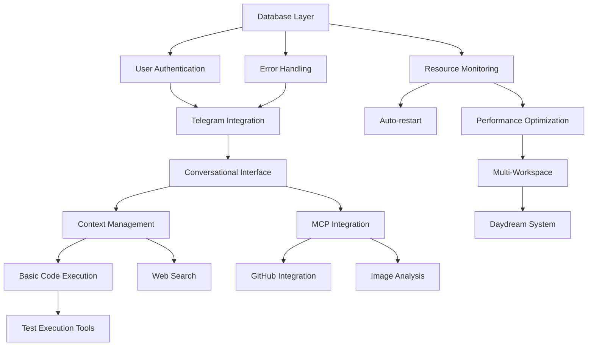

# Feature Prioritization Matrix

## Prioritization Framework

Using the **RICE** scoring method adapted for our context:
- **Reach**: How many users will benefit (1-10 scale)
- **Impact**: How much value per user (1-10 scale)  
- **Confidence**: How certain we are (0.5, 0.8, 1.0)
- **Effort**: Engineering weeks required

**RICE Score = (Reach × Impact × Confidence) / Effort**

## Feature Scoring Matrix

### MVP Features (Launch Blockers)

| Feature | Reach | Impact | Confidence | Effort | RICE Score | Priority |
|---------|-------|--------|------------|--------|------------|----------|
| Conversational Interface | 10 | 10 | 1.0 | 2.0 | **50.0** | P0 |
| Telegram Integration | 10 | 9 | 1.0 | 1.5 | **60.0** | P0 |
| Basic Code Execution | 10 | 9 | 1.0 | 2.0 | **45.0** | P0 |
| Context Management | 10 | 8 | 1.0 | 1.5 | **53.3** | P0 |
| Error Handling | 10 | 7 | 1.0 | 1.0 | **70.0** | P0 |
| User Authentication | 10 | 8 | 1.0 | 0.5 | **160.0** | P0 |
| Database Layer | 10 | 7 | 1.0 | 1.0 | **70.0** | P0 |

### V1 Features (Core Product)

| Feature | Reach | Impact | Confidence | Effort | RICE Score | Priority |
|---------|-------|--------|------------|--------|------------|----------|
| MCP/Claude Code Integration | 8 | 10 | 0.8 | 3.0 | **21.3** | P1 |
| GitHub Integration | 7 | 8 | 1.0 | 2.0 | **28.0** | P1 |
| Web Search (Perplexity) | 9 | 7 | 1.0 | 1.0 | **63.0** | P1 |
| Multi-Workspace Support | 6 | 9 | 0.8 | 2.5 | **17.3** | P1 |
| Performance Optimization | 10 | 8 | 1.0 | 2.0 | **40.0** | P1 |
| Resource Monitoring | 8 | 7 | 1.0 | 1.5 | **37.3** | P1 |
| Notion Integration | 5 | 7 | 0.8 | 2.0 | **14.0** | P1 |
| Image Analysis (GPT-4V) | 6 | 8 | 1.0 | 1.5 | **32.0** | P1 |
| Auto-restart Capability | 10 | 6 | 1.0 | 1.0 | **60.0** | P1 |
| Test Execution Tools | 8 | 8 | 1.0 | 1.5 | **42.7** | P1 |

### V2 Features (Enhanced)

| Feature | Reach | Impact | Confidence | Effort | RICE Score | Priority |
|---------|-------|--------|------------|--------|------------|----------|
| Daydream System | 7 | 9 | 0.8 | 3.0 | **16.8** | P2 |
| Image Generation (DALL-E) | 5 | 7 | 1.0 | 1.0 | **35.0** | P2 |
| Voice Transcription | 4 | 6 | 1.0 | 1.5 | **16.0** | P2 |
| YouTube Integration | 3 | 6 | 0.8 | 2.0 | **7.2** | P2 |
| Link Analysis | 4 | 5 | 1.0 | 1.0 | **20.0** | P2 |
| Intent Recognition (Ollama) | 6 | 6 | 0.5 | 2.0 | **9.0** | P2 |
| Multi-user Collaboration | 4 | 8 | 0.5 | 4.0 | **4.0** | P2 |
| Analytics Dashboard | 5 | 7 | 0.8 | 2.5 | **11.2** | P2 |
| Linear Integration | 3 | 6 | 0.8 | 2.0 | **7.2** | P2 |
| Custom Tool Creation UI | 3 | 7 | 0.5 | 3.0 | **3.5** | P2 |

## Implementation Roadmap

### Sprint 1-2 (Week 1-2): Foundation
**Goal**: Core infrastructure and basic messaging

**Must Complete** (Total Effort: 6.5 weeks):
1. User Authentication (RICE: 160.0)
2. Database Layer (RICE: 70.0) 
3. Error Handling (RICE: 70.0)
4. Telegram Integration (RICE: 60.0)

### Sprint 3-4 (Week 3-4): Core Conversation
**Goal**: Working conversational system

**Must Complete** (Total Effort: 5.0 weeks):
1. Context Management (RICE: 53.3)
2. Conversational Interface (RICE: 50.0)
3. Basic Code Execution (RICE: 45.0)

### Sprint 5-6 (Week 5-6): Essential Tools
**Goal**: Productive developer experience

**Must Complete** (Total Effort: 6.0 weeks):
1. Web Search (RICE: 63.0)
2. Auto-restart (RICE: 60.0)
3. Test Execution Tools (RICE: 42.7)
4. Performance Optimization (RICE: 40.0)

### Sprint 7-8 (Week 7-8): Integrations
**Goal**: External service connectivity

**Must Complete** (Total Effort: 7.5 weeks):
1. Resource Monitoring (RICE: 37.3)
2. Image Analysis (RICE: 32.0)
3. GitHub Integration (RICE: 28.0)
4. MCP Integration (RICE: 21.3)

### Post-Launch (Month 3+): Enhancements
**Goal**: Advanced features and scaling

**Priority Order**:
1. Image Generation (RICE: 35.0)
2. Link Analysis (RICE: 20.0)
3. Multi-Workspace Support (RICE: 17.3)
4. Daydream System (RICE: 16.8)
5. Voice Transcription (RICE: 16.0)

## Feature Dependencies

## Risk-Adjusted Timeline

### Critical Path Items
These features block other development:
1. **Database Layer** - Blocks everything
2. **User Authentication** - Blocks all user features
3. **Telegram Integration** - Blocks all messaging
4. **Context Management** - Blocks advanced features
5. **MCP Integration** - Blocks Claude Code features

### Parallel Development Opportunities
These can be built simultaneously:
- **Team 1**: Core Infrastructure (Database, Auth, Error Handling)
- **Team 2**: Telegram Integration and Message Processing
- **Team 3**: Tool Development (Search, GitHub, Image Analysis)

## Feature Cut Candidates

If timeline slips, these features can be deferred:
1. **YouTube Integration** (RICE: 7.2) - Nice to have
2. **Linear Integration** (RICE: 7.2) - Limited user base
3. **Custom Tool UI** (RICE: 3.5) - Can use config files
4. **Multi-user Collaboration** (RICE: 4.0) - Complex, low initial demand
5. **Intent Recognition** (RICE: 9.0) - Can use keyword matching initially

## Success Criteria by Phase

### MVP Success (Week 4)
- [ ] 10 beta users successfully using system
- [ ] 100+ messages processed daily
- [ ] <2s average response time
- [ ] Zero critical bugs
- [ ] 5 core tools working

### V1 Success (Week 8)
- [ ] 50 active users
- [ ] 1000+ messages daily
- [ ] 15+ tools integrated
- [ ] 99.9% uptime achieved
- [ ] GitHub and MCP fully integrated

### V2 Success (Month 4)
- [ ] 200 active users
- [ ] 5000+ messages daily
- [ ] Daydream providing daily insights
- [ ] <30MB memory per session
- [ ] Self-service configuration available

## Decision Points

### Week 2 Checkpoint
**Decision**: Continue with current architecture?
- If database performance issues → Consider PostgreSQL
- If Telegram limits hit → Add queue system
- If memory usage high → Optimize context management

### Week 4 Checkpoint
**Decision**: Ready for beta users?
- Required: All P0 features complete
- Required: <2s response time
- Required: Error handling comprehensive
- If not ready: Delay beta by 1 week max

### Week 6 Checkpoint
**Decision**: Launch V1 or extend development?
- Required: All P1 features functional
- Required: Performance targets met
- Required: Security audit passed
- If not ready: Prioritize stability over features

## Resource Allocation

### Engineering Effort Distribution
- **40%** - Core Infrastructure & Architecture
- **25%** - Tool Development & Integration
- **20%** - Testing & Quality Assurance
- **10%** - Documentation & DevOps
- **5%** - Buffer for Unknown Issues

### Recommended Team Structure
- **Lead Engineer**: Architecture, code reviews, integration
- **Backend Engineer**: Tools, database, performance
- **DevOps Engineer**: Infrastructure, monitoring, deployment
- **QA Engineer** (Part-time): Testing, validation, quality

---

**Document Status**: Complete
**Last Updated**: 2025-01-07
**Next Actions**: 
1. Review with engineering team
2. Validate effort estimates
3. Confirm resource availability
4. Lock MVP scope