# Django Project Template Architecture

This document outlines the architecture of the Django Project Template, showing the relationships between different apps and components.

## App Structure

The project is organized into several Django apps, each with a specific responsibility:

- **common**: Core models, utilities, and reusable components used across the system
- **public**: Front-end website and user interface components
- **api**: RESTful API endpoints
- **integration**: Third-party service integrations
- **ai**: AI model integrations and utilities (planned)

## Architecture Diagram

```mermaid
graph TD
    %% External Systems
    subgraph External ["External Systems"]
        AWS["AWS Services"]
        Twilio["Twilio"]
        Loops["Loops Email"]
        AI_Services["AI Services<br>(OpenAI, Anthropic)"]
    end

    %% Django Layers
    subgraph Django ["Django Project"]
        %% Apps
        subgraph Apps ["Django Apps"]
            Common["common<br>Core models & behaviors"]
            Public["public<br>Web UI & templates"]
            API["api<br>REST endpoints"]
            Integration["integration<br>3rd party services"]
            AI["ai<br>AI components"]
        end

        %% Core Framework
        subgraph Core ["Django Core"]
            Settings["settings"]
            URLs["URLs & Routing"]
            Templates["Templates"]
            Static["Static Files"]
        end

        %% Background Tasks
        subgraph Tasks ["Background Tasks"]
            TaskFramework["Django 6.0 @task"]
            Worker["db_worker process"]
        end
    end

    %% Database
    DB[(PostgreSQL<br>Database)]

    %% Frontend
    Frontend["Frontend<br>HTMX & Tailwind"]

    %% Connections between components
    Common --> DB
    Public --> Common
    API --> Common
    Integration --> Common
    AI --> Common

    Integration --> AWS
    Integration --> Twilio
    Integration --> Loops
    AI --> AI_Services

    TaskFramework --> DB
    Worker --> TaskFramework

    Public --> Frontend
    Public --> Templates
    API --> URLs

    %% User interactions
    User((User)) --> Frontend
    User --> API

    %% Style definitions
    classDef external fill:#f9f,stroke:#333,stroke-width:2px;
    classDef database fill:#69b,stroke:#333,stroke-width:2px;
    classDef app fill:#bfb,stroke:#333,stroke-width:2px;
    classDef core fill:#ddd,stroke:#333,stroke-width:2px;

    %% Apply styles to nodes
    class External external
    class DB database
    class Common,Public,API,Integration,AI app
    class Settings,URLs,Templates,Static core
```



## App Relationships and Dependencies

### Common App
- Foundation of the system with shared models and behaviors
- Provides core functionality like User model, behavior mixins, and utilities
- Used by all other apps

### Public App
- Consumes Common app models and behaviors
- Generates HTML interfaces using templates and HTMX
- Handles user interface logic and sessions

### API App
- Consumes Common app models
- Exposes REST endpoints using Django REST Framework
- Provides serializers for data transformation

### Integration App
- Interfaces with third-party services:
  - AWS: File storage and services
  - Twilio: SMS messaging
  - Loops: Transactional email
- Abstracts external API details behind a clean interface

### AI App
- Integrates with AI service providers (OpenAI, Anthropic)
- Provides chat agent functionality using PydanticAI framework
- Includes MCP (Model Context Protocol) servers for external integrations
- Follows strict separation between Django models (database) and PydanticAI models (in-memory)
- See [PydanticAI Integration Guide](PYDANTIC_AI_INTEGRATION.md) for implementation details

## Data Flow

1. **User Requests**:
   - Web requests route through Public app views
   - API requests route through API app views

2. **Data Access**:
   - Apps access data through Common app models
   - Models leverage behavior mixins for standard functionality

3. **External Interactions**:
   - Communication with external services happens through Integration app
   - Integration app provides a consistent interface for service access

4. **Frontend Rendering**:
   - Templates and static files provide frontend structure
   - HTMX handles dynamic frontend interactions
   - Tailwind CSS v4 with django-tailwind-cli provides styling

5. **Background Tasks**:
   - Long-running operations use Django 6.0's native `@task` decorator
   - Tasks enqueued with `.enqueue()`, tracked via `TaskResult`
   - Dev/test: `ImmediateBackend` runs tasks inline (synchronous)
   - Production: `DatabaseBackend` (`django-tasks-db`) persists tasks to PostgreSQL
   - Worker process (`manage.py db_worker`) polls and executes queued tasks
   - Task status: `NEW` → `RUNNING` → `SUCCESSFUL` or `FAILED`

## Technology Stack

- **Backend**: Django 6.0, DRF, PostgreSQL
- **Frontend**: HTMX, Tailwind CSS v4 with django-tailwind-cli
- **Background Tasks**: Django 6.0 native `@task` + `django-tasks-db` (DatabaseBackend)
- **External Services**: AWS, Twilio, Loops
- **AI Integration**: PydanticAI framework with OpenAI/Anthropic, MCP protocol
- **Deployment**: Render (web service + background worker)

## AI Integration Architecture

The AI app uses a layered architecture to separate concerns:

```
Django Views (HTTP) → Adapters → PydanticAI Agents → LLM Providers
       ↓                 ↓              ↓
Django Models    AgentModels    Tool Execution
  (database)     (in-memory)
```

**Key principles:**
- Clear naming: Django `ChatSession` vs PydanticAI `AgentChatSession`
- Adapter pattern for model conversion
- Async-first with Django's async views
- Tool sandboxing for security
- See [PydanticAI Integration Guide](PYDANTIC_AI_INTEGRATION.md) for full details
