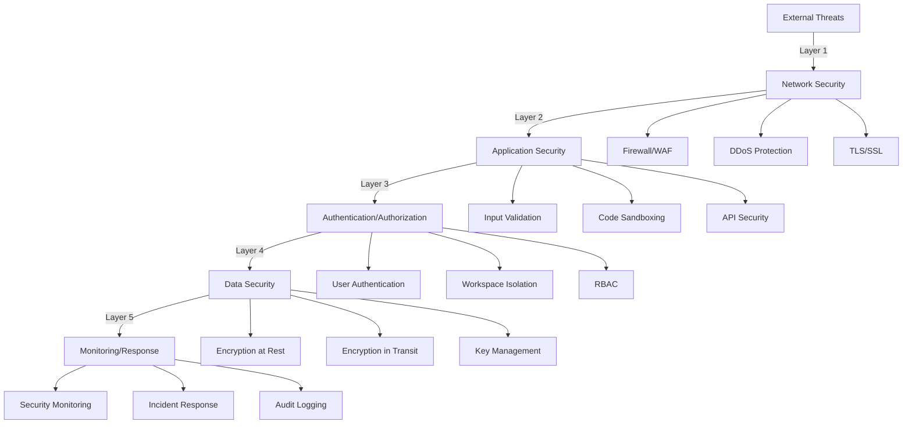

# Security and Compliance Requirements

## Executive Summary

This document defines comprehensive security requirements, compliance standards, and risk management strategies for the AI system. It establishes security controls, threat models, and compliance frameworks to protect user data, ensure system integrity, and meet regulatory requirements.

## Security Architecture

### Defense in Depth Strategy



### Security Zones

| Zone | Description | Security Level | Access Control |
|------|-------------|----------------|----------------|
| **Public** | Telegram interface | Standard | Rate limiting, user whitelist |
| **Application** | Core AI system | High | Authenticated users only |
| **Execution** | Code sandbox | Maximum | Isolated containers |
| **Data** | Database layer | Maximum | Encrypted, access logged |
| **Management** | Admin functions | Critical | MFA, audit trail |

## Threat Model

### STRIDE Analysis

#### Spoofing Identity
**Threats:**
- Impersonation of legitimate users
- Telegram account takeover
- API key theft

**Mitigations:**
- User whitelist validation
- Session token rotation
- API key encryption and rotation
- Rate limiting per user

#### Tampering with Data
**Threats:**
- Message manipulation in transit
- Database tampering
- Code injection

**Mitigations:**
- TLS for all communications
- Database integrity checks
- Input sanitization
- Parameterized queries

#### Repudiation
**Threats:**
- Denial of actions performed
- Unauthorized code execution claims

**Mitigations:**
- Comprehensive audit logging
- Digital signatures on critical operations
- Immutable log storage

#### Information Disclosure
**Threats:**
- Conversation leakage
- API key exposure
- Source code disclosure

**Mitigations:**
- Encryption at rest and in transit
- Secrets management system
- Access control lists
- Data classification

#### Denial of Service
**Threats:**
- Resource exhaustion
- API rate limit abuse
- Database lock contention

**Mitigations:**
- Rate limiting (10 req/min per user)
- Resource quotas
- Circuit breakers
- Auto-scaling

#### Elevation of Privilege
**Threats:**
- Sandbox escape
- Workspace boundary violation
- Admin function access

**Mitigations:**
- Container isolation
- Principle of least privilege
- Security boundaries enforcement
- Regular security audits

### Attack Vectors

```yaml
High Risk:
  - Code Execution:
      Risk: Malicious code execution
      Mitigation: Sandboxed environment, resource limits
  
  - API Abuse:
      Risk: Excessive API consumption
      Mitigation: Rate limiting, quota management
  
  - Data Exfiltration:
      Risk: Unauthorized data access
      Mitigation: Access controls, monitoring

Medium Risk:
  - Social Engineering:
      Risk: Tricking system into revealing information
      Mitigation: Strict response filtering, user education
  
  - Dependency Vulnerabilities:
      Risk: Exploits in third-party libraries
      Mitigation: Regular updates, vulnerability scanning

Low Risk:
  - Physical Access:
      Risk: Server compromise
      Mitigation: Cloud infrastructure, access controls
```

## Security Controls

### Authentication and Authorization

#### User Authentication
```yaml
Requirements:
  - Telegram user ID validation
  - Whitelist-based access control
  - Session management with timeout (24 hours)
  - Token rotation on security events
  
Implementation:
  Method: OAuth 2.0 pattern with Telegram
  Storage: Encrypted session tokens
  Validation: Every request validated
  Revocation: Immediate on security event
```

#### Authorization Model
```yaml
Role-Based Access Control (RBAC):
  Roles:
    - Admin: Full system access
    - Developer: Project workspace access
    - User: Limited workspace access
    - Guest: Read-only access
  
Workspace Isolation:
  - Each workspace has independent permissions
  - Cross-workspace access prohibited
  - Project-specific tool availability
  - Data isolation enforced
```

### Data Protection

#### Encryption Standards
```yaml
Encryption at Rest:
  Algorithm: AES-256-GCM
  Key Management: AWS KMS or HashiCorp Vault
  Scope:
    - Database files
    - Backup files
    - Log files (sensitive data)
    - Configuration files
  
Encryption in Transit:
  Protocol: TLS 1.3 minimum
  Certificate: Let's Encrypt or commercial CA
  Scope:
    - All API communications
    - Database connections
    - Inter-service communication
    - Webhook callbacks
```

#### Data Classification
```yaml
Classification Levels:
  Public:
    - System status
    - Documentation
    - Anonymous metrics
    
  Internal:
    - System configuration
    - Performance metrics
    - Non-sensitive logs
    
  Confidential:
    - User conversations
    - Code repositories
    - API responses
    
  Restricted:
    - API keys
    - Encryption keys
    - User PII
    - Authentication tokens
```

#### Data Sanitization
```yaml
Input Sanitization:
  - HTML encoding for display
  - SQL parameterization
  - Command injection prevention
  - Path traversal prevention
  
Output Filtering:
  - Remove sensitive data from logs
  - Mask API keys in responses
  - Truncate long outputs
  - Filter error messages
```

### Application Security

#### Secure Coding Standards
```yaml
Development Practices:
  - Security-first design
  - Threat modeling for features
  - Security code reviews
  - Static analysis (SAST)
  - Dynamic analysis (DAST)
  
Code Quality Standards:
  - No hardcoded secrets
  - Input validation on all endpoints
  - Output encoding
  - Error handling without info leakage
  - Secure defaults
```

#### API Security
```yaml
API Protection:
  Rate Limiting:
    - Per user: 10 requests/minute
    - Per IP: 100 requests/minute
    - Global: 1000 requests/minute
  
  Authentication:
    - Bearer token required
    - Token expiry: 24 hours
    - Refresh token support
  
  Validation:
    - Schema validation (OpenAPI)
    - Input size limits
    - Type checking
    - Business logic validation
```

#### Code Execution Security
```yaml
Sandbox Environment:
  Container: Docker with security profiles
  Resources:
    - CPU: 1 core limit
    - Memory: 512MB limit
    - Disk: 100MB limit
    - Network: Restricted egress
    - Time: 30 second timeout
  
  Restrictions:
    - No file system access outside sandbox
    - No network access to internal services
    - No system calls (seccomp)
    - No privilege escalation
    - Read-only root filesystem
```

### Infrastructure Security

#### Network Security
```yaml
Firewall Rules:
  Ingress:
    - 443/tcp: HTTPS (public)
    - 22/tcp: SSH (restricted IPs)
  
  Egress:
    - 443/tcp: External APIs
    - 53/udp: DNS
    - 123/udp: NTP
  
Network Segmentation:
  - Public subnet: Load balancer
  - Private subnet: Application servers
  - Data subnet: Database servers
  - Management subnet: Admin access
```

#### Host Security
```yaml
Operating System:
  - Hardened Linux (CIS benchmarks)
  - Regular security updates
  - Minimal installed packages
  - SELinux/AppArmor enabled
  - Audit daemon configured
  
Access Control:
  - SSH key authentication only
  - MFA for administrative access
  - Privilege escalation logging
  - Session recording
```

## Compliance Requirements

### Regulatory Compliance

#### GDPR (General Data Protection Regulation)
```yaml
Requirements:
  - User consent for data processing
  - Right to access data
  - Right to delete data
  - Right to data portability
  - Data breach notification (72 hours)
  
Implementation:
  - Privacy policy and terms of service
  - User data export functionality
  - Data deletion procedures
  - Breach response plan
  - Data Processing Agreements (DPAs)
```

#### SOC 2 Type II
```yaml
Trust Service Criteria:
  Security:
    - Access controls
    - System monitoring
    - Incident response
  
  Availability:
    - SLA compliance
    - Disaster recovery
    - Performance monitoring
  
  Confidentiality:
    - Encryption controls
    - Access restrictions
    - Data classification
  
  Processing Integrity:
    - Data validation
    - Error handling
    - Transaction logging
  
  Privacy:
    - Data collection limits
    - Use restrictions
    - Retention policies
```

### Industry Standards

#### OWASP Top 10 Compliance
```yaml
Addressed Risks:
  A01-Broken Access Control: RBAC, workspace isolation
  A02-Cryptographic Failures: TLS 1.3, AES-256
  A03-Injection: Input sanitization, parameterization
  A04-Insecure Design: Threat modeling, security reviews
  A05-Security Misconfiguration: Hardening, scanning
  A06-Vulnerable Components: Dependency scanning
  A07-Authentication Failures: MFA, session management
  A08-Data Integrity Failures: Integrity checks, signing
  A09-Logging Failures: Comprehensive audit logs
  A10-SSRF: Network restrictions, validation
```

#### CIS Controls
```yaml
Implemented Controls:
  - Inventory of authorized devices
  - Inventory of authorized software
  - Secure configurations
  - Vulnerability assessment
  - Administrative privileges control
  - Audit log management
  - Email and web browser protections
  - Malware defenses
  - Data recovery capability
  - Security awareness training
```

## Security Monitoring

### Logging and Monitoring

#### Security Events
```yaml
Monitored Events:
  Authentication:
    - Login attempts (success/failure)
    - Password changes
    - MFA events
    - Session creation/termination
  
  Authorization:
    - Permission changes
    - Privilege escalation
    - Access denials
  
  Data Access:
    - Database queries
    - File access
    - API calls
    - Data exports
  
  System:
    - Configuration changes
    - Service starts/stops
    - Error conditions
    - Resource limits
```

#### Security Information and Event Management (SIEM)
```yaml
SIEM Integration:
  Platform: ELK Stack or Splunk
  
  Data Sources:
    - Application logs
    - System logs
    - Network logs
    - Security tools
  
  Correlation Rules:
    - Multiple failed logins
    - Unusual access patterns
    - Data exfiltration attempts
    - Privilege escalation
  
  Alerting:
    - Real-time security alerts
    - Daily security reports
    - Weekly trend analysis
    - Monthly executive summary
```

### Incident Response

#### Incident Response Plan
```yaml
Phases:
  1. Preparation:
     - Response team defined
     - Communication channels
     - Tools and access ready
     - Runbooks documented
  
  2. Detection:
     - Automated monitoring
     - User reports
     - Threat intelligence
  
  3. Analysis:
     - Severity assessment
     - Scope determination
     - Evidence collection
  
  4. Containment:
     - Isolate affected systems
     - Preserve evidence
     - Prevent spread
  
  5. Eradication:
     - Remove threat
     - Patch vulnerabilities
     - Update defenses
  
  6. Recovery:
     - Restore services
     - Verify integrity
     - Monitor for recurrence
  
  7. Lessons Learned:
     - Post-mortem analysis
     - Update procedures
     - Share knowledge
```

#### Security Incident Categories
```yaml
Categories:
  Critical (SEV-1):
    - Data breach
    - System compromise
    - Ransomware
    Response: Immediate, all hands
  
  High (SEV-2):
    - Authentication bypass
    - Privilege escalation
    - DoS attack
    Response: Within 1 hour
  
  Medium (SEV-3):
    - Suspicious activity
    - Policy violation
    - Failed security control
    Response: Within 4 hours
  
  Low (SEV-4):
    - Security scan findings
    - Non-critical patches
    Response: Within 24 hours
```

## Security Testing

### Vulnerability Management

#### Vulnerability Scanning
```yaml
Scanning Schedule:
  - Infrastructure: Weekly automated
  - Applications: Per deployment
  - Dependencies: Daily automated
  - Penetration test: Quarterly
  
Tools:
  - SAST: SonarQube, Semgrep
  - DAST: OWASP ZAP, Burp Suite
  - Dependency: Snyk, Dependabot
  - Infrastructure: Nessus, OpenVAS
```

#### Penetration Testing
```yaml
Scope:
  - External infrastructure
  - Web applications
  - APIs
  - Social engineering (limited)
  
Methodology:
  - OWASP Testing Guide
  - PTES Standard
  - Black box and white box
  
Frequency:
  - Full test: Annually
  - Targeted test: Quarterly
  - After major changes
```

### Security Metrics

#### Key Performance Indicators (KPIs)
```yaml
Security KPIs:
  - Mean Time to Detect (MTTD): <1 hour
  - Mean Time to Respond (MTTR): <4 hours
  - Vulnerability remediation: <30 days
  - Security training completion: 100%
  - Patch compliance: >95%
  
Risk Metrics:
  - Critical vulnerabilities: 0
  - High vulnerabilities: <5
  - Security incidents/month: <2
  - Failed security audits: 0
```

## Privacy Protection

### Privacy by Design

#### Data Minimization
```yaml
Principles:
  - Collect only necessary data
  - Delete when no longer needed
  - Anonymize where possible
  - Aggregate for analytics
  
Implementation:
  - Conversation retention: 90 days
  - Log retention: 30 days
  - Automated deletion schedules
  - Anonymous analytics only
```

#### User Rights
```yaml
Supported Rights:
  Access:
    - Download conversation history
    - View stored metadata
    - Access audit logs
  
  Correction:
    - Update profile information
    - Correct stored data
  
  Deletion:
    - Delete all personal data
    - Remove from whitelist
    - Purge conversation history
  
  Portability:
    - Export in JSON format
    - Include all associations
    - Machine-readable format
```

## Security Governance

### Roles and Responsibilities

| Role | Responsibilities | Authority |
|------|------------------|-----------|
| **Security Officer** | Overall security posture | Policy approval |
| **Engineering Lead** | Secure development | Implementation decisions |
| **DevOps Lead** | Infrastructure security | Access control |
| **Compliance Manager** | Regulatory compliance | Audit coordination |

### Security Policies

```yaml
Required Policies:
  - Information Security Policy
  - Acceptable Use Policy
  - Access Control Policy
  - Incident Response Policy
  - Data Classification Policy
  - Encryption Policy
  - Password Policy
  - Vulnerability Management Policy
  - Business Continuity Policy
  - Third-Party Security Policy
```

### Security Training

```yaml
Training Requirements:
  All Staff:
    - Security awareness (annual)
    - Phishing simulation (quarterly)
    - Data handling (annual)
  
  Developers:
    - Secure coding (annual)
    - OWASP Top 10 (annual)
    - Security tools (onboarding)
  
  Administrators:
    - Infrastructure security (annual)
    - Incident response (biannual)
    - Security monitoring (onboarding)
```

## Third-Party Security

### Vendor Risk Management

```yaml
Assessment Criteria:
  - Security certifications (SOC 2, ISO 27001)
  - Data handling practices
  - Incident history
  - Security controls
  - Compliance status
  
Required Documentation:
  - Security questionnaire
  - Penetration test results
  - Compliance certificates
  - Data Processing Agreement
  - Incident response plan
```

### API Security Requirements

```yaml
External API Requirements:
  - TLS 1.2 minimum
  - API key rotation capability
  - Rate limiting support
  - Audit logging
  - Security documentation
  
Integration Security:
  - Validate all responses
  - Timeout handling
  - Error recovery
  - Circuit breaker pattern
  - Security monitoring
```

## Security Roadmap

### Phase 1: Foundation (Weeks 1-4)
- [ ] Implement authentication system
- [ ] Set up encryption (at rest/transit)
- [ ] Configure audit logging
- [ ] Establish security monitoring

### Phase 2: Hardening (Weeks 5-8)
- [ ] Complete security scanning setup
- [ ] Implement rate limiting
- [ ] Deploy WAF
- [ ] Conduct security training

### Phase 3: Compliance (Months 3-4)
- [ ] GDPR compliance audit
- [ ] SOC 2 preparation
- [ ] Penetration testing
- [ ] Policy documentation

### Phase 4: Maturity (Months 5-6)
- [ ] Advanced threat detection
- [ ] Security automation
- [ ] Compliance certification
- [ ] Continuous improvement

## Emergency Procedures

### Security Breach Response

```bash
# IMMEDIATE ACTIONS (0-15 minutes)
1. Isolate affected systems
2. Preserve evidence
3. Notify security team
4. Begin investigation

# SHORT TERM (15-60 minutes)
5. Assess scope and impact
6. Implement containment
7. Notify stakeholders
8. Prepare communications

# RECOVERY (1-24 hours)
9. Eradicate threat
10. Restore from clean backups
11. Verify system integrity
12. Resume operations

# POST-INCIDENT (24-72 hours)
13. Complete investigation
14. Document lessons learned
15. Update security controls
16. Regulatory notifications
```

---

**Document Status**: Complete
**Last Updated**: 2025-01-07
**Classification**: Confidential
**Review Schedule**: Quarterly
**Next Review**: 2025-04-07

## Appendix: Security Checklist

### Pre-Deployment Security Checklist

- [ ] All dependencies updated
- [ ] Security scanning completed
- [ ] Secrets properly managed
- [ ] Access controls configured
- [ ] Logging enabled
- [ ] Monitoring configured
- [ ] Backup tested
- [ ] Incident response ready
- [ ] Documentation complete
- [ ] Training completed