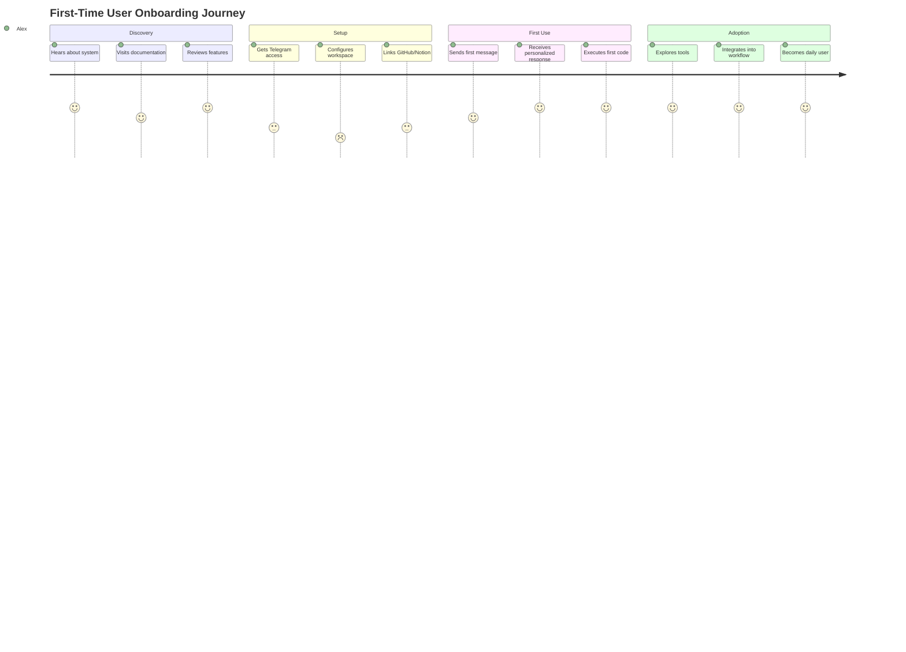
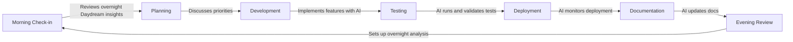
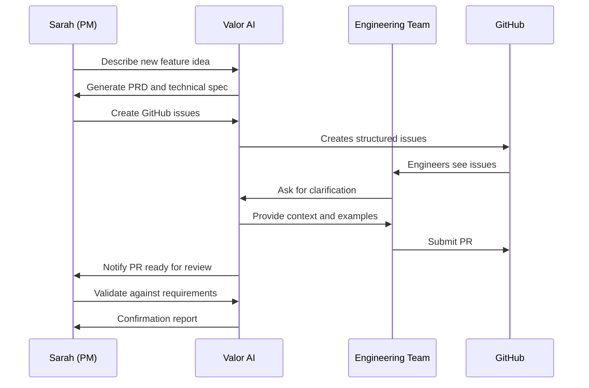
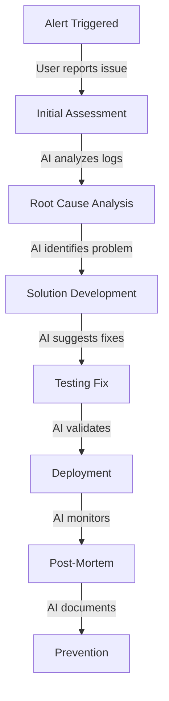
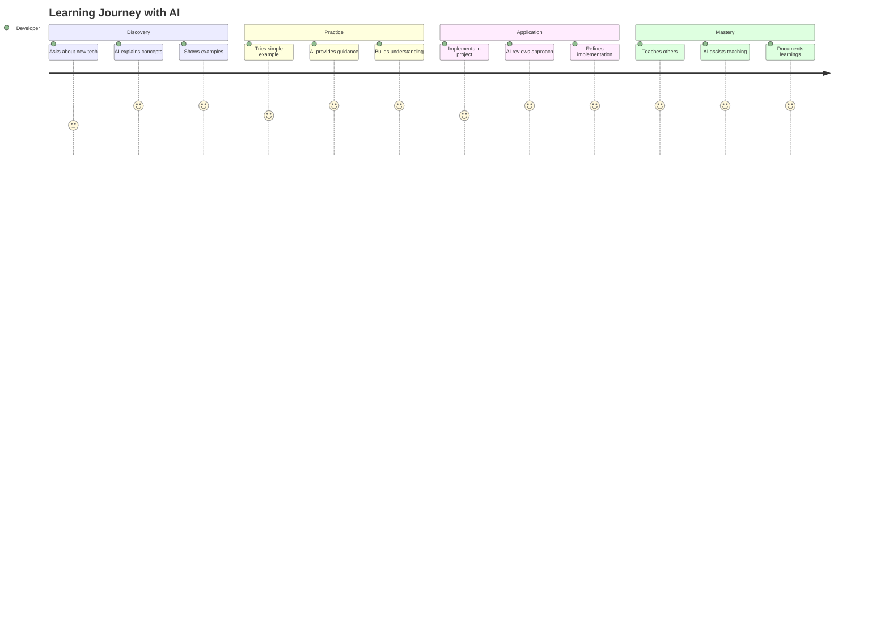

# User Journey Maps

## Overview

These journey maps detail the end-to-end experience for each user persona, identifying touchpoints, emotions, pain points, and opportunities throughout their interaction with the AI system.

## Journey Map 1: First-Time User Onboarding

### Persona: Senior Developer (Alex Chen)
### Scenario: Setting up the AI assistant for their project



### Detailed Journey Stages

#### Stage 1: Awareness (Pre-signup)
**Touchpoints:**
- GitHub README
- Blog post/tutorial
- Word of mouth
- Demo video

**User Actions:**
- Reads about capabilities
- Compares to alternatives
- Checks requirements

**Emotions:**
- 😊 Excited about possibilities
- 🤔 Skeptical about claims
- 😟 Concerned about complexity

**Pain Points:**
- Unclear pricing/access model
- Complex technical requirements
- Security concerns

**Opportunities:**
- Clear value proposition
- Simple getting started guide
- Security whitepaper

#### Stage 2: Activation (0-5 minutes)
**Touchpoints:**
- Telegram bot
- Welcome message
- Quick setup wizard

**User Actions:**
- Starts Telegram bot
- Provides authentication
- Selects workspace

**Emotions:**
- 😊 Impressed by quick start
- 😰 Anxious about permissions
- 🤗 Delighted by personality

**System Responses:**
```
"Hey! I'm Valor, your AI development companion. Let's get you set up in under 2 minutes.

First, I need to verify you're on the whitelist. What's your GitHub username?"

[After verification]
"Perfect! I see you have 3 repositories. Which project would you like me to help with first?"

[Shows project list]
"Great choice! I'm analyzing your codebase now... Done! I understand your project structure, dependencies, and recent commits. 

Try asking me something like:
- 'What does the auth module do?'
- 'Run the test suite'
- 'Show me recent PRs'"
```

#### Stage 3: First Value (5-15 minutes)
**Touchpoints:**
- First conversation
- First tool execution
- First code generation

**User Actions:**
- Asks about codebase
- Requests code execution
- Tests capabilities

**Emotions:**
- 😲 Surprised by context awareness
- 😊 Happy with response quality
- 🚀 Excited to do more

**Example Interaction:**
```
User: "What's the most complex function in my codebase?"

Valor: "Looking at your codebase, the most complex function is `processPaymentTransaction()` in `/src/payments/processor.py` with a cyclomatic complexity of 23.

It handles 7 different payment providers, has 4 nested try-catch blocks, and contains 156 lines. 

Would you like me to:
1. Show you the function
2. Suggest refactoring approaches
3. Generate tests for edge cases"

User: "Generate tests"

Valor: "I'll create comprehensive tests for the payment processor. Let me analyze the function first...

[Generates and executes tests]

✅ Created 12 test cases covering:
- Each payment provider
- Network failures  
- Invalid inputs
- Edge cases (zero amounts, refunds)

All tests passing! Should I create a PR with these tests?"
```

#### Stage 4: Habit Formation (Day 1-7)
**Touchpoints:**
- Daily interactions
- Multiple tool usage
- Integration discovery

**User Actions:**
- Daily check-ins
- Feature exploration
- Workflow integration

**Emotions:**
- 🎯 Focused and productive
- 💡 Discovering new capabilities
- 🔄 Building new habits

**Progressive Engagement:**
- Day 1: Basic queries and code execution
- Day 2: GitHub integration usage
- Day 3: Automated testing
- Day 4: Code review assistance
- Day 5: Documentation generation
- Day 6: Daydream insights review
- Day 7: Custom workflow creation

## Journey Map 2: Daily Power User Workflow

### Persona: Solo Founder (Marcus Rodriguez)
### Scenario: Daily development workflow with AI assistance



### Daily Touchpoints Timeline

**6:00 AM - Overnight Analysis Complete**
```
Valor: "Good morning! While you were sleeping, I analyzed your codebase and found:

🔍 3 performance optimizations that could reduce load time by 20%
🐛 2 potential bugs in error handling
📚 5 dependencies that need updates
💡 1 architectural improvement suggestion

Would you like to review these now or should I create issues for later?"
```

**9:00 AM - Morning Planning**
```
User: "What should I focus on today?"

Valor: "Based on your GitHub issues and our previous conversations:

PRIORITY 1: Fix the authentication bug (3 users affected)
- I've already identified the likely cause in session management
- Estimated: 1 hour with my assistance

PRIORITY 2: Ship the dashboard feature
- 2 tests failing, I can help fix those
- PR ready after tests pass
- Estimated: 2 hours

PRIORITY 3: Customer feature request (payment webhooks)
- I've drafted an implementation plan
- Estimated: 3 hours

Should we start with the auth bug?"
```

**10:00 AM - Active Development**
```
User: "Let's fix that auth bug"

Valor: "I've traced the issue to line 234 in auth_handler.py. The session token isn't being refreshed when it expires after 24 hours.

Here's my fix:
[Shows code with explanation]

This adds automatic token refresh. Should I:
1. Apply the fix and run tests
2. Show you alternative approaches
3. Explain the root cause in more detail"
```

**2:00 PM - Code Review**
```
User: "Review my morning's work"

Valor: "I've analyzed your 3 commits from this morning:

✅ GOOD:
- Auth bug properly fixed with tests
- Clean code structure
- Good error handling

⚠️ SUGGESTIONS:
- Missing rate limiting on the new endpoint
- Could extract the validation logic for reusability
- Consider adding metrics for monitoring

Should I implement these improvements?"
```

**5:00 PM - End of Day**
```
User: "Set up overnight analysis"

Valor: "I'll run my Daydream analysis tonight focusing on:
- Performance bottlenecks in the new features
- Security audit of today's changes
- Test coverage gaps
- Documentation updates needed

I'll have insights ready by 6 AM. Have a great evening!"
```

## Journey Map 3: Team Collaboration Flow

### Persona: Technical PM (Sarah Williams)
### Scenario: Coordinating feature development with engineering team



### Collaboration Touchpoints

**Feature Ideation**
```
PM: "We need a way for users to export their data in different formats"

Valor: "I'll help you spec this out. Based on similar features in your codebase:

📋 EXPORT FEATURE SPECIFICATION

Formats to support:
- CSV (most requested)
- JSON (for developers)  
- PDF (for reports)
- Excel (for business users)

Implementation approach:
1. Create export service layer
2. Add format converters
3. Implement async processing for large exports
4. Add progress tracking

I can create:
- Detailed PRD
- Technical specification
- GitHub issues with tasks
- Acceptance criteria

What would you like first?"
```

**Requirements Translation**
```
PM: "Create the GitHub issues for this feature"

Valor: "I'll create a structured set of issues:

[Creates Epic]
📦 EPIC: Data Export Feature

[Creates Tasks]
✅ Task 1: Create export service interface
- Estimated: 2 hours
- Labels: backend, architecture
- Assigned: Suggested for Alex

✅ Task 2: Implement CSV exporter
- Estimated: 3 hours
- Labels: backend, feature
- Dependencies: Task 1

[Continues creating all tasks...]

Created 8 issues with dependencies mapped. Should I also create a project board?"
```

## Journey Map 4: Debugging Crisis

### Scenario: Production issue requiring immediate attention



### Crisis Response Flow

**T+0 minutes: Issue Reported**
```
User: "URGENT: Users can't login, getting 500 errors"

Valor: "🚨 I'm on it. Analyzing now...

[5 seconds later]

FOUND: Database connection pool exhausted
- Started: 14 minutes ago
- Affected users: ~200
- Error rate: 87% on auth endpoints

IMMEDIATE ACTION:
1. I can restart the connection pool (2 min fix)
2. I can scale up database connections (5 min fix)
3. I can implement emergency bypass (1 min fix)

What's your call?"
```

**T+2 minutes: Fix Applied**
```
Valor: "✅ Connection pool restarted
- Error rate dropping: 87% → 23% → 2%
- Users recovering: 150 successfully logged in
- System stabilizing

ROOT CAUSE: Connection leak in the payment webhook handler introduced in commit abc123 (2 hours ago)

Should I:
1. Rollback that commit
2. Apply a hotfix
3. Monitor for now"
```

**T+30 minutes: Post-Mortem**
```
Valor: "📝 INCIDENT POST-MORTEM

Duration: 14 minutes
Impact: 200 users affected
Root Cause: Connection leak in payment webhook

TIMELINE:
- 14:23 - Leak introduced in deployment
- 14:37 - Connections exhausted
- 14:39 - Alert triggered
- 14:41 - Fix applied
- 14:43 - Service restored

PREVENTION:
1. Add connection pool monitoring
2. Implement connection timeout
3. Add integration test for webhooks
4. Set up canary deployments

I've created:
- Post-mortem document
- 4 prevention tasks in GitHub
- Monitoring alert updates

Anything else you need?"
```

## Journey Map 5: Learning and Growth

### Scenario: Developer learning new technology



### Learning Interaction Pattern

**Conceptual Understanding**
```
User: "Explain React hooks like I'm a backend developer"

Valor: "Think of hooks as Flask decorators but for UI state:

BACKEND ANALOGY:
```python
@app.route('/user')  # Hook: connects function to route
@require_auth       # Hook: adds authentication
def get_user():
    return user_data
```

REACT EQUIVALENT:
```javascript
function UserProfile() {
  useState()      // Hook: manages component data (like class attributes)
  useEffect()     // Hook: handles side effects (like middleware)
  useAuth()       // Hook: custom auth logic (like your decorator)
  
  return <div>{userData}</div>
}
```

Key insight: Hooks let functions have persistent state and lifecycle, just like how decorators add functionality to your routes.

Want me to:
1. Show a real example from your codebase
2. Help you refactor a component to use hooks
3. Explain specific hooks in detail"
```

## Emotional Journey Mapping

### Satisfaction Curve Over Time

```
Satisfaction Level (1-10)
10 |                                    ╭─────────
   |                              ╭────╯ Mastery
 8 |                        ╭────╯ 
   |                  ╭────╯ Productivity
 6 |            ╭────╯
   |      ╭────╯ First Success
 4 |  ╭──╯
   | ╯ Skepticism
 2 |
   |________________________
   0  1hr  1day  1wk  1mo  3mo
        Time Using System
```

### Emotional Triggers

**Delight Moments 😊**
- First successful code execution
- AI understanding project context
- Time saved on repetitive tasks
- Catching bugs before production
- Learning something new

**Frustration Points 😤**
- Initial setup complexity
- Rate limiting hits
- Unclear error messages
- Waiting for responses
- Missing integrations

**Trust Builders 🤝**
- Accurate code understanding
- Reliable test execution
- Consistent personality
- Helpful error recovery
- Respecting boundaries

## Service Blueprint

### Frontend (User-Facing)

| Stage | User Actions | Touchpoints | Emotions |
|-------|--------------|-------------|----------|
| Discover | Research solution | Docs, demos | Curious 🤔 |
| Setup | Configure workspace | Telegram, Config | Anxious 😰 |
| Learn | Explore features | Chat, tools | Excited 😊 |
| Use | Daily development | All features | Productive 🚀 |
| Advocate | Recommend to others | Social, reviews | Proud 💪 |

### Backend (Behind the Scenes)

| Stage | System Actions | Technologies | Metrics |
|-------|----------------|--------------|---------|
| Discover | Serve documentation | GitHub Pages | Page views |
| Setup | Validate, provision | Auth, Database | Setup time |
| Learn | Analyze, suggest | AI, Analytics | Feature adoption |
| Use | Process, execute | All systems | Response time |
| Advocate | Track, optimize | Analytics, NPS | Referral rate |

## Key Moments of Truth

### Critical Touchpoints That Define Experience

1. **First Message Response** (0-10 seconds)
   - Sets expectation for entire experience
   - Must demonstrate understanding and capability
   - Personality must shine through

2. **First Code Execution** (30-60 seconds)
   - Proves the system actually works
   - Must be flawless and fast
   - Should exceed expectations

3. **First Error Recovery** (When things go wrong)
   - Shows system reliability
   - Builds or breaks trust
   - Must be helpful, not frustrating

4. **First Complex Task** (5-10 minutes)
   - Demonstrates real value
   - Shows depth of capability
   - Creates "aha" moment

5. **First Day-After Return** (24 hours)
   - Indicates habit formation
   - System must remember context
   - Should show learned preferences

## Optimization Opportunities

### Quick Wins
1. Reduce setup time to <2 minutes
2. Add interactive onboarding tutorial
3. Implement suggested actions
4. Create keyboard shortcuts
5. Add progress indicators

### Medium-Term Improvements
1. Predictive command suggestions
2. Personalized learning paths
3. Team templates and sharing
4. Mobile app for monitoring
5. Voice interaction support

### Long-Term Vision
1. Proactive problem prevention
2. Autonomous feature development
3. Cross-team knowledge sharing
4. Industry-specific specializations
5. Self-improving AI models

---

**Document Status**: Complete
**Last Updated**: 2025-01-07
**Next Steps**: 
1. Validate journeys with user research
2. Implement journey analytics
3. Create journey-based onboarding
4. Monitor satisfaction at each stage