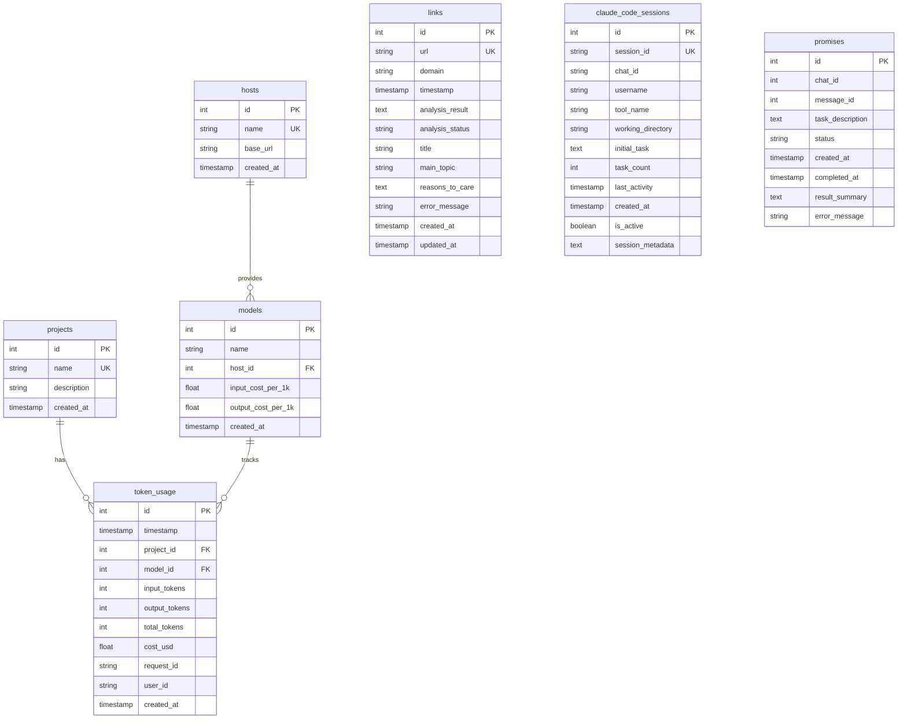

# Complete Data Model Documentation

## Overview

This document provides a comprehensive overview of all data models, database schemas, and their relationships in the AI agent system. The system uses SQLite as its primary database engine with a single unified database file: `system.db`.

## Database Architecture

### Database Type
- **Engine**: SQLite 3
- **File**: `system.db` (unified storage)
- **ORM**: None - Direct SQL queries (no SQLAlchemy despite initial design)
- **Connection Management**: Context-managed connections via `utilities/database.py`

### Migration History
The system previously used separate databases that have been consolidated:
- `token_usage.db` → Migrated to `system.db`
- `links.db` → Migrated to `system.db`
- Legacy databases backed up as `.backup` files

## Database Schema

### 1. Projects Table
Stores project metadata for organizing AI interactions and tracking usage.

```sql
CREATE TABLE projects (
    id INTEGER PRIMARY KEY AUTOINCREMENT,
    name TEXT UNIQUE NOT NULL,
    description TEXT,
    created_at TIMESTAMP DEFAULT CURRENT_TIMESTAMP
);

CREATE INDEX idx_projects_name ON projects(name);
```

**Purpose**: Organization of AI interactions by project
**Key Relationships**: Referenced by `token_usage`

### 2. Hosts Table
Stores AI provider configurations (Anthropic, OpenAI, Ollama).

```sql
CREATE TABLE hosts (
    id INTEGER PRIMARY KEY AUTOINCREMENT,
    name TEXT UNIQUE NOT NULL,
    base_url TEXT,
    created_at TIMESTAMP DEFAULT CURRENT_TIMESTAMP
);

CREATE INDEX idx_hosts_name ON hosts(name);
```

**Purpose**: AI provider management
**Default Data**: Pre-populated with Anthropic, OpenAI, Ollama

### 3. Models Table
Stores AI model configurations and pricing information.

```sql
CREATE TABLE models (
    id INTEGER PRIMARY KEY AUTOINCREMENT,
    name TEXT NOT NULL,
    host_id INTEGER NOT NULL,
    input_cost_per_1k REAL,
    output_cost_per_1k REAL,
    created_at TIMESTAMP DEFAULT CURRENT_TIMESTAMP,
    FOREIGN KEY (host_id) REFERENCES hosts(id),
    UNIQUE(name, host_id)
);

CREATE INDEX idx_models_name ON models(name);
CREATE INDEX idx_models_host_id ON models(host_id);
```

**Purpose**: Model pricing and configuration
**Key Relationships**: 
- `host_id` → `hosts.id`
- Referenced by `token_usage`

### 4. Token Usage Table
Tracks AI model usage for cost monitoring and analytics.

```sql
CREATE TABLE token_usage (
    id INTEGER PRIMARY KEY AUTOINCREMENT,
    timestamp TIMESTAMP NOT NULL,
    project_id INTEGER NOT NULL,
    model_id INTEGER NOT NULL,
    input_tokens INTEGER NOT NULL,
    output_tokens INTEGER NOT NULL,
    total_tokens INTEGER NOT NULL,
    cost_usd REAL,
    request_id TEXT,
    user_id TEXT,
    created_at TIMESTAMP DEFAULT CURRENT_TIMESTAMP,
    FOREIGN KEY (project_id) REFERENCES projects(id),
    FOREIGN KEY (model_id) REFERENCES models(id)
);

CREATE INDEX idx_token_usage_timestamp ON token_usage(timestamp);
CREATE INDEX idx_token_usage_project_id ON token_usage(project_id);
CREATE INDEX idx_token_usage_model_id ON token_usage(model_id);
CREATE INDEX idx_token_usage_user_id ON token_usage(user_id);
```

**Purpose**: Usage tracking and cost monitoring
**Key Relationships**:
- `project_id` → `projects.id`
- `model_id` → `models.id`

### 5. Links Table
Stores analyzed URLs with AI-generated summaries.

```sql
CREATE TABLE links (
    id INTEGER PRIMARY KEY AUTOINCREMENT,
    url TEXT UNIQUE NOT NULL,
    domain TEXT NOT NULL,
    timestamp DATETIME DEFAULT CURRENT_TIMESTAMP,
    analysis_result TEXT,  -- JSON blob
    analysis_status TEXT DEFAULT 'pending',  -- 'success', 'error', 'pending'
    title TEXT,
    main_topic TEXT,
    reasons_to_care TEXT,
    error_message TEXT,
    created_at DATETIME DEFAULT CURRENT_TIMESTAMP,
    updated_at DATETIME DEFAULT CURRENT_TIMESTAMP
);

CREATE INDEX idx_links_url ON links(url);
CREATE INDEX idx_links_domain ON links(domain);
CREATE INDEX idx_links_analysis_status ON links(analysis_status);
CREATE INDEX idx_links_timestamp ON links(timestamp);
```

**Purpose**: URL analysis and content summarization
**JSON Structure** (`analysis_result`):
```json
{
    "title": "Page Title",
    "main_topic": "Core topic summary",
    "reasons_to_care": ["Reason 1", "Reason 2"],
    "key_insights": ["Insight 1", "Insight 2"],
    "technical_details": "Optional technical summary"
}
```

### 6. Claude Code Sessions Table
Tracks Claude Code development sessions for continuity and monitoring.

```sql
CREATE TABLE claude_code_sessions (
    id INTEGER PRIMARY KEY AUTOINCREMENT,
    session_id TEXT UNIQUE NOT NULL,
    chat_id TEXT,
    username TEXT,
    tool_name TEXT NOT NULL,
    working_directory TEXT NOT NULL,
    initial_task TEXT NOT NULL,
    task_count INTEGER DEFAULT 1,
    last_activity DATETIME DEFAULT CURRENT_TIMESTAMP,
    created_at DATETIME DEFAULT CURRENT_TIMESTAMP,
    is_active BOOLEAN DEFAULT 1,
    session_metadata TEXT  -- JSON blob
);

CREATE INDEX idx_claude_sessions_session_id ON claude_code_sessions(session_id);
CREATE INDEX idx_claude_sessions_chat_id ON claude_code_sessions(chat_id);
CREATE INDEX idx_claude_sessions_is_active ON claude_code_sessions(is_active);
```

**Purpose**: Development session tracking and management
**JSON Structure** (`session_metadata`):
```json
{
    "environment": {"os": "macos", "cwd": "/path"},
    "tools_used": ["bash", "edit", "read"],
    "files_modified": ["file1.py", "file2.py"],
    "git_commits": ["commit_hash1", "commit_hash2"]
}
```

### 7. Promises Table
Manages long-running background tasks with status tracking.

```sql
CREATE TABLE promises (
    id INTEGER PRIMARY KEY AUTOINCREMENT,
    chat_id INTEGER NOT NULL,
    message_id INTEGER NOT NULL,
    task_description TEXT NOT NULL,
    status TEXT DEFAULT 'pending',  -- 'pending', 'in_progress', 'completed', 'failed'
    created_at TIMESTAMP DEFAULT CURRENT_TIMESTAMP,
    completed_at TIMESTAMP,
    result_summary TEXT,
    error_message TEXT
);

CREATE INDEX idx_promises_chat_id ON promises(chat_id);
CREATE INDEX idx_promises_status ON promises(status);
CREATE INDEX idx_promises_created_at ON promises(created_at);
```

**Purpose**: Background task management and status tracking
**Status Flow**: `pending` → `in_progress` → `completed`/`failed`

## Data Relationships



## Database Operations

### Connection Management
```python
from utilities.database import get_database_connection, init_database

# Initialize database (creates all tables)
init_database()

# Get connection
with get_database_connection() as conn:
    cursor = conn.cursor()
    cursor.execute("SELECT * FROM projects")
    results = cursor.fetchall()
```

### Key Functions

#### Token Usage Tracking
```python
# Log token usage
log_token_usage(
    project_name="AI-Project",
    host_name="Anthropic",
    model_name="claude-3-opus",
    input_tokens=1500,
    output_tokens=500,
    user_id="user123",
    request_id="req456"
)

# Get usage summary
summary = get_token_usage_summary(days=30)
```

#### Promise Management
```python
# Create promise
promise_id = create_promise(
    chat_id=12345,
    message_id=67890,
    task_description="Generate comprehensive report"
)

# Update promise
update_promise_status(
    promise_id=promise_id,
    status="completed",
    result_summary="Report generated successfully"
)

# Get pending promises
pending = get_pending_promises()
```

#### Link Analysis
```python
# Store analyzed link
conn.execute("""
    INSERT INTO links (url, domain, analysis_result, analysis_status)
    VALUES (?, ?, ?, ?)
""", (url, domain, json.dumps(analysis), "success"))
```

## Startup Behavior

### Message Handling on Startup
When the server starts, it:
1. **Checks for missed messages** via `_check_startup_missed_messages()`
2. **Stores missed messages** in memory (not database)
3. **Processes them** when user sends next message to that chat

### Promise Handling on Startup
Currently, the system:
- ❌ Does NOT check for pending promises
- ❌ Does NOT resume interrupted promises
- ❌ Does NOT notify users about promise status

**Note**: Pending promises remain in the database but are not automatically resumed after server restart.

## Best Practices

### Adding New Tables
1. Add schema to `init_database()` in `utilities/database.py`
2. Create appropriate indexes for query performance
3. Add utility functions for common operations
4. Document relationships and purpose

### JSON Storage Guidelines
- Use JSON blobs for flexible, evolving data structures
- Always validate JSON before storage
- Consider extracting frequently queried fields to columns

### Performance Considerations
- All foreign key columns are indexed
- Timestamp columns are indexed for time-based queries
- Use transactions for multi-table operations
- Consider SQLite's limitations for high-concurrency scenarios

## Future Enhancements

### Planned Features
1. **Promise Resume on Startup**: Query and resume pending promises
2. **Message Queue Table**: Persistent storage for missed messages
3. **Audit Log Table**: Track all system actions for compliance
4. **User Preferences Table**: Store per-user settings and configurations

### Migration Path
When adding new features:
1. Add new tables/columns in `init_database()`
2. Create migration functions for existing databases
3. Update this documentation
4. Add appropriate indexes and constraints