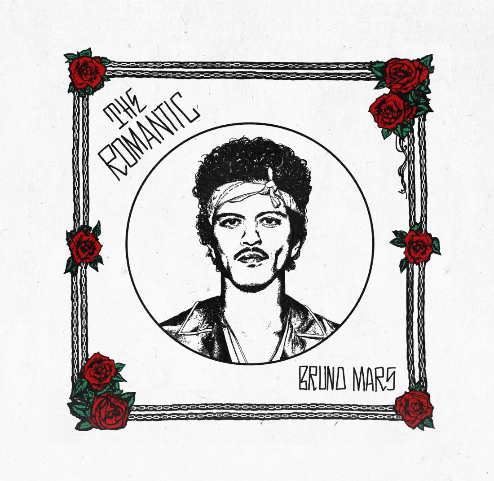

# Design System Inspiration

Reference images that inform the Cuttlefish/Yudame visual identity.

## Images

### bruno-mars-dude-romantic.jpg

**Source**: Hand-drawn illustration, artist unknown
**Relevance**: Strong alignment with brand principles:

| Element | Brand Connection |
|---------|-----------------|
| **Black ink linework** | Bold, hand-drawn ink strokes — matches our "black ink on warm cream" foundation |
| **Rough paper texture** | Organic, tactile background that gives warmth to high-contrast linework |
| **Red roses as sole color accent** | Mirrors our red-annotation-only color strategy |
| **High contrast, minimal palette** | Warm minimalism with intentional restraint |

**Key takeaway**: Black ink linework on a rough paper background — demonstrates how hand-drawn strokes on an organic texture create visual warmth and impact through restraint.
