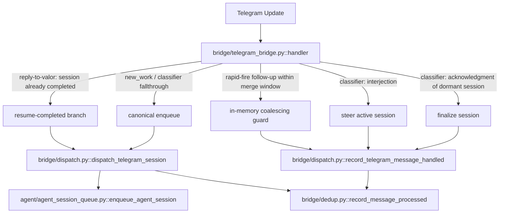

# Bridge Module Architecture

The Telegram bridge (`bridge/telegram_bridge.py`) is organized into focused sub-modules:

| Module | Responsibility |
|--------|---------------|
| `bridge/media.py` | Media detection, download, transcription, image description |
| `bridge/routing.py` | Message routing, project config, mention/response classification |
| `bridge/context.py` | Context building, conversation history, reply chains, implicit-context heuristic (`references_prior_context`) |
| `bridge/response.py` | Message formatting, reactions (re-exports from `agent/constants.py`), file extraction, sending |
| `bridge/catchup.py` | Abandoned session revival and re-enqueueing |
| `bridge/reconciler.py` | Periodic scan for messages missed during live connection |
| `bridge/dedup.py` | Per-chat message dedup storage (`DedupRecord`), `is_duplicate_message`, `record_message_processed` |
| `bridge/dispatch.py` | Centralized dispatch wrapper: every live-handler ingestion site enqueues and records dedup through `dispatch_telegram_session` / `record_telegram_message_handled` |

## telegram_bridge.py

The main module (`bridge/telegram_bridge.py`) serves as the entry point and coordinator:
- Initializes the Telegram client and event handlers
- Loads configuration and propagates it to sub-modules
- Contains the `handler()` event callback and `main()` startup function
- Maintains backward-compatible imports so existing code continues to work
- Enqueues `AgentSession` records to Redis via `enqueue_agent_session()`
- Registers output callbacks for session reply delivery

**The bridge does not manage session execution.** Session lifecycle (recovery, worker spawning, orphan cleanup, health loop) is exclusively the worker's responsibility. See [Bridge/Worker Architecture](bridge-worker-architecture.md) for the full separation design.

## Import Guidelines

New code should import directly from sub-modules:

```python
# Preferred
from bridge.media import get_media_type
from bridge.routing import find_project_for_chat
from bridge.context import build_context_prefix

# Still works (backward compat) but not preferred
from bridge.telegram_bridge import get_media_type
```

## Configuration Propagation

Sub-modules that depend on runtime configuration (loaded from `~/Desktop/Valor/projects.json` and `.env`) receive it via module-level attribute assignment in `telegram_bridge.py` at startup. This avoids circular imports while ensuring sub-module functions have access to config, project mappings, and active project lists.

## Message Ingestion Flow

The `handler()` callback in `telegram_bridge.py` has five routes that can end in a dedup record. All five route through `bridge/dispatch.py` rather than calling `enqueue_agent_session` / `record_message_processed` directly. This centralization is enforced by an AST contract test (`tests/unit/test_bridge_dispatch_contract.py`) that fails the build if any `handler` branch bypasses the wrapper.



The wrapper records dedup only after `enqueue_agent_session` returns successfully, so a failed enqueue leaves dedup unrecorded and the reconciler can retry the message on its next scan.

Recovery paths (`bridge/catchup.py`, `bridge/reconciler.py`) are intentionally NOT routed through `bridge/dispatch.py` -- they keep their explicit `enqueue_agent_session` + `record_message_processed` pairing so future maintainers can see that these paths are different from the live handler's dispatch.
