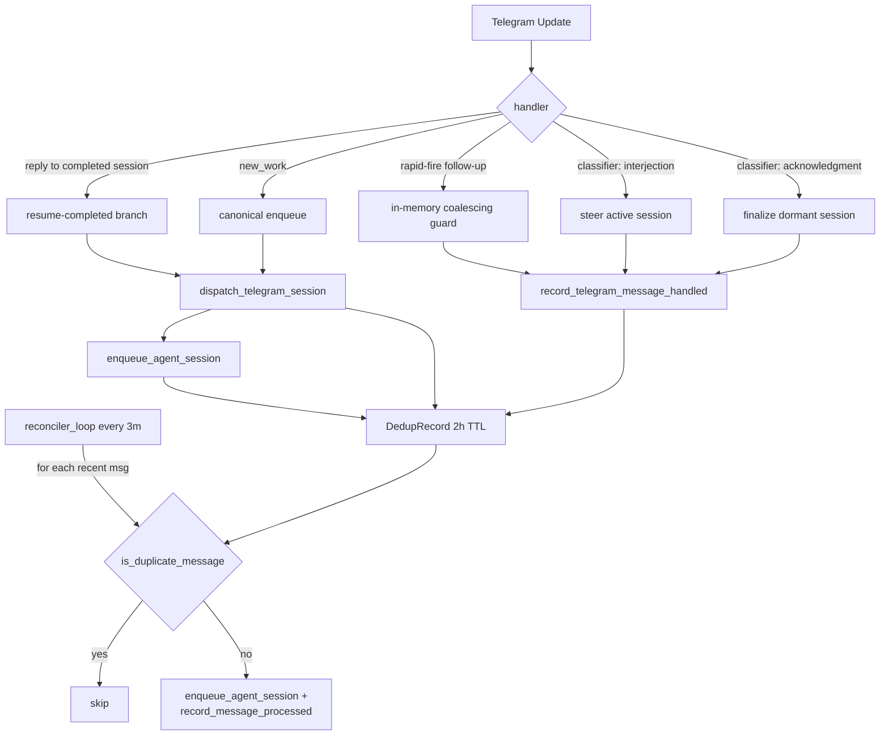

# Message Reconciler

Periodic background loop that detects and recovers Telegram messages missed during a live bridge connection.

## Problem

Telethon can silently drop updates when the Telegram server delivers them out of sequence or the client misses a `pts` (persistent timeline sequence) gap. Existing reliability mechanisms only cover restart and startup scenarios:

- `catch_up=True` replays on reconnect
- `bridge/catchup.py` scans once at boot
- Dedup checks prevent re-processing but cannot detect messages that never arrived

The reconciler fills the gap by scanning continuously while the bridge is alive.

## How It Works

The reconciler runs as an `asyncio.create_task` background loop inside the bridge, alongside the heartbeat and session watchdog.

### Scan Cycle

Every 3 minutes (configurable via `RECONCILE_INTERVAL_SECONDS`):

1. Fetches recent messages from each monitored group via `client.get_messages()`
2. Filters to messages within the lookback window (default 10 minutes)
3. Checks each message against dedup records (`is_duplicate_message()`)
4. Skips outgoing messages, empty-text messages, and messages that fail routing (`should_respond_async()`)
5. Enqueues qualifying missed messages via `enqueue_agent_session()` with `priority="low"`
6. Records dispatched messages in dedup to prevent future re-dispatch

### Data Flow

```
reconciler_loop (every 3min)
    |
    +-- for each monitored group:
    |       get_messages(limit=20)
    |       for each message:
    |           outside lookback window? --> stop scanning group
    |           is outgoing? --> skip
    |           no text? --> skip
    |           is_duplicate? --> skip
    |           should_respond? no --> skip
    |           enqueue_agent_session(priority="low")
    |           record_message_processed()
    |
    +-- log summary: "Scanned N group(s), recovered M message(s)"
```

## Configuration

| Constant | Default | Purpose |
|----------|---------|---------|
| `RECONCILE_INTERVAL_SECONDS` | 180 (3 min) | Time between scans |
| `RECONCILE_LOOKBACK_MINUTES` | 10 | How far back each scan looks |
| `RECONCILE_MESSAGE_LIMIT` | 20 | Max messages fetched per group per scan |

These are module-level constants in `bridge/reconciler.py`. They are not exposed in `projects.json` or `.env` -- adjust by editing the source.

## Logging

| Level | Condition |
|-------|-----------|
| INFO | Reconciler started (once at boot) |
| DEBUG | Scan complete, no gaps found (normal path) |
| WARNING | One or more missed messages recovered |
| ERROR | Exception during scan (loop continues) |

Log lines are prefixed with `[reconciler]` for filtering:

```bash
grep reconciler logs/bridge.log
```

## Relationship to Other Components

| Component | Relationship |
|-----------|-------------|
| `bridge/catchup.py` | Catchup scans once at startup with a longer lookback (up to 24h). The reconciler scans continuously with a shorter 10-minute window. Both use the same dedup and routing interfaces. |
| `bridge/dedup.py` | The reconciler gates all re-dispatches through `is_duplicate_message()` and records recoveries via `record_message_processed()`. |
| `monitoring/session_watchdog.py` | The session watchdog monitors stalled SDK sessions. The reconciler monitors missed Telegram messages. Different failure modes, same background-loop pattern. |
| Bridge self-healing | The reconciler complements crash recovery (watchdog, catchup) by covering a gap that only manifests during a live, healthy connection. |

## Race Conditions

The live handler and the reconciler can both observe the same incoming message briefly, but the window is narrow and the outcomes are bounded.

**Canonical path (queue coalesces).** The live handler's main enqueue path derives `session_id = tg_{project}_{chat_id}_{message_id}` -- identical to the `session_id` the reconciler would derive for the same message. If both fire before dedup is recorded, the second `enqueue_agent_session` is a no-op because the queue coalesces duplicate `session_id`s. No duplicate dispatch.

**Resume-completed and other early-return branches (formerly unsafe, now mitigated).** The handler has several early-return branches that do NOT derive a fresh `session_id` from the incoming message -- they reuse an existing session id (resume-completed branch), steer an in-memory coalesced session, or finalize a dormant session. Their `session_id` differs from the reconciler's `tg_{project}_{chat_id}_{message_id}`, so the queue's coalescing guard does not fire. Historically each branch had to remember to call `record_message_processed` manually; a missed call produced a duplicate dispatch ~3 minutes later when the reconciler's next scan ran.

`bridge/dispatch.py` closes this gap by providing `dispatch_telegram_session` (wraps enqueue + dedup record) and `record_telegram_message_handled` (dedup record only, for steer/finalize branches). Every live-handler branch now routes through one of these two helpers, so the reconciler's next `is_duplicate_message` check always returns True for a message the live handler has already handled. An AST contract test (`tests/unit/test_bridge_dispatch_contract.py`) fails the build if any new handler branch reintroduces a direct `enqueue_agent_session` or `record_message_processed` call.

**Residual crash window.** If the bridge crashes between `enqueue_agent_session` returning and `record_message_processed` being written, the enqueued session survives in Redis but dedup is not recorded. The worker's recovery path will still pick up the enqueued session; the reconciler's next scan may also enqueue a second session under a different `session_id`. Orders of magnitude less likely than the class of bug the wrapper removes; accepted as residual risk.

## Ingestion Paths



Every ingestion path writes to the same `DedupRecord` gate, so the reconciler's next scan short-circuits on anything the live handler already handled.

## API Cost

One `get_messages(limit=20)` call per monitored group per interval. With 5 groups at 3-minute intervals, that is approximately 100 API calls per hour -- well within Telethon rate limits.

## Files

| File | Purpose |
|------|---------|
| `bridge/reconciler.py` | Reconciliation loop and single-scan function |
| `bridge/telegram_bridge.py` | Registers reconciler as background task |
| `bridge/dispatch.py` | Centralized dispatch wrapper; every live-handler ingestion site records dedup here |
| `bridge/dedup.py` | `DedupRecord` storage, `is_duplicate_message`, `record_message_processed` |
| `tests/unit/test_reconciler.py` | Unit tests for gap detection logic |
| `tests/unit/test_bridge_dispatch_contract.py` | AST contract test: handler must not bypass `bridge/dispatch.py` |
| `tests/integration/test_reconciler.py` | Integration test for end-to-end recovery |

## Related

- [Bridge Self-Healing](bridge-self-healing.md) -- crash recovery, watchdog, catchup lookback
- [Bridge Module Architecture](bridge-module-architecture.md) -- bridge sub-module organization
- [Message Pipeline](message-pipeline.md) -- deferred enrichment and zero-loss restart
