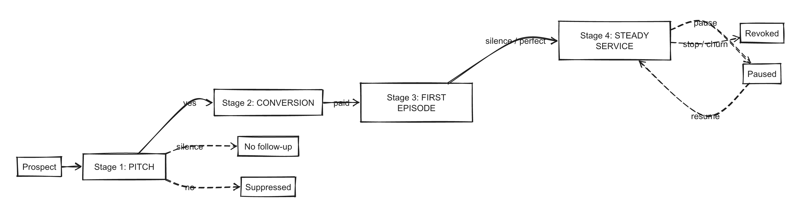
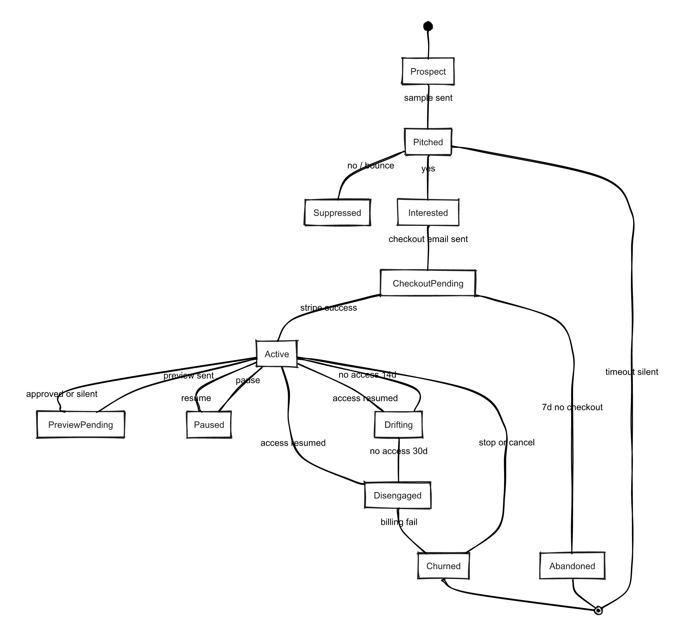
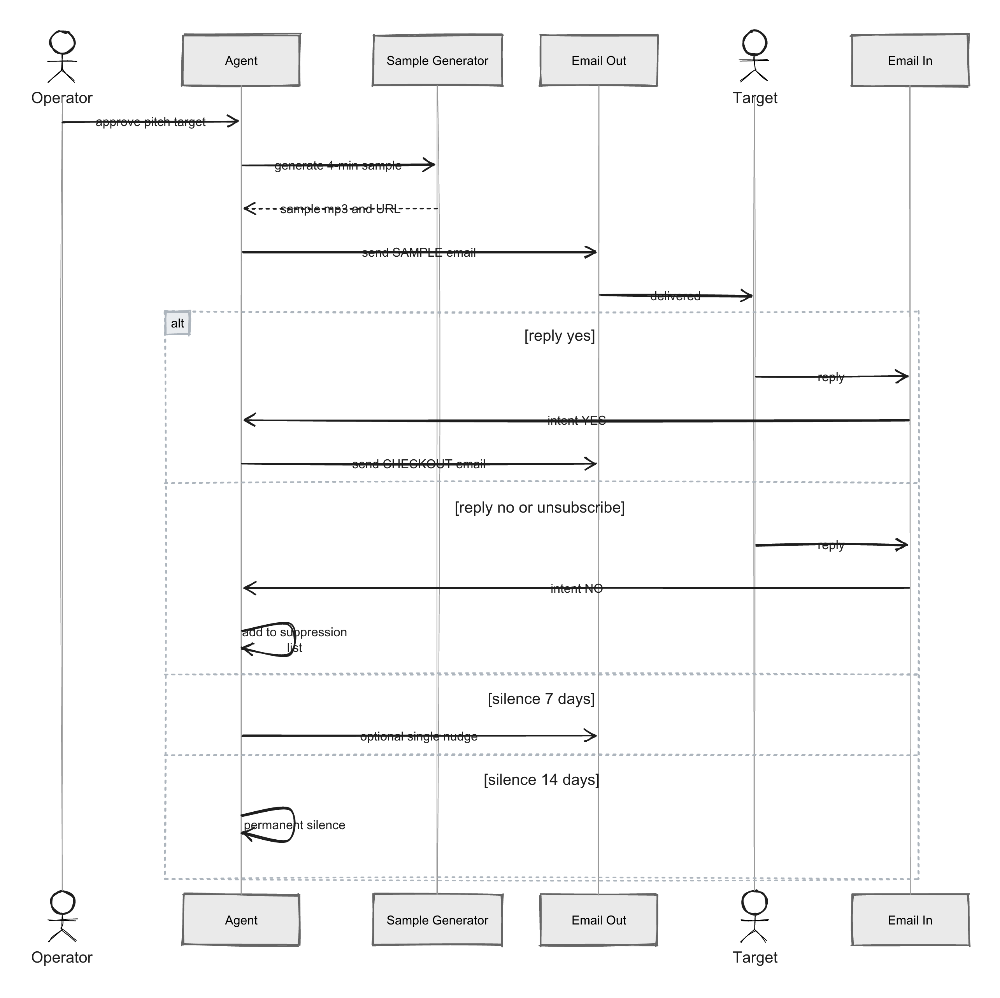
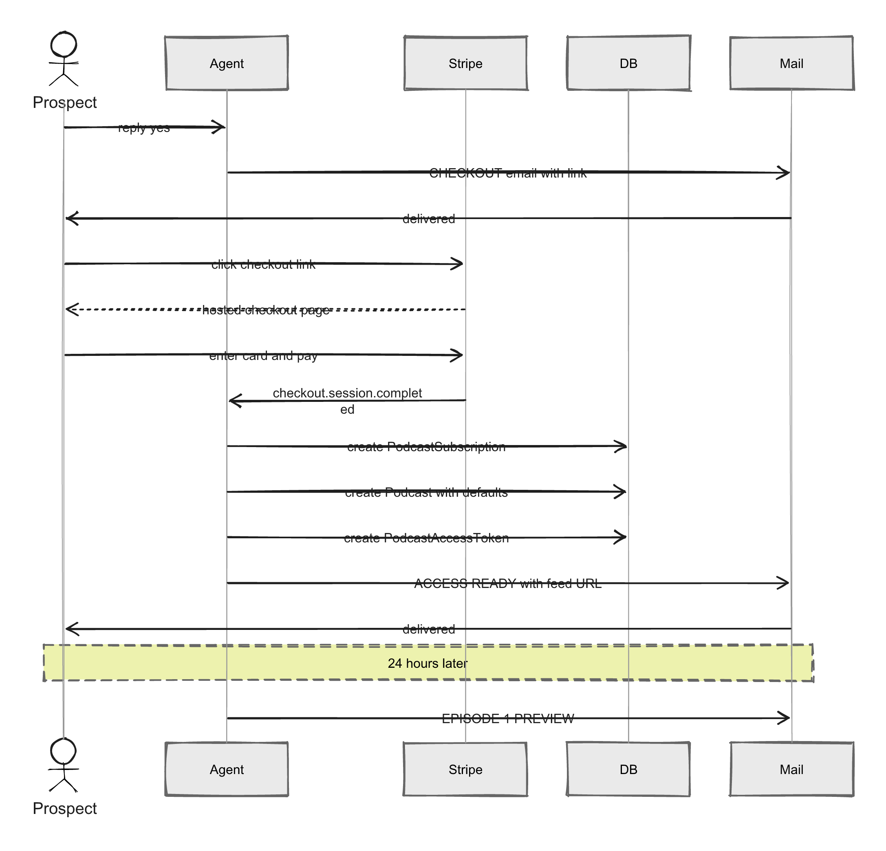
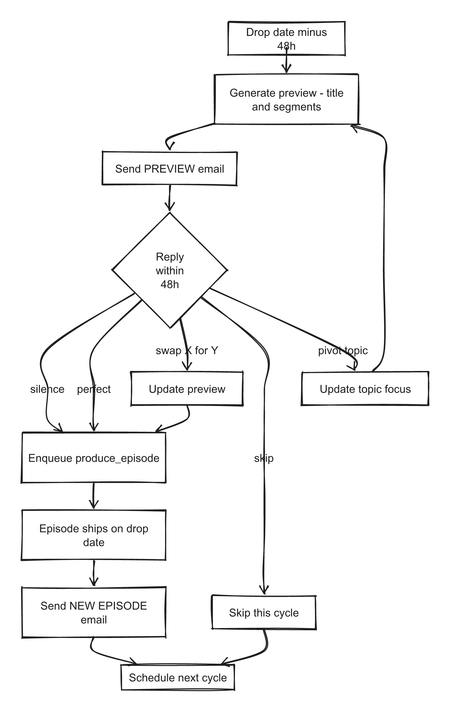
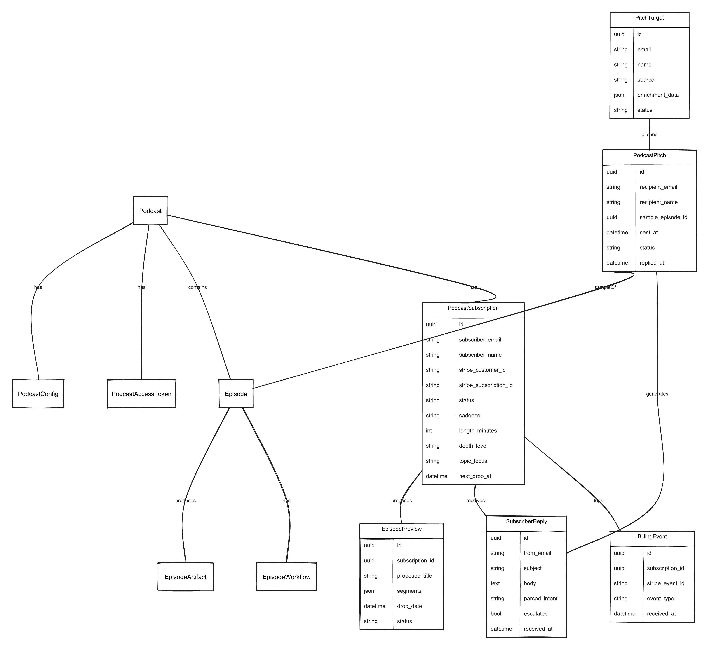

# Private Podcast User Journey Mapping

Product journey design for the private podcast product, operated agentically via email. Companion to [Email UX](./private-podcast-email-ux.md) (outgoing email structure), [MVP PRD](./private-podcast-mvp.md) (what we build first), and [Full PRD](./private-podcast-prd.md) (the complete vision). This document defines the end-to-end relationship arc and the agent's job at each stage.

Diagrams in this document are rendered in a hand-drawn Excalidraw style from mermaid source files in [`./private-podcast-diagrams/`](./private-podcast-diagrams/).

---

## Vision

A private podcast product where the **inbox is the product surface**. The subscriber never logs in to manage anything. The agent — acting on their behalf — pitches, onboards, produces, ships, and adapts. Each touchpoint honors the rules from the Email UX doc: defaults over questions, safe ignore, one job per email, no reply = success.

The mental model is **concierge, not SaaS**. The subscriber is a client, not a user. We lead the service. They redirect us when they want something different.

---

## The Four Stages



```
1. PITCH          (cold → interested)
2. CONVERSION     (interested → paying)
3. FIRST EPISODE  (paying → active subscriber)
4. STEADY SERVICE (active → long-term client)
```

Each stage has a distinct agent job, a subscriber mental state, a default path, and failure modes to avoid.

### Subscriber State Machine

The full subscriber lifecycle is a state machine. Every transition is triggered either by an explicit reply, a Stripe event, or a time-based check. The default path (silence) always advances forward without interruption.



---

## Stage 1: The Pitch

### Subscriber mental state
- Has never heard of us
- Receives ~50 cold emails/week, deletes 48
- Pattern-matches on "pitch deck language" within 3 seconds and deletes
- Needs a concrete reason to read past the first line

### Agent job
Earn 10 seconds of attention by delivering a **specific, tangible artifact** — not a pitch. The product being offered is "a podcast made for you", so the pitch itself should be a miniature version of that product.

### The hook: send a real sample

The pitch email contains a **real, already-generated 3-5 minute sample episode** made specifically for the recipient. Not a template. Not a "here's what we could do". A concrete episode that mentions them by name, references their work, and covers a topic we inferred they'd care about.

This inverts the cold email economy. Instead of asking for attention to describe a product, we use the product to earn attention.

### Touchpoints
| Channel | Purpose |
|---|---|
| Cold email #1 | Sample episode + one-line offer |
| (silence) | No follow-up for 7 days |
| Cold email #2 (optional) | Single nudge: "Still here?" |
| (silence) | Permanent silence. No further outreach. |



### Sample email structure
```
Subject: [SAMPLE] 4-minute episode for {First Name}

{First Name},

I made this for you: a 4-minute episode about {specific topic
drawn from their public work}.

▶ Listen  [4:12]

If this is useful, I'll make you a weekly 15-minute version.
One reply — "yes" — is all it takes.

No reply = no follow-up.
```

### Defaults and safe ignore
- Ignore → nothing happens. Zero follow-up spam.
- "Yes" → Stage 2 begins.
- "Tell me more" → pricing + format one-pager (still ≤ 10-second read).
- "Not for me" / "unsubscribe" → permanent suppression, confirmed once.

### Failure modes
- Generic samples. The sample must cite something the recipient specifically cares about.
- Multi-paragraph value props. The audio is the value prop.
- Tracking pixels as the primary signal. We use replies, not opens.
- Pitch copy that sounds like marketing. The tone is a concierge proposing service, not a salesperson closing.

### Open questions for product
- Who sources targets, and how? (LinkedIn scraping? Manual curation? Referrals only?)
- Can we afford to speculatively generate a sample episode for every recipient? Cost per sample must be low enough to send at volume.
- CAN-SPAM / GDPR compliance for cold outreach with AI-generated personalized content.
- Is the sample durable (hosted as a real episode) or ephemeral (destroyed after 30 days if not converted)?

---

## Stage 2: Conversion

### Subscriber mental state
- "Interested, but is this a scam?"
- Wants to know: price, commitment, how to stop
- Does NOT want: to create an account, pick a password, verify their email, fill out a form, schedule a call

### Agent job
Move them from "yes" to "paying" with **zero friction beyond Stripe checkout itself**. No account creation as a separate step. No configuration questionnaire. Defaults are chosen for them and can be adjusted later in one click.

### The flow
```
"yes" reply
  → agent sends [CHECKOUT] email with one button
    → Stripe Checkout (hosted)
      → success
        → [ACCESS READY] email (within 60s) with feed URL + "adjust your podcast" link
```



Account creation happens **server-side on Stripe success**. The subscriber never sees a signup form. Email address comes from Stripe. Their `PodcastSubscription` record is created by the webhook handler.

### Defaults applied on first episode setup
| Field | Default |
|---|---|
| Podcast title | `{First Name}'s Weekly Brief` |
| Privacy | `restricted` (private feed, tokenized URL) |
| Cadence | Weekly |
| Length | 15 minutes |
| Depth | `accessible` (no baseline knowledge assumed) |
| Topic focus | Inferred from the sample episode topic |
| Voice/tone | Default NotebookLM two-host format |

### The "adjust your podcast" page
One page, ≤ 6 fields, all optional:

- Podcast name (text, prefilled)
- Length (15 / 25 / 40 min)
- Cadence (weekly / biweekly / monthly)
- Depth (accessible / intermediate / advanced)
- Topic focus (freeform, prefilled from sample)
- Privacy (keep private / share with a teammate)

No "save and continue". Changes auto-save. No confirmation. Closing the tab is success.

### Touchpoints
| # | Email | Triggered by | Purpose |
|---|---|---|---|
| 1 | `[CHECKOUT]` | "yes" reply | Single button to Stripe |
| 2 | `[ACCESS READY]` | Stripe success webhook | Feed URL + adjust link |
| 3 | `[EPISODE 1 PREVIEW]` | 24h after checkout | (begins Stage 3) |

### Failure modes
- Asking them to create a password before or after checkout.
- Requiring email verification before they can listen to Episode 1.
- A settings page with more than 6 fields.
- Any form that blocks access to the feed URL.
- Welcome email that buries the feed URL below a marketing preamble.
- Requiring them to pick a podcast name before they can check out.

### Open questions for product
- Pricing model: flat monthly ($25/mo? $50/mo?) vs. per-episode? Annual-only to reduce churn friction?
- Refund policy — how do we handle "I paid but the first episode wasn't what I wanted"?
- Who is the buyer? B2C individual vs. B2B exec expense. Different checkout flows might be warranted.
- Stripe Customer Portal: expose for self-service billing management, or keep all billing ops in email?
- Do we offer a money-back guarantee on the first episode as a way to lower "is this a scam" fear?

---

## Stage 3: First Episode Kickoff

### Subscriber mental state
- "I paid. Now what? What will they actually make?"
- Slight anxiety that the product won't match the sample quality
- Does NOT want a creative writing assignment ("what do you want to hear about?")

### Agent job
**Propose a specific first episode. Don't ask open-ended questions.** The agent acts like a concierge who already planned tomorrow's menu — the subscriber just approves or redirects.

### The mechanism

24 hours after checkout, send a **preview email**:

```
Subject: [EPISODE 1 PREVIEW] {proposed title}

{First Name},

Episode 1 drops {day}. Here's what I'm making:

**{Proposed title}**
{One-sentence premise}

- Segment 1: {topic}
- Segment 2: {topic}
- Segment 3: {topic}

Length: 15 min
Drops: {date}

Reply to adjust:
  • "perfect" — ship it (or silence)
  • "swap X for Y" — single-line redirect
  • "different topic: Z" — pivot entirely
  • "later" — push back one week
```

### Safe ignore
Silence → we ship exactly what was proposed on the promised day. **This is the deal.** Silence is not ambiguity; it is trust.

### Why this works
- No creative labor on the subscriber's side.
- The subscriber sees that we already understand them (we proposed something specific).
- One-line redirects are cheap to send and cheap to parse.
- The relationship starts with demonstration, not negotiation.

### The preview → ship loop

The same mechanism powers every subsequent episode. Stage 3 and Stage 4 share this loop — the only difference is that Stage 3 draws topic inference from the sample episode, while Stage 4 draws from prior episode history.



### Failure modes
- Asking "what do you want to hear about?" (makes them do the work)
- Sending a form with checkboxes (breaks inbox-native principle)
- Asking for approval before production (latency is the enemy)
- Waiting for a reply to ship (waiting is a contract violation)

### Open questions for product
- What happens if Episode 1 isn't accepted by the subscriber? Reroll free once? Money-back?
- Do we offer a preview audio clip in the preview email, or is the text preview enough?
- How do we reliably infer a good first episode topic? From the sample episode? From checkout form? From their public bio?

---

## Stage 4: Steady Service

### Subscriber mental state
- "I pay for this thing. It should just work."
- Wants proactive leadership, not a dashboard
- Will churn if asked to manage anything
- Will churn if the content drifts away from their interests without a check-in

### Agent job
**Lead.** Propose every episode 48 hours before drop. Ship on schedule. Never ask open-ended questions. Adapt based on listening behavior, not surveys.

### The weekly rhythm
```
Friday  → [NEXT WEEK] preview email (silence = ship)
Monday  → [NEW EPISODE] delivery email
```

The Friday preview reuses the Stage 3 mechanism. Every episode is a menu the concierge proposes. Every silence is implicit approval.

### Monthly reality check
Once a month — and **only** once a month — the agent asks one question:

```
Subject: [MONTHLY] Still landing?

{First Name},

Last 4 episodes:
  • {title 1}
  • {title 2}
  • {title 3}
  • {title 4}

Keep going this direction, or want a pivot?

Reply "pivot: {direction}" to shift. No reply = we keep going.
```

This is the only non-transactional email in the cadence. Everything else is access delivery or episode delivery.

### Behavioral adaptation

The agent watches three signals (via feed access logs + `PodcastAccessToken.last_accessed_at`):

| Signal | Meaning | Agent response |
|---|---|---|
| Listens within 24h of drop | Engaged | Continue as planned |
| Last access > 14 days | Drifting | Next monthly check-in is flagged |
| Last access > 30 days | Disengaged | Send a "pause?" email with default = continue |
| Explicit "stop" reply | Done | Revoke access, send `[ACCESS REVOKED]` |

### Lifecycle events that break the cadence

| Event | Agent behavior |
|---|---|
| Billing failure | Escalate to human operator; subscriber gets `[BILLING]` email from Stripe only |
| Renewal | Silent. No "about to renew" email unless price changes. |
| Topic drift request ("pivot:") | Confirmed via next preview, not a separate acknowledgment email |
| "Skip next week" | Confirmed once, no reminder |
| Refund request | Routed to human operator |
| Legal / abuse reports | Routed to human operator |

### Failure modes
- Sending "we haven't heard from you in a while!" nag emails.
- Surveying satisfaction (NPS, thumbs up/down). Listening behavior is the signal.
- Adding features and announcing them ("new! custom intro music!"). The product is invisible.
- Changing cadence without explicit confirmation.
- Using monthly check-ins as a surveillance mechanism. One question, one default, done.

### Open questions for product
- What's the right cadence default — weekly, biweekly, or subscriber-set?
- How does the agent detect topic drift requests from within a normal reply thread vs. explicit pivot commands?
- Do we support "guest episodes" — subscriber requests a one-off on a different topic?
- How do we handle shared feeds (one subscriber shares the URL with a teammate)? Detect? Ignore? Offer a seat upgrade?

---

## Agentic Email Principles (Across All Stages)

These extend the rules in [Private Podcast Email UX](./private-podcast-email-ux.md) and apply to the agent's behavior across the entire lifecycle.

### 1. The inbox is the interface

No dashboard is required to use the product. A subscriber should be able to complete every lifecycle action (pitch response, checkout, first episode config, pivots, pause, stop) from their inbox alone.

### 2. Single-word replies as state transitions

The agent must recognize and act on:

| Reply | Action |
|---|---|
| `yes` | Advance to Stage 2 (checkout) |
| `no` / `unsubscribe` / `stop` | Permanent suppression |
| `perfect` | Approve preview, ship as-is |
| `skip` | Pause one cycle |
| `pause` | Pause indefinitely |
| `resume` | Un-pause |
| `pivot: {direction}` | Topic shift acknowledged next cycle |
| `help` | Link to support page |

Anything longer is routed to a human operator for the first release. A later version can use an LLM to interpret freeform replies, but defaults must still dominate.

### 3. Ignore is approval

Silence means the subscriber trusts us. We ship the default every time. This is the core contract and is non-negotiable. The moment we violate it, we become a nagware product.

### 4. Humans handle exceptions

Any reply the agent can't map to a known transition gets routed to a human operator. The agent never guesses at ambiguous intent. It's better to be silent than wrong.

### 5. Billing is never conversational

Stripe owns billing. The agent never negotiates, never discusses price, never processes refunds. Billing emails are sent by Stripe (or transactional templates matching Stripe's tone), not by the agent.

---

## Data Model Implications

This journey requires models that don't yet exist. Minimum additions:

| Model | Purpose |
|---|---|
| `PodcastSubscription` | Paying subscriber: email, name, Stripe customer ID, podcast FK, status, cadence, length, depth, topic focus |
| `PodcastPitch` | Cold outreach record: recipient, sample episode FK, sent at, replied status, suppression state |
| `PitchTarget` | Pre-outreach target pool with enrichment data and operator approval gating |
| `EpisodePreview` | Proposed-but-not-yet-produced episode: title, segments, scheduled drop, subscriber FK, status (proposed/approved/redirected/shipped) |
| `SubscriberReply` | Inbound email log: from, subject, body, parsed intent, acted upon, escalated to human |
| `BillingEvent` | Stripe webhook event log for audit and idempotency |
| `SuppressionEntry` | Global unsubscribe / bounce / complaint list |

The existing `PodcastAccessToken` can serve feed authentication for Stage 2+ without modification. See [PRD §8](./private-podcast-prd.md#8-data-model) for full schemas.



---

## What's Missing (Product Owner Punch List)

Before any of this can be built, product needs to answer:

1. **Target definition.** Who is the ideal first 100 subscribers? (B2C professionals? B2B execs? A specific vertical?)
2. **Pricing.** Flat monthly rate, tier, or custom? Annual-only? Free trial or not?
3. **Sample generation economics.** Can we afford speculative samples for cold outreach at the volume we need?
4. **Outreach sourcing.** Where do pitch targets come from? Manual curation is the safest MVP.
5. **Legal review.** CAN-SPAM, GDPR, AI-generated content disclosure requirements for cold outreach.
6. **Escalation path.** Who is the "human operator" handling ambiguous replies, refunds, and billing issues? What's their SLA?
7. **Success metrics.** What does "working" look like per stage? Proposed:
   - Stage 1: sample → reply conversion rate ≥ 5%
   - Stage 2: "yes" reply → paid conversion ≥ 60%
   - Stage 3: Episode 1 preview → "perfect" or silence ≥ 80%
   - Stage 4: 30-day retention ≥ 85%, 6-month retention ≥ 50%
8. **Failure recovery.** What happens when a subscriber's first episode is bad? Reroll policy? Credit? Refund?

---

## Next Steps

1. Validate the "real sample in pitch email" hook with 5 test targets before building anything.
2. Define pricing and escalation ownership.
3. Design the `PodcastSubscription` and `PodcastPitch` data models.
4. Build Stage 2 (Stripe checkout → feed delivery) first — it's the most mechanical and unlocks everything else.
5. Build Stage 4 (steady cadence) next — the core value loop.
6. Build Stage 3 (first-episode intake) on top of Stage 4's preview mechanism.
7. Build Stage 1 (pitch) last — it depends on being able to generate real sample episodes cheaply at volume, and on a validated value prop from subscribers already in the system.

The order is reversed from the journey itself because the proof-of-value for cold outreach requires having paying subscribers first to learn what actually works.
