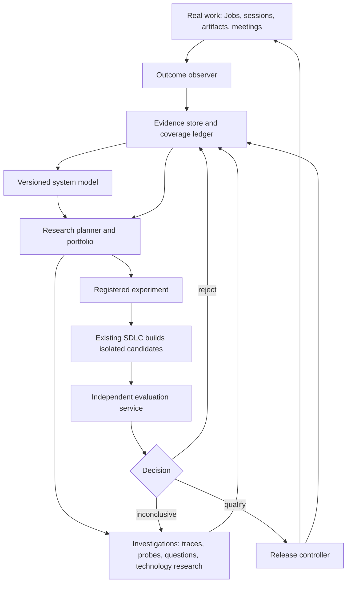

# Recursive self-improvement: owning the research loop

## Decision and intended outcome

Build a durable improvement controller around Valor's existing execution system. The controller owns discovery of weaknesses, gathering missing information (including asking people questions), designing experiments, constructing candidate versions, evaluating them, and releasing measured improvements. It also investigates opportunities to acquire capabilities that current work never exercises.

The controller is a persistent state machine served by bounded agent sessions, not an indefinitely running reflective conversation. Reuse Jobs, AgentSessions, Reflections, worktrees, the SDLC pipeline, and existing communication adapters. Add explicit research records and evaluation/release boundaries. Do not build a second general task scheduler.

The first deliverable is a complete autonomous research cycle. Subsequent releases allow the controller to propose changes to its own planning and experimentation mechanisms. This is system-level recursive improvement with externally supplied models; model-weight training and claims of unbounded acceleration are outside scope.

This document proposes implementation; it does not authorize deployment, meeting attendance, new external communications, or changes to existing human-owned approval signals.

## Success criteria supplied by Tom

1. Less architectural rescue from Tom. The dominant UI failure is misunderstanding the end-to-end user journey: locally plausible work that misses the larger purpose.
2. Greater competence communicating with clients and nontechnical stakeholders, including acquiring meeting, real-time voice, and related tool capabilities when useful.
3. A plateau in bug creation as the system matures.

Operationalize these as a vector, not a single gameable reward:

| Objective | Primary measures | Required context and guardrails |
|---|---|---|
| Architectural independence | Rescue incidence and severity per comparable task; observed Tom time | Attempted workload, difficulty, abandoned work, and whether needed clarification was suppressed |
| Stakeholder competence | Verified communication-task completion; corrected misunderstandings; accurate and fulfilled commitments | Capability coverage, factual accuracy, stakeholder feedback, latency, and authorized scope |
| Sustainable quality | Unique defect arrival per exposure; recurrence; severity-weighted unresolved debt | Raw issue count, detection coverage, duplicate/label changes, throughput, and defect observation window |

Distinguish architect intervention, ordinary preference, new scope, and expected domain clarification. Classification is uncertain evidence until corroborated. Never invent time estimates from message counts. A declining bug count with declining detection is not a win. Publish raw measures beside normalized ones.

## Current repository grounding

Inspected at the baseline above; live Redis evidence and fleet deployment were not verified. The checkout changed during the preceding discussion, so implementation begins with a freshness check.

| Existing component | Reuse | Gap |
|---|---|---|
| `models/job.py` | Durable responsibility, versioned goals, bidirectional expectations | Research and experiments need typed artifacts; do not duplicate Job ownership |
| `models/session_event.py`, `models/session_log.py` | Session evidence and lifecycle references | Completion is not verified user success; capture revisions, interventions, and delayed outcomes |
| `models/task_type_profile.py` | Existing maturity/rework aggregates | Aggregates are advisory; preserve task-level evidence for comparisons |
| `agent/pipeline_ledger.py` | Durable issue-level stage/verdict lineage | Research lifecycle is distinct from implementation lifecycle |
| `agent/reflection_scheduler.py` | Scheduled, supervised dispatch | Add bounded collection/controller ticks rather than another daemon |
| `agent/worktree_manager.py` | Candidate checkout isolation | Also isolate memory, dependencies, runtime configuration, credentials, and external side effects |
| `agent/steering.py`, `tools/ask_poll.py` | Existing conversation delivery and response transport | Add durable question identity, answer binding, deduplication, expiry, and interpretation |
| `agent/memory_extraction.py`, `models/memory.py` | Discovery and retrieval of prior knowledge | Usage/confidence signals are not causal evidence of task improvement |
| `tools/memory_eval/` | Paired comparisons, uncertainty estimates, artifact patterns | Generalize to full tasks and candidate bundles |
| `scripts/sdlc_reflection.py` | Source of procedure-learning candidates | Extracted PR lessons lack behavioral validation |
| `scripts/autoexperiment.py` | Historical design reference only | Obsolete target; no actual branch isolation; unsafe dry-run semantics; inadequate evaluation |

Do not revive autoexperiment as a parallel optimizer. Inventory its installation paths, retire its schedule/entry point when the replacement is available, and update misleading docs. Preserve historical reports as evidence, clearly marked as legacy.

## Architecture

There are three execution authorities:

- **Research authority:** can read scoped evidence, author hypotheses, request investigations, and dispatch experiments within an approved charter.
- **Candidate authority:** can modify declared candidate surfaces in an isolated environment. Cannot read private evaluation answers, alter release policy, access production state, or contact real stakeholders during replay.
- **Evaluation/release authority:** runs frozen evaluation contracts, writes signed or access-controlled verdicts, and promotes exact artifact digests within policy. A separate process identity enforces the boundary; agent role prompts alone do not.

Begin with a local supervisor-owned evaluation process and OS-level separation. A worktree is not a security boundary. Until evaluator secrets and production credentials are separated from candidate execution, automated promotion remains disabled.

## 1. Outcome observer

Collect incremental evidence from Job goal/expectation changes, session traces, delivered artifacts, human corrections, issue lifecycle events, test failures, production incidents, and authorized stakeholder interactions. Each adapter owns a durable cursor and reports its coverage, lag, errors, and source version.

Write evidence asynchronously outside the user-response critical path. Reconcile missed events from source history using overlapping windows and stable source IDs. Deduplicate before interpreting. Partial data is marked partial, never converted to success or absence of failure.

For each sampled Job, assemble an outcome packet:

- Intended outcome and the goal version effective when work began.
- Inputs and constraints available at the time; subsequent scope changes separately.
- Actual artifacts, walkthrough traces, user feedback, and delayed defects.
- Human interventions and whether they changed architecture, preferences, or requirements.
- Effort and cost with provenance; missing quantities remain unknown.
- Links to the exact system release, model, memory state, and execution records.

Observe successful and abandoned work as well as failures. Randomly sample apparently successful tasks for independent checking. Otherwise quiet failures disappear and the research agenda becomes biased toward easily reported bugs.

## 2. Versioned system model and higher-level planning

Maintain structured claims and relations, with evidence references, confidence, effective dates, scope, and supersession. A relational/JSON representation is sufficient initially; no graph database is needed.

Two related views serve different purposes:

**Task intent view:** actor, desired outcome, trigger, user knowledge, journey steps, decisions, dependencies, handoffs, recovery paths, and completion evidence. Attach it to the existing Job goal as a referenced artifact. Keep Job expectations authoritative for obligations.

**System capability view:** capability → supported task families → failure modes → suspected causes → interventions → measured outcomes. Include missing capabilities and unknowns, not only observed defects.

Every consequential local plan states which end-to-end outcome it serves, its assumptions, and how completion will be checked. Planning checkpoints occur on material changes: new requirements, failed assumptions, cross-component handoffs, or contradictory outcomes. Do not require a full replan on every tool call.

The observer proposes model updates; it cannot silently turn an inference into a user requirement. Preserve competing explanations. Confidence is a belief used to prioritize research, not proof for promotion.

Context assembly delivers a bounded brief containing the active goal, relevant journey, critical assumptions, unresolved questions, and evidence links. Detailed records are fetched on demand. This avoids replacing today's context limitations with an ever-growing instruction file.

## 3. Research planner and portfolio

On each bounded tick, the planner reviews fresh evidence, stalled investigations, outcome coverage, and the capability frontier. It chooses one of: investigate, experiment, defer, retire, or escalate. Every choice includes a short rationale and the evidence that could change it.

Rank opportunities using expected downstream impact, frequency/exposure, uncertainty, experiment expense, reversibility, and human attention. Use ordinal estimates until calibration supports numbers; avoid fabricated precision in expected-value scores.

Maintain separate configurable allocations for recurring failures, capability expansion, and improvements to the research process. Initial proposal: 60/25/15 percent of experiment spend, explicitly provisional. Unused capacity can move with a recorded decision; production incident recovery retains its existing priority and separate accounting.

Hypotheses must identify a mechanism and falsifier. Example: “The planner loses cross-screen user intent after decomposition; injecting a persistent journey brief will reduce unseen journey-level failures without increasing human effort.” “Improve planning” is not an admissible hypothesis.

A novelty check retrieves previous investigations and rejected experiments. Retry only when new evidence, a changed environment, or a revised mechanism warrants it. Periodic frontier review can research meeting/voice capabilities using dated primary documentation and compatibility probes. Novelty is not an adoption criterion.

## 4. Investigations and questions

Investigation actions include source inspection, trace analysis, observational sampling, synthetic probes, external documentation research, and human questions. Choose the least costly action that can resolve a decision-relevant uncertainty.

A question record contains recipient/scope, triggering evidence, uncertainty, the decision it affects, existing answers checked, expected information value, answer binding ID, expiry policy, and permissible independent work while waiting.

Question lifecycle:

`draft → deduplicated → policy_checked → queued → sent → answered → interpreted → applied`

Alternative terminal states are `cancelled`, `expired`, and `superseded`. Delivery ambiguity enters `delivery_unknown`, reconciled by outbox/message identity before retry. Exactly-once delivery is not assumed.

Answers retain original text and source. Interpretation creates scoped claims and identifies which hypothesis, objective, or experiment changed. Ask a follow-up only when unresolved ambiguity would materially alter the decision. Do not require confirmation of every paraphrase. Conflicting answers coexist until scope or chronology resolves them.

Questions continue in the original Room/Job via existing transport. Late answers bind to their original investigation even after executor replacement. No answer is not approval and not evidence that an assumption is true. Block only dependent work; use explicit provisional assumptions for reversible independent work.

The charter specifies who can be contacted and for what purpose. Tom's research questions may be preauthorized as a class; client outreach requires its own scope. Batch low-urgency questions into an attention queue, with a configurable daily ceiling. Record observed response burden and avoid notifications about unchanged state.

Bootstrap the model from this conversation: the three objectives, the journey-comprehension diagnosis, and the requirement that Valor own elicitation are already supplied evidence. Do not ask Tom to repeat them.

## 5. Research records and storage

Use typed Pydantic payloads and Popoto records following repository key/index conventions. All records include schema version, project partition, timestamps, provenance, and revision. Proposed storage:

| Record | Essential fields |
|---|---|
| `ImprovementCharter` | Objective versions, constraints, eligible surfaces, contact/release authority, budgets, portfolio allocation |
| `EvidenceRecord` | Stable source identity, Job/session/release IDs, event kind, artifact digest, coverage, interpretation status |
| `SystemModelRevision` | Parent revision, claims/relations delta, evidence refs, author, disputed/superseded claims |
| `ResearchCase` | Job ID, objective refs, hypothesis alternatives, state, priority rationale, next action, lease/fence, budget reservation |
| `Investigation` | Case ID, action type, question/probe specification, delivery IDs, raw result, interpreted claims, resolution |
| `Experiment` | Case ID, preregistered contract digest, incumbent/candidate manifests, data splits, budget, execution IDs |
| `Evaluation` | Experiment ID, evaluator digest, per-case outcomes, missingness, uncertainty, decision and limitations |
| `Release` | Parent release, immutable bundle digest, evaluation refs, exposure assignment, rollout state, rollback target |

ResearchCase owns research state; Job owns the responsibility; AgentSession owns execution; PipelineLedger owns implementation stages. None substitutes for another.

Store large transcripts, screenshots, and environment snapshots in content-addressed artifacts. Redis holds references and bounded metadata. Begin with local artifact storage plus tested backup/restore; require shared durable storage before fleet-wide execution. Export the research ledger for recovery. Promoted-release and evaluation lineage outlives session TTLs; retention of raw sensitive material is policy-controlled, with tombstones recording evidence loss.

Avoid high-cardinality secondary indexes. Use bounded project/state recency queries; IDs are direct lookups. Define retention and cardinality tests before schema registration.

## 6. Controller lifecycle and concurrency

ResearchCase states:

`observed → triaged → investigating → experiment_ready → experimenting → evaluating → qualified → rollout → monitoring → closed`

Additional states: `waiting_answer`, `inconclusive`, `rejected`, `blocked_dependency`, `paused_budget`, `rolled_back`. Inconclusive cases return to investigation only with a new registered action and remaining budget. Qualification does not imply release authorization.

Each transition requires the expected revision, a current execution fence, and an output artifact. Use ORM-supported atomic operations or a reviewed dedicated transaction/lease namespace; never manipulate Popoto-managed keys directly. Leases expire, but stale executors cannot write after replacement.

Persist a dispatch intent before creating a child session; bind the resulting ID using a stable action key. On restart, reconcile intent, session, and artifacts before redispatch. Effects are idempotent and at-least-once, not magically exactly-once. A completed session without its required artifact is incomplete research.

Reflections collect and reconcile; bounded worker sessions perform model reasoning. Slow probes cannot block the scheduler. Track heartbeats and source coverage independently. If observation or evaluation stops working, freeze promotion and surface the specific failure rather than reporting a quiet healthy system.

## 7. Experiments and evaluation

Before candidate construction, freeze an experiment contract containing:

- Hypothesis, mechanism, eligible changes, and falsification criteria.
- Primary outcome, minimum worthwhile effect, constraints, sample/power rationale.
- Development, validation, and final holdout assignments by task/project/time grouping.
- Trial count, stopping rules, error treatment, cost ceiling, and production observation window.
- Evaluation implementation and rubric version, model/tool configuration, baseline identity.

A candidate manifest identifies code SHA, skill/prompt content hashes, model IDs and parameters, dependencies, memory/knowledge snapshot, configuration, tool interfaces, and environment fixtures. Track provider revisions where available; when unavailable, use concurrent comparisons and disclose irreproducibility.

Run paired incumbent/candidate tasks with randomized ordering and isolated writable state. Freeze memory for the first comparison, then separately evaluate the learning policy across a sequence of tasks. Never share trial-written memory between arms. Preserve full per-case outcomes; candidate failures count as failures, evaluator infrastructure failures invalidate/retry the pair under a predeclared cap.

Use end-to-end verifiable outcomes where possible. Journey tasks require implemented walkthroughs, not just plan grading. Stakeholder tasks include intent preservation, interruption, clarification, commitment accuracy, and follow-through. Real calls are later scoped deployments, not offline replay targets.

Judges are blinded to candidate identity, calibrated against retained human/outcome references, and monitored for disagreement. Another model is not independent ground truth by itself. Protect holdout inputs/labels and reference judgments outside candidate-accessible storage. Treat all trace content as untrusted data.

Promotion requires a practical gain, appropriate uncertainty evidence, and no prohibited regression. Define confidence/noninferiority tests per endpoint; do not reuse a universal 95% threshold without accounting for repeated candidate selection. Register finite experiment batches or sequential testing rules. Rotate holdouts with an untouched final set to limit adaptive overfitting. Small samples yield “inconclusive,” not “probably better.”

Replay cannot prove production benefit. Rollout observation measures delayed defects and real human intervention, stratified by task type/difficulty. At low traffic, retain matched comparisons and longer windows; do not manufacture significance from a handful of tasks.

## 8. Release and resource control

A release is an immutable system bundle. Activate it for newly assigned Jobs; keep active Jobs pinned unless explicitly migrated. Pin subprocess environment, global skill sources, and memory policy so a fleet update cannot silently change a running arm.

Initial policy: observe and experiment autonomously; qualify releases for review. Later, authorize automatic promotion for named reversible surfaces once evaluation and recovery pass. Existing human-owned `upvote` labels remain human-owned; the controller must not award itself that signal. Authorized experiment lanes need a separate dispatch provenance and unchanged SDLC quality gates.

Rollout states are `staged → limited → expanded → accepted` or `reverted`. Use stable Job-level exposure assignment. Exclude high-impact external actions until explicitly included in the charter. Rollback repoints the default bundle and stops new assignments; completed external actions cannot be undone by reverting code. State/schema changes require compatible rollback or forward-repair plans before qualification.

Enforce reservations before dispatch for spend, tokens, runtime, concurrency, storage, and human attention. Set per-call limits and reconcile actual usage after completion. Unknown spend pauses additional work. Budget checks only between iterations are insufficient. The controller and evaluator have independent budgets so candidate work cannot exhaust the capacity needed to judge or reverse it.

## 9. Recursive improvement boundary

Once the ordinary loop works, register planner, context assembly, observation sampling, hypothesis generation, and experiment selection as candidate surfaces.

Compare old and new research policies on fresh, matched research opportunities with equal total budgets, including evaluation expense and human time. Outcome: verified downstream gains and their durability, not number of hypotheses, patches, or self-assigned scores. Freeze the worker model when measuring planner gains; model changes are separate factors.

Evaluator upgrades undergo separate calibration against retained independent anchors before judging future candidates. Objective/authority/budget amendments remain externally governed. A system can improve recursively without being allowed to redefine success.

Claim levels in reporting:

1. **Loop operational:** one complete autonomous investigation-to-measurement cycle.
2. **System improvement demonstrated:** held-out and production gains over incumbent.
3. **Recursive improvement demonstrated:** a changed research process produces greater validated gains per comparable total budget on fresh opportunities.

Repeated edits alone satisfy none of the latter two claims.

## Implementation proposal

Proposed modules (new unless explicitly identified as existing):

| Location | Responsibility |
|---|---|
| `models/improvement/` | Research records, schemas, revisions, and lifecycle invariants |
| `agent/improvement/controller.py` | Bounded transitions, reconciliation, dispatch, budgets |
| `agent/improvement/observer.py` and `adapters/` | Source cursors, outcome packets, coverage |
| `agent/improvement/system_model.py` | Evidence-backed claims, journey/capability views |
| `agent/improvement/planner.py` | Research brief, portfolio selection, hypothesis contracts |
| `agent/improvement/investigations.py` | Probe/question lifecycle and answer integration |
| `agent/improvement/experiments.py` | Registration, bundle manifests, isolated trial dispatch |
| `tools/improvement_eval/` | Independent runner, rubrics, statistics, verdict artifacts |
| `agent/improvement/releases.py` | Qualification, assignment, monitoring, rollback |
| `reflections/improvement.py` | Lightweight collection/reconciliation entry points |
| `tools/improvement.py` | Inspect case, explain decision, compare releases, pause/resume |
| `config/improvement.yaml` | Versioned charter defaults and configurable thresholds |
| `ui/` improvement views | Existing dashboard integration; no separate application |

Resolve module boundaries during phase 0 against the current session enqueue and delivery APIs. Keep natural-language research instructions in a narrowly scoped skill; put durable behavior and authority enforcement in code.

### Phase 0 — contracts and instrumentation audit

Inventory live configuration, trace completeness, experiment installation, dispatch APIs, isolation, and release paths. Establish baseline observation coverage. Seed the charter from supplied user answers. Specify schema/cardinality and immutable artifact contracts. Produce a capability matrix marking implemented, deployed, measured, and unknown separately.

**Exit:** replayable source samples; no claim that missing data means success; implementation seams verified. No dependency on Tom answering another broad discovery questionnaire.

### Phase 1 — durable discovery and investigation

Implement records, controller transitions, observer adapters, system model, research portfolio, and question/answer binding. Operate in observation mode. Emit candidate weaknesses with evidence, alternative explanations, and next investigations. Add UI views for “what is being improved, why, what is missing, and what it costs.”

**Exit:** a real correction becomes a research case; existing answers are retrieved; a necessary question can be delivered within charter scope, survive restart, and change the research decision. Unaffected cases continue while it waits.

### Phase 2 — first complete experimental loop

Implement bundle manifests, isolated candidate dispatch through existing SDLC, frozen contracts, independent paired evaluation, and qualified-release reports. First target: journey preservation in planning/context assembly, using historical intervention cases for development and fresh journey tasks for evaluation. Prefer one narrowly specified change over an entire new planning methodology.

**Exit:** one autonomous hypothesis is tested, accepted or rejected for valid reasons, and its evidence informs the next selection. A rejected result is a successful controller run. Retire obsolete autoexperiment wiring.

### Phase 3 — measured production releases

Implement scoped release authority, stable exposure assignment, production outcome windows, rollback, and artifact retention. Run incident and recovery drills before enabling automatic promotion. Extend to communication simulations and capability probes; real stakeholder deployment follows its charter scope.

**Exit:** a qualified release survives limited exposure and produces attributable outcome evidence, or is reverted correctly. Observability loss prevents promotion.

### Phase 4 — improve the research process

Make planner/context/research strategies eligible targets. Run budget-matched comparisons on fresh opportunities. Add evaluator calibration upgrades as separately governed experiments.

**Exit:** report operational recursion separately from measured improvement in research productivity; claim the latter only when evidence supports it.

Planning estimate, not a delivery commitment: phases 0–2 are approximately 4–7 focused engineering weeks; production release controls and communication adapters add roughly 3–6 weeks, depending on existing isolation and data quality. Recursive-effect measurement depends on research opportunity volume and may take longer than implementation. Re-estimate after phase 0; a credible thin slice matters more than completing every adapter.

## Verification and acceptance

Use the repository's sanctioned test wrapper and isolated test databases. Required tests emphasize failures that can corrupt evidence or create unintended actions:

- Duplicate event replay, concurrent dispatch, lease expiry, stale executor writes, restart between dispatch intent and session binding.
- Answer arrives after restart, refers to an older question, contradicts a prior answer, or never arrives; ambiguous delivery does not send duplicates.
- Candidate cannot read holdout labels, mutate evaluator artifacts, access production memory, or issue real replay communications.
- Failed/missing trials cannot inflate scores; altered contract digests invalidate verdicts; repeated selection rules behave as registered.
- Identical manifests resolve the intended code, skill sources, memory, and configuration; active Jobs remain pinned during updates.
- Budget exhaustion, provider failures, missing source coverage, and evaluator outage halt the appropriate work without losing state.
- Rollback during limited exposure, incompatible migration refusal, and evidence restore from backup.
- A known harmful candidate is rejected; an unchanged candidate is not systematically promoted by stochastic noise.
- End-to-end fixture: discover a seeded journey failure, identify a missing fact, consume an answer, revise hypothesis, build a candidate, evaluate, and release/reject with complete lineage.

Success dashboard shows outcome vectors, workload mix, coverage, active hypotheses, rejected experiments, intervention burden, spend, and release lineage. It must never present number of experiments or merged patches as improvement.

## Principal risks and decisions

The hard risks are weak causal attribution, missing outcome evidence, evaluator overfitting, shared-environment contamination, and creating more demands on Tom than the system removes. Address them with paired experiments, explicit missingness, protected evaluation, pinned bundles, and attention accounting—not additional reflective prose.

Implementation can begin with the supplied objectives and proposed defaults. Required production decisions are narrowly scoped charter fields: contact permissions, expenditure limits, automatically releasable surfaces, and acceptable regressions. The investigation system should resolve these at the point they become necessary, while continuing authorized independent work.

The architectural test is simple: can Valor notice a consequential weakness, decide what it needs to learn, acquire that information, test a change, and explain with durable evidence why the next version deserves to exist? Everything in this proposal serves that loop.
