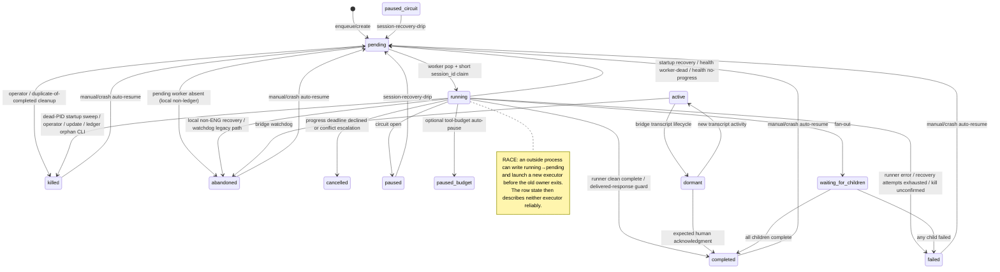

# AgentSession recovery and observation audit

**Date:** 2026-07-15  
**Scope:** AgentSession creation, execution, liveness, recovery, termination, and SDLC identity across worker, reflection, bridge, CLI, and update processes.  
**Method:** Read-only code and log audit. No sessions were spawned and no runtime state was changed.

## Executive diagnosis

The failure is not one bad timeout. It is an ownership failure compounded by an identity failure.

1. **The confirmed false positive came from the 300-second worker-presence guard, not from `SESSION_PROGRESS_DEADLINE_S`.** `session-liveness-check` is started inside the real worker and is also scheduled as an out-of-process reflection (`worker/__main__.py:887-900`, `config/reflections.yaml:35-42`). Its decisive `worker_alive` and `handle` evidence comes from process-local dictionaries (`agent/session_health.py:3398-3412`). In the reflection process those dictionaries do not describe the real worker, so a running session older than 300 seconds is declared `worker_dead` without consulting its persisted PID, runner heartbeat, stdout, turn activity, or the worker deadman beacon (`agent/session_health.py:3420-3434`). This is **confirmed in code and in the incident logs**.
2. **Recovery can restart work before the old owner has stopped.** The foreign reflection has no task handle with which to cancel the real worker's `SessionRunner`; it can at most signal the currently persisted subprocess PID (`agent/session_health.py:2411-2468`). It then changes `running -> pending` and starts a queue worker in its own process (`agent/session_health.py:2655-2762,3471-3488`). Killing one `claude -p` child does not fence the original executor from advancing or spawning another role turn. The incident shows both processes resuming the same Claude UUID at 11:01:09, followed by the original completing at 11:02:03 while the reflection-owned copy continued (`logs/worker.log:72788-72800`, `logs/reflection_worker_error.log:35783-35802,35817-35908`).
3. **There is no structural one-live-work-item invariant.** `_push_agent_session` always creates a new pending record and only deletes terminal duplicates with the same `session_id`; it never rejects an existing pending/running record for the same issue, slug, Telegram message, parent, or worktree (`agent/agent_session_queue.py:221-416,1295-1364`). The pending-run claim is keyed by `session_id`, lasts only 30 seconds, and fails open; it protects one claim operation, not the lifetime of a work item (`models/session_lifecycle.py:735-793`). The SDLC issue lock is acquired only after the `sdlc-local-N` record is created and marked running, so concurrent creators can all pass the pre-check and create duplicate ledgers (`tools/sdlc_session_ensure.py:492-585`, `models/session_lifecycle.py:796-929`).
4. **Ledger rows are intentionally invisible to every normal session reaper.** `sdlc-local-N` anchors are created as `is_ledger=True` and `running`, even though they have no worker or subprocess by design (`tools/sdlc_session_ensure.py:521-527,554-580`). Startup recovery, running health, pending health, and the 30-second tool-timeout loop all skip them (`agent/session_health.py:704-710,3351-3356,3511-3516,4160-4165`). The only record-level ledger reaper found is the explicit `sdlc-session-ensure --kill-orphans` path; it is not registered as a reflection or startup task (`tools/sdlc_session_ensure.py:623-751`, `config/reflections.yaml:34-60`). This explains the 13-hour phantom `running` records.
5. **The advertised single authoritative liveness design is not enforced.** `session_runner/liveness.py` centralizes only the sticky “SDK ever produced output” predicate (`agent/session_runner/liveness.py:1-50`). Actual death decisions independently use process-local worker membership, three timestamp fields, hook telemetry, PID existence, direct CPU/socket probes, transcript mtimes, `updated_at`, tool duration, and reflection counters. These actors operate in different processes, on different cadences, and with incompatible meanings of “alive.” The informational ownership table is not runtime-enforced (`models/session_lifecycle.py:86-101`).

**Ranked root causes:** (P0) out-of-process health actuation using process-local ownership; (P0) no atomic work-item uniqueness/fencing; (P0) recovery requeues before owner/task death is acknowledged; (P1) ledger rows modeled as running sessions but excluded from normal cleanup; (P1) non-atomic/ambiguous session identity and finalization; (P1) premature runner completion plus probabilistic recovery; (P2) fragmented secondary heuristics and fail-open locks.

## Evidence classification

- **Confirmed in code** means the cited control flow directly implements the stated behavior.
- **Confirmed in incident logs** means the repository logs show the behavior for the reported incident.
- **Inferred** means the mechanism is supported by code but the particular #2092/#2093 event is not present in the retained local logs.

## Incident reconstruction: issue #2091

| Time (2026-07-15, Asia/Bangkok) | Confirmed event | Evidence |
|---|---|---|
| 10:55:32 | The real worker claimed `0_1784087731752`, started the SDLC runner, and maintained SDK/deadman heartbeats. | `logs/worker.log:72752-72781`; `logs/session_telemetry/0_1784087731752.jsonl:1-2` |
| 11:00:34 | Worker deadman beacon age was 2.9 seconds; the real worker's in-process health check found nothing to recover. | `logs/worker.log:72781-72783` |
| 11:01:09 | The **reflection process** ran `session-liveness-check`, declared the session `worker_dead` at 336 seconds, and wrote `running -> pending`. In the same reflection tick, `stall-advisory` independently classified that session healthy. | `logs/reflection_worker_error.log:35762-35784`; the contradictory healthy verdict is at `:35771` |
| 11:01:09 | The reflection process immediately created its own queue worker, claimed the same row `pending -> running`, and resumed Claude UUID `dc57682b-...`. | `logs/reflection_worker_error.log:35785-35802`; `logs/session_telemetry/0_1784087731752.jsonl:3-5` |
| 11:01:09 | The real worker also resumed the same Claude UUID after its current child was signalled. The row transition did not cancel or fence the original executor. | `logs/worker.log:72786-72793` |
| 11:02:03 | The original worker produced 1,667 output tokens and finalized the shared row `completed`; its own output says the SDLC pipeline had not actually executed. | `logs/worker.log:72798-72807`; `logs/session_telemetry/0_1784087731752.jsonl:6-8`; output evidence at `logs/bridge.log:2806-2810` |
| 11:02-11:22 | The reflection-owned execution kept emitting SDK heartbeats after the shared record had been completed and later emitted 4,343 tokens. Telemetry recorded an attempted `completed -> failed`, but the lifecycle guard rejected the terminal overwrite—so telemetry and durable status diverged. | `logs/reflection_worker_error.log:35817-35908,36213-36296,36387-36390`; `logs/session_telemetry/0_1784087731752.jsonl:9-13` |
| 11:18:48 | A separate `sdlc-local-2091` ledger was created and marked running; it was manually killed at 11:24:36. | `logs/session_telemetry/sdlc-local-2091.jsonl:1-2` |

This sequence answers the central question. The “stale” execution did not disappear: the reflection killed or disrupted only its current child process, changed the shared row, and launched another executor. The original owner remained alive and continued its state machine. The database status was therefore no longer a faithful representation of either process.

## Architecture and identity map

### Processes and the evidence each can actually own

| Process/subsystem | What it genuinely owns | What it currently infers or mutates outside that ownership |
|---|---|---|
| Worker queue | Queue tasks, `_active_workers`, `_active_sessions`, slot semaphores, executor tasks, child PIDs, runner callbacks (`agent/session_state.py:41-70`, `agent/agent_session_queue.py:1552-1600`) | Starts health, tool-timeout, hierarchy, and orphan reapers; changes running rows based on timestamps and probes (`worker/__main__.py:887-895`, `agent/session_health.py:3217-3595,4127-4278`) |
| `session_runner` | One headless role subprocess at a time, its process group, stream events, structured route, resume UUID (`agent/session_runner/harness/claude.py:717-830,1019-1052`; `agent/session_runner/runner.py:715-800`) | Does not own a persisted, fenced execution lease that outside observers can trust. “Authoritative” helper covers only `sdk_ever_output` (`agent/session_runner/liveness.py:1-50`). |
| Reflection worker | Reflection tasks and its own Python event loop | Imports queue/health code, acts on process-local registries that are empty relative to the real worker, and can start queue workers itself (`config/reflections.yaml:35-51`, `agent/session_health.py:3398-3488`) |
| Bridge watchdog | Legacy `active`/`dormant` records and Telegram-facing observation | Uses `updated_at`, transcript mtime, duration, tool repetition, then abandons rows without terminating a subprocess (`monitoring/session_watchdog.py:325-453,946-1069,1262-1333`) |
| `/update` process | Update orchestration | Claims to clean sessions with no live process, but only checks 30-minute `updated_at`, 120-minute creation age, and a process-local worker dictionary that is empty standalone; it never checks a PID (`scripts/update/run.py:179-280`) |
| CLI scheduler | Operator-directed create/retry/kill | Discovers PIDs by `pgrep`, then finalizes one or all rows. It is not an owner-acknowledged task cancellation protocol (`tools/agent_session_scheduler.py:906-998`) |
| SDLC skill/ensure | Durable pipeline stage ledger and issue-level mutation lock | Represents a worker-less ledger as `running`; its lock is acquired after record creation (`.claude/skills/sdlc/SKILL.md:46-69`, `tools/sdlc_session_ensure.py:492-585`) |

### Three identities that must not be conflated

1. **Work identity:** the unit that must be unique while live. For Telegram this is `(project, chat_id, message_id)`; for SDLC it is `(repo/project, issue_number)` or the canonical slug/worktree. The SDLC skill states that one issue slug determines one branch and worktree (`.claude/skills/sdlc/SKILL.md:13-15,46-69`).
2. **Attempt identity:** `agent_session_id`, the unique database row/attempt. Multiple attempts can legitimately exist historically, but at most one should hold the live work lease.
3. **Conversation identity:** `session_id`/Claude UUID, used for continuity. Several rows can share a `session_id`; lifecycle helpers deliberately choose one “authoritative” sibling by preferring a running/newer record (`models/session_lifecycle.py:112-167`). That selection does not make the others non-executable.

Current locks cover only fragments:

- Queue worker guards are process-local and keyed by `worker_key` (`agent/agent_session_queue.py:1552-1600`).
- The pop lock is keyed by `worker_key`, has a 5-second TTL, and fails open (`agent/session_pickup.py:77-104`).
- The run claim is keyed by `session_id`, has a 30-second TTL, and fails open (`models/session_lifecycle.py:735-793`). It is released/expired after claiming; it does not prevent a second row with the same `session_id` from running while the first continues.
- Slot leases are process-local, keyed by `agent_session_id`, and intentionally have no age-based expiry (`agent/slot_lease.py:1-52,108-188`). They limit one process to `MAX_CONCURRENT_SESSIONS`, default 8, but do not coordinate another process or an issue (`worker/__main__.py:551-559`).
- The issue lock is closer to the needed abstraction, but is fail-open on Redis errors, defaults to an 1,800-second TTL, and is acquired only by `sdlc-session-ensure` after the row is created (`models/session_lifecycle.py:796-929`; `tools/sdlc_session_ensure.py:562-585`).

## Lifecycle state machine

The set of terminal statuses is `completed`, `failed`, `killed`, `abandoned`, and `cancelled`; resumable terminal statuses exclude only `cancelled` (`models/session_lifecycle.py:64-83`). `paused_budget` is opt-in, human-only recovery: the budget detector changes the status only when `TOOL_BUDGET_AUTO_PAUSE` is enabled, and the normal drip excludes it (`agent/tool_budget.py:71-77,256-274`; `reflections/agents/session_recovery_drip.py:73-111`). `superseded` is oddly classified as non-terminal even though its name implies replacement, and no current recovery transition out of it was found (`models/session_lifecycle.py:71-83`). The recovery ownership map is documentation only, not an enforcement mechanism (`models/session_lifecycle.py:86-101`).

## A. Liveness signals and every automatic liveness transition

### Signal/threshold inventory

| Detector | Cadence / threshold | Signal actually used | Actuation | Assessment |
|---|---|---|---|---|
| Worker-presence health branch | Health every 300s; session age >300s; both constants are fixed in current code (`agent/session_health.py:345-359`) | Process-local `_active_workers[worker_key]` and `_active_sessions[agent_session_id]` only (`agent/session_health.py:3398-3434`) | Shared recovery helper: usually `running -> pending`; can complete/abandon/fail (`agent/session_health.py:2203-2244,2547-2762`) | **Primary false positive.** Invalid outside the owning worker process. Ignores every persisted live signal. |
| Queue progress deadline | Poll 30s; `SESSION_PROGRESS_DEADLINE_S`, env default **1800s** in current code (`agent/agent_session_queue.py:1603-1615`; `.env.example:376-382`) | Max of `last_tool_use_at`, `last_turn_at`, and slot-acquired time only (`agent/agent_session_queue.py:1618-1637`) | Reclaims slot, calls recovery, then cancels executor (`agent/agent_session_queue.py:2017-2137`) | Not the 336s incident trigger. Still unsafe if configured to 300s: a legitimate runner turn may take up to 7200s and stdout/heartbeat do not refresh this clock. |
| Direct subprocess hang probe | Roughly third 30s sample (~90s) before first SDK output | Live PID plus flat CPU <=5%, no children, and no established configured API socket (`agent/session_runner/liveness.py:148-378`; queue use at `agent/agent_session_queue.py:2026-2045`) | Same as progress deadline | Stronger than timestamp inference, but socket assumptions and multiple caller-local sample histories remain fallible. It is intentionally disabled after any output. |
| Main health no-progress branch | Worker exists, no handle, >300s, and `_has_progress` false (`agent/session_health.py:3455-3469`) | Tool/turn freshness, limited heartbeat/output-derived gates, children, and Tier-2 PID/probe reprieves (`agent/session_health.py:1147-1547`) | Shared recovery helper | More conservative than worker-presence branch, but it is bypassed entirely by the false-positive branch. |
| Never-started/tool-timeout loop | Every 30s; never-started grace 1200s + 30s margin; tool defaults internal 30s, MCP 120s, fallback 300s, all env-overridable (`agent/session_health.py:432-453,1024-1111,4127-4278`; `agent/session_stall_classifier.py:52-83`) | No demonstrable activity, or a tool-in-flight duration over its tier | Shared recovery helper | Never-started defaults are conservative. Internal-tool 30s can be tight for commands that legitimately run longer unless correctly classified. Ledger skip makes it powerless against phantom anchors. |
| Stall classifier/advisory | Every 300s; never-started 1200+30; idle suspect 300, stalled 600; action after 3 observations by default (~15m) (`agent/session_stall_classifier.py:52-83,202-285,361-410`; `config/settings.py:517-554`) | Telemetry timeline, turn/tool activity, idle gaps; probes `running`, `active`, `paused`, `paused_circuit` (`reflections/stall_advisory.py:7-15,118-181`) | Scheduler kill, then `valor-catchup` (`reflections/stall_advisory.py:242-405`) | Independent actor despite “advisory” name. Same tick classified the incident session healthy while health killed it, proving signal disagreement. |
| Worker deadman | Thread heartbeat 30s; loop beacon every 5s; stale at 90s; startup grace 300s; env-overridable (`worker/__main__.py:49-75,260-343`) | In-process monotonic event-loop beacon | SIGKILL whole worker; launchd restart | Good worker-loop ownership signal, but session health does not consume it. A fresh beacon coexisted with the incident false kill. |
| Startup dead-PID sweep | On worker startup; running record with a persisted dead `claude_pid`, after the minimum age guard (`agent/session_health.py:849-948`; startup order `worker/__main__.py:759-780`) | PID existence | `running -> killed`, then `bridge.agent_catchup` | Reasonable when PID identity is valid. It does not prove the owning executor task is gone and does not apply to PID-less ledger rows. |
| Startup interrupted recovery | On worker startup; recent-running protection only 300s (`agent/session_health.py:606-846`) | Status, age, local/bridge/session-type classification; ledger rows skipped | Local ENG and bridge `running -> pending`; local PM/teammate `running -> abandoned` | Coarse recovery based on restart context, not a persisted owner lease. It can requeue a live foreign-process owner. |
| Bridge watchdog | Every 300s; silence 600s, abandon after 1800s, duration 7200s; stalled pending 300/running 2700/active 600 (`monitoring/session_watchdog.py:72-91`) | `updated_at`, start time, transcript mtime for active, tool history | `active -> abandoned`/`failed`; row mutation only (`monitoring/session_watchdog.py:238-310,1262-1333`) | Separate legacy state owner. It does not terminate worker/runner processes, so its “kill” side is under-powered. |
| `/update` Step 5.5 | On update; skip if `updated_at` <30m; kill if created >120m (`scripts/update/run.py:179-280`) | `updated_at`, creation age, process-local worker dict | `running -> killed` | Comment says “no live process,” but no PID is checked. Can false-kill a quiet live session and can miss recently rewritten phantoms. |
| SDLC ledger orphan CLI | Explicit invocation only; no heartbeat, no stage activity for 600s (`tools/sdlc_session_ensure.py:623-679`) | Ledger shape + `updated_at`/`started_at`/`created_at` | `running -> killed` (`tools/sdlc_session_ensure.py:682-751`) | Correctly targeted but has no scheduled owner, so it did not protect production. |
| Cross-process orphan process reaper | Slow cleanup plus fast 300s one-shot pass; stale `claude --print` default 600s (`agent/session_health.py:4835-5136`) | PPID/orphan signature, command line, process age, heartbeat exemptions | SIGTERM then SIGKILL process only | Cleans OS processes, not phantom rows. Its inverse cannot prove which live work item owns a process. |

### Can a live turn exceed the progress deadline without a progress event?

**Yes. Confirmed in design, and the incident exceeded five minutes.** The ENG role timeout is 7,200 seconds (`agent/session_runner/runner.py:91-104`), and one role turn awaits the entire headless subprocess before routing (`agent/session_runner/runner.py:715-792`). The harness emits stdout callbacks on stream lines (`agent/session_runner/harness/claude.py:790-812`), and the runner persists `last_stdout_at` (`agent/session_runner/runner.py:488-546`), but `_session_progress_ts` ignores stdout, `last_heartbeat_at`, the live child PID, token streaming, and CPU (`agent/agent_session_queue.py:1618-1637`). A model inference, long shell command, build/test, or subagent phase can therefore exceed a 300-second production override with neither `last_tool_use_at` nor `last_turn_at` changing.

The current repository default is 1,800 seconds, not 300 (`agent/agent_session_queue.py:1611`, `.env.example:376-382`). The exact incident reason string—`worker dead/missing, running for 336s (>300s guard)`—is emitted by the separate worker-presence branch (`agent/session_health.py:3420-3434`; `logs/session_telemetry/0_1784087731752.jsonl:3`). Thus:

- **Confirmed:** the 336-second false positive was not `SESSION_PROGRESS_DEADLINE_S`.
- **Confirmed:** a 300-second override would create a second independent five-minute false-positive surface.
- **Recommendation:** do not tune either threshold upward as the primary fix. Remove non-owner actuation and make a fenced owner lease the decisive signal.

### Is `session_runner`'s “one authoritative signal” upheld?

No. The strong wording in `agent/session_runner/liveness.py:1-12` applies only to deriving `sdk_ever_output`. Even that fact is reconstructed from several persisted fields (`last_tool_use_at`, `last_turn_at`, `last_stdout_at`) rather than a runner-owned lease (`agent/session_runner/liveness.py:23-50`). Other subsystems independently infer liveness:

- hook writers query by shared `session_id` and select the first match, so duplicate records can receive each other's tool/turn stamps (`agent/hooks/liveness_writers.py:38-99,117-177`);
- health uses process-local worker/handle membership and multiple sticky fields (`agent/session_health.py:1147-1547,3398-3469`);
- queue uses only two timestamps plus acquisition time (`agent/agent_session_queue.py:1618-1637`);
- stall advisory uses telemetry gaps (`agent/session_stall_classifier.py:202-285,350-410`);
- watchdog uses `updated_at` and transcript mtime (`monitoring/session_watchdog.py:325-453`);
- update uses `updated_at` and creation age (`scripts/update/run.py:179-280`).

The result is multi-field inference spread across independent processes, exactly the architecture the “single authoritative” comment says to avoid.

## B. Duplicate spawn and recovery inventory

### Paths that create a new record or make an old record executable again

| Path | Operation | Existing-live-work check | Dedup gap / consequence |
|---|---|---|---|
| Normal/live enqueue and all callers | `_push_agent_session` creates a new pending `AgentSession` (`agent/agent_session_queue.py:221-416`) | Deletes only terminal siblings with exactly the same `session_id`; no issue/slug/message/parent check (`agent/agent_session_queue.py:308-353`) | Every caller inherits the structural gap. |
| Health `worker_dead` / no-progress / tool timeout / queue deadline | Mutates same record `running -> pending`, then ensures a worker (`agent/session_health.py:2655-2762,3471-3488`; queue deadline `agent/agent_session_queue.py:2082-2137`) | No persisted owner-generation check; no wait for foreign owner task exit | Same row can be concurrently executed by two processes, as in #2091. |
| Startup recovery | Same row `running -> pending`, then startup begins workers (`agent/session_health.py:606-846`; `worker/__main__.py:809-828`) | No cross-process owner lease | A live owner on another process/machine can be duplicated. |
| `bridge.agent_catchup` used by health/stall/update | Creates deterministic `tg_{project}_{chat}_{message}` record (`bridge/agent_catchup.py:543-602`) | Checks only whether a Valor reply has landed; intentionally never reads durable dedup and does not use the shared per-message claim (`bridge/agent_catchup.py:1-40,485-529,604-609`) | Until any attempt delivers a reply, every invocation can create another live row for the same inbound message. |
| Mechanical bridge catchup/reconciler/live dispatch | Creates same deterministic Telegram ID (`bridge/catchup.py:229-301`; `bridge/reconciler.py:211-284`; `bridge/dispatch.py:122-176`) | Uses durable dedup and a short atomic per-message producer claim | Better at ingress, but the guarantee ends after enqueue and is bypassed by `agent_catchup`. It is not a lifetime work lease. |
| Failed/cancelled retry | Copies the old record into a new pending row (`agent/agent_session_queue.py:688-729`; scheduler retry `tools/agent_session_scheduler.py:685-710`) | Checks selected record state, not live issue/slug siblings | Generates another attempt without work-key exclusion. |
| Manual/crash resume | Changes a terminal record back to pending (`tools/valor_session.py:680-757`; `reflections/crash_recovery.py:455-490`) | Only checks that selected record itself is not pending/running | A sibling for the same work can already be live. Crash budgets are per `session_id`/record, so distinct duplicate IDs multiply the cap. |
| Session recovery drip | `paused[_circuit] -> pending`, one per 30s (`reflections/agents/session_recovery_drip.py:45-123`) | No same-issue/slug sibling check | Multiple paused duplicates are revived sequentially. |
| Harness startup retry / nudge | Usually reuses same record (`agent/session_executor.py:404-452,511-638`) | Re-read is by ambiguous `session_id`; missing-record fallback recreates a row (`agent/session_executor.py:558-603`) | Safer than creating a new ID, but duplicate siblings and fail-open recreation remain. |
| Leftover steering continuation | Enqueues a new record when steering remains (`agent/session_executor.py:2247-2304`) | No work-key uniqueness | Can fork an additional attempt after a race in completion/steering. |
| Session revival | Reuses an existing live session when found, otherwise calls normal enqueue (`agent/session_revival.py:53-91,156-184`) | Searches by a limited status/identity set | Falls through to structurally non-deduplicating enqueue. |
| `sdlc-session-ensure` | Creates deterministic `sdlc-local-{issue}` ledger, marks running, then acquires issue lock (`tools/sdlc_session_ensure.py:492-585`) | Pre-check by issue/exact session ID, but check-and-create is not atomic | Concurrent invocations all see none and create distinct `agent_session_id` rows with the same `session_id`. Lock comes too late. |
| Scheduler issue session | Creates unique `scheduled-{issue}-{uuid}` pending record (`tools/agent_session_scheduler.py:315-416`) | Rate limiter counts only recent sessions with a parent (`tools/agent_session_scheduler.py:102-120`) | No existing issue/slug check; top-level sessions typically evade the stated limiter. |
| Reflection-generated/system-fix sessions | Reflection scheduler and health digest create and enqueue unique sessions (`agent/reflection_scheduler.py:597-625`; `reflections/agents/system_health_digest.py:135-171`; update fix `bridge/update.py:112-135`) | Purpose-specific cadence/budgets only | Can duplicate a work item if their generated task targets an issue already under execution. |
| Transcript standalone fallback | Creates an `active` record if lookup finds none (`bridge/session_transcript.py:90-125`) | Query-first, non-atomic | Legacy active-record duplicate surface. |

### Why the original and duplicate ran together

The exact #2091 interaction is confirmed:

1. The real worker held the executor and emitted healthy heartbeats (`logs/worker.log:72773-72783`).
2. The reflection process had an empty/foreign process-local registry and chose `reason_kind="worker_dead"`, a branch that explicitly skips Tier-2 liveness reprieves (`agent/session_health.py:2220-2235,3398-3434`).
3. With no foreign task handle, recovery signalled only the current persisted child PID, rewrote the row to pending, and started a reflection-local queue worker (`agent/session_health.py:2411-2468,2655-2762,3471-3488`).
4. The original `SessionRunner` task was not cancelled or fenced, so both processes resumed the same conversation (`logs/worker.log:72788-72793`, `logs/reflection_worker_error.log:35789-35802`).
5. Both then wrote lifecycle and liveness data through helpers keyed primarily by `session_id`. One process completed the row while the other continued; the second later emitted a `completed -> failed` telemetry event even though the terminal-state guard rejected the durable overwrite (`logs/session_telemetry/0_1784087731752.jsonl:8-13`; `logs/reflection_worker_error.log:36387-36390`).

### Why seven or eight duplicates are plausible

**Confirmed mechanism, inferred multiplier for #2088.** The retained incident transcript confirms 7 `sdlc-local-2088` rows, 4 `sdlc-local-2083` rows, and 1 `sdlc-local-2082` row, all with no process (`logs/sessions/7c6ec29c-18c2-4c6b-bfe7-458fe6b6ff9d/transcript.jsonl:138-140`). The code explains the shape:

- Default global concurrency is 8 per process, not per issue (`worker/__main__.py:551-559`). A second reflection process can have another independent set of 8 slots.
- `sdlc-session-ensure` performs lookup, create, `pending -> running`, and only then issue-lock acquisition (`tools/sdlc_session_ensure.py:492-585`). Seven concurrent callers can therefore create seven rows even though the deterministic `session_id` is identical.
- `_push_agent_session` tolerates multiple live rows with the same `session_id` (`agent/agent_session_queue.py:221-416`), and the 30-second run claim does not cover execution lifetime (`models/session_lifecycle.py:735-793`).
- Catchup, crash auto-resume, retry, and stall budgets are scoped per message/session attempt rather than per issue work key (`bridge/agent_catchup.py:543-609`; `config/settings.py:447-554`). New attempts reset or multiply those limits.

The concurrency value is therefore a natural ceiling for a burst, while repeated five-minute/30-second recovery ticks can create later waves. A single atomic issue/slug work lease would eliminate this entire multiplier regardless of which retry actor fires.

## C. Under-powered kill and non-deterministic recovery

### Why dead sessions persist as `running`

1. **Ledger records are explicitly skipped.** The `is_ledger` predicate is documented as a mandatory skip for normal pop/finalize/requeue paths (`agent/session_health.py:46-57`). The health loop logs and skips running ledgers (`agent/session_health.py:3351-3356`); pending health and tool-timeout do the same (`agent/session_health.py:3511-3516,4160-4165`). Production logs show the same seven ledger IDs skipped every five minutes (`logs/reflection_worker_error.log:25-32,139-146,275-282`).
2. **There is no scheduled record-level ledger owner.** `--kill-orphans` can identify `sdlc-local-*`, heartbeat-less, inactive ledgers after 600 seconds and terminalize them (`tools/sdlc_session_ensure.py:623-751`), but no reflection or worker startup step invokes it (`config/reflections.yaml:34-60`, `worker/__main__.py:759-828`).
3. **OS-process reapers and row reapers are disconnected.** Orphan reapers match PPID/command signatures and signal processes; cleanup repairs corrupt/index records but does not terminalize a valid hydrated ledger hash (`agent/session_health.py:4456-4721,4835-5136`). A pure phantom has no process for the former and is considered valid by the latter.
4. **Some “killers” only mutate the row.** `valor-session kill` calls `finalize_session` but does not signal any process (`tools/valor_session.py:1194-1241`). The bridge watchdog abandons a row without task/process cancellation (`monitoring/session_watchdog.py:1240-1246,1262-1333`). `/update` finalizes stale rows without PID/process-group termination (`scripts/update/run.py:259-279`). This is the inverse of the health false positive: status becomes terminal while work may continue.
5. **The health helper can treat missing PID as confirmed death.** Its kill result distinguishes signalling from confirmation, but a missing persisted PID can be accepted as already dead and permit requeue (`agent/session_health.py:1604-1729,2411-2468`). Absence of a recorded PID proves only that the observer lacks a PID, not that the foreign executor is gone.

### What `no_process_found` means

The scheduler kill first searches for a process by session ID. If none is found it returns `{"pid": null, "action": "no_process_found"}`, but it then **unconditionally calls `finalize_session(..., "killed")`** (`tools/agent_session_scheduler.py:906-946`). The manual `kill --all` evidence reports `status: killed` for all 12 rows despite `no_process_found` (`logs/sessions/7c6ec29c-18c2-4c6b-bfe7-458fe6b6ff9d/transcript.jsonl:139-140`). Therefore:

- **Confirmed:** `no_process_found` identified pure phantom rows and manual cleanup terminalized them.
- **Not supported by code:** that this particular scheduler command left those 12 records running.
- **Remaining problem:** no automatic owner would perform the same phantom terminalization, so they remained running for 13+ hours until the manual command.

There is still an identity hazard: single-session CLI lookup and lifecycle finalization can choose an “authoritative” sibling by shared `session_id` rather than the exact `agent_session_id` (`tools/agent_session_scheduler.py:1035-1057`; `models/session_lifecycle.py:112-167,233-345`). With duplicates, a command aimed by logical ID may kill one sibling and leave others. The `--all` incident command happened to enumerate and kill every row.

### Why #2091/#2092 were rescued but #2093 could be dropped

The reported sibling asymmetry is **inferred**, because retained local telemetry contains #2091 but no `sdlc-local-2092` or `sdlc-local-2093` file. The code has no deterministic issue-level recovery coordinator:

- `agent_catchup` only examines recent Telegram-originated messages, within a bounded lookback/thread sample, and asks a model whether a landed Valor message means the inbound request was answered (`bridge/agent_catchup.py:50-85,330-420,475-540`). It never recovers a purely local/scheduled issue that has no qualifying Telegram inbound.
- Any Valor reply after the inbound can make the message look answered, even if the SDLC work did not merge; the pre-enqueue guard checks delivery, not issue completion (`bridge/agent_catchup.py:358-410,485-519`).
- Crash recovery scans recently terminal, resumable records and is disabled by default; when enabled, signature occurrence/confidence, per-record attempts, and per-run budget determine which records resume (`config/settings.py:447-515`; `reflections/crash_recovery.py:200-245,443-490`). The incident logs show it in propose-only mode (`logs/reflection_worker_error.log:35857-35864`).
- `sdlc-progress-check` is notification-only and explicitly does not spawn sessions (`reflections/sdlc_progress.py:1-10,188-208`). `session-count-throttle` only writes throttle state (`reflections/agents/session_count_throttle.py:1-93`). `failure-loop-detector` files/escalates issues but does not own recovery (`reflections/agents/failure_loop_detector.py:1-30,220-271`).
- The runner accepts a structured `complete` route and exits without independently checking SDLC stage completion, PR merge, or issue closure (`agent/session_runner/runner.py:776-792,1173-1208`). The executor maps a clean complete route to `completed` (`agent/session_executor.py:84-97,2070-2192`). This matches the three ~1,667-token premature exits reported by the owner and the retained #2091 output.

Thus two siblings can be rescued because their Telegram/thread/signature evidence passes, while a third is silently ineligible, outside the lookback, considered answered, lacks a resumable UUID, or exhausts a per-record gate. None of those decisions asks the authoritative work-level question: “Is issue N already merged/closed, or is there exactly one live owner continuing it?”

## D. Race and double-owner inventory

| Race / double owner | Consequence | Evidence |
|---|---|---|
| Worker health loop **and** external reflection both run the same actuation function | Reflection sees empty process-local registries and false-kills/restarts real work | `worker/__main__.py:887-900`; `config/reflections.yaml:35-42`; incident `logs/reflection_worker_error.log:35762-35802` |
| Health, queue deadline, tool-timeout, stall recovery, watchdog, update, and operator CLI can all terminalize/requeue | Last writer wins; incompatible evidence and side effects | `agent/session_health.py:2203-2771`; `agent/agent_session_queue.py:2017-2137`; `reflections/stall_advisory.py:242-405`; `monitoring/session_watchdog.py:1262-1333`; `scripts/update/run.py:179-280` |
| Row status changes before foreign owner/task death acknowledgement | Old task continues while new task starts | `agent/session_health.py:2411-2468,2655-2762`; incident logs above |
| Slot is reclaimed before cancellation completes | Capacity becomes available for another attempt while old execution may still exist | `agent/agent_session_queue.py:2082-2101,2133-2137`; `agent/session_health.py:2258-2285` |
| Issue lock acquired after SDLC ledger creation | Multiple same-issue `sdlc-local-N` rows | `tools/sdlc_session_ensure.py:492-585` |
| Enqueue has no atomic work-key check | Every recovery producer can create a sibling | `agent/agent_session_queue.py:221-416` |
| Short `session_id` run claim vs long execution | Serializes claim moment, not execution lifetime | `models/session_lifecycle.py:735-793` |
| Lifecycle “CAS” is read/compare/save and chooses by logical `session_id` | Two processes can pass the read; exact-row caller may mutate another sibling | `models/session_lifecycle.py:112-167,170-230,233-345` |
| Liveness writers select first same-`session_id` row | Progress can be stamped onto the wrong duplicate | `agent/hooks/liveness_writers.py:38-99,117-177` |
| `register_worker_pid` duplicate check is observability-only and fail-open | Multiple worker processes remain active; later registration overwrites visibility | `agent/session_health.py:3896-3997` |
| Slot registry is process-local | Worker and reflection each admit up to 8 executions | `agent/slot_lease.py:52-188`; `worker/__main__.py:551-559` |
| `agent_catchup` bypasses the shared producer claim/dedup read | Repeated catchup invocations enqueue unanswered work repeatedly | `bridge/agent_catchup.py:1-40,543-609` versus `bridge/dispatch.py:122-176` |
| Early runner `complete` vs issue/merge reality | Row becomes terminal, then probabilistic recovery decides whether work returns | `agent/session_runner/runner.py:776-792,1173-1208`; retained output `logs/bridge.log:2806-2810` |
| Ledger uses executable `running` state but is excluded from execution/reapers | Dashboard zombies, counts/throttles distorted, no automatic terminalization | `tools/sdlc_session_ensure.py:521-580`; `agent/session_health.py:46-57,3351-3356` |
| Bridge/update row-only abandonment/kill | Process can continue behind a terminal row | `monitoring/session_watchdog.py:1262-1333`; `scripts/update/run.py:259-279` |

## Prioritized fix plan

### P0. Stop the active false-positive source immediately

1. **Run `_agent_session_health_check` only in the worker process.** Remove/disable the `session-liveness-check` reflection registration, or make that reflection strictly read-only. The same function must not be both a worker-owned actuator and an external observer (`worker/__main__.py:887-900`, `config/reflections.yaml:35-42`). This is the smallest change that directly prevents a repeat of the confirmed #2091 race.
2. **Until the authoritative lease exists, make `worker_alive == false` advisory outside the owner process.** A process-local dictionary cannot be negative evidence about another process. Do not allow that branch to call recovery or `_ensure_worker` without a persisted expired owner lease plus process-death confirmation.
3. **Do not requeue or release capacity before kill acknowledgement.** Introduce `terminating` (or equivalent fenced generation state): request cancellation from the owning worker, wait for task/process-group death or owner-lease expiry, verify it, then transition to pending and admit a replacement. If cancellation cannot be confirmed, fail closed to operator escalation rather than duplicate execution.

### P0. Add structural work-item uniqueness

4. **Define a canonical `work_key`.** Suggested forms:
   - Telegram: `tg:{project}:{chat_id}:{message_id}`.
   - SDLC: `sdlc:{repo_identity}:{issue_number}`; slug/worktree is derived, not a separate competing key.
   - Parent fan-out: include the child stage/role only when parallelism is intentional.
5. **Acquire an atomic work lease before record creation.** Use Redis `SET NX`/Lua with an owner `agent_session_id`, execution generation/fencing token, and renewal. Under the lease, re-read all non-terminal attempts for the work key. Return/steer/coalesce into the existing live attempt instead of creating a sibling. Do this in the lowest common creation primitive, not separately in each caller.
6. **Hold and renew the work lease for the full execution lifetime.** A 5/30-second claim is not enough. Release only after terminal persistence **and** owner/process teardown. On takeover, increment a fencing generation so stale owners cannot write status, progress, or output.
7. **Make all recovery producers use the same gate.** `agent_catchup`, mechanical catchup/reconciler, crash resume, scheduler retry, nudge fallback, leftover steering, recovery drip, and SDLC ensure must acquire/check the same `work_key`. Delete `agent_catchup`'s intentional dedup bypass or route it through `dispatch_telegram_session` plus the work lease.

### P0/P1. Establish one authoritative execution-liveness contract

8. **Persist a runner/owner lease rather than infer death from progress.** The owner record should include `agent_session_id`, `work_key`, worker host/role/PID, executor generation, process-group ID, lease expiry, and last renewal. Renew from the owning worker event loop every <=30 seconds. The deadman beacon remains the worker's self-kill mechanism; external observers treat an unexpired execution lease as alive even if no tool/turn progress occurs.
9. **Separate liveness from progress.** A healthy owner can make no semantic progress for a long model/build turn. Progress deadlines may alert or nudge, but must not preempt an unexpired owner lease. If retained, include `last_stdout_at` and runner events, align the deadline with the 7,200-second role timeout, and require direct negative process evidence before kill (`agent/session_runner/runner.py:91-104`; `agent/agent_session_queue.py:1618-1637`).
10. **Make hook/lifecycle writes exact-attempt and generation-fenced.** Writers should address `agent_session_id` plus generation, never select `sessions[0]` by shared `session_id`. A stale owner generation must be rejected.

### P1. Make kill real for both executable and phantom records

11. **Persist process group ownership and cancel through the owner.** Standardize one kill API: cancel executor task; signal its process group TERM; wait; KILL; verify; then terminalize exact `agent_session_id`. Row-only watchdog/update/`valor-session` paths should call this API or request it from the owner.
12. **Treat `no_process_found` as a valid phantom cleanup result only after lease expiry.** Terminalize the exact row, verify readback, release work/slot leases, and report `phantom_terminalized`. It should not be interpreted as a failed cleanup, nor should missing PID alone permit immediate retry while an owner lease is live.
13. **Stop representing ledgers as executable `running` sessions.** Best option: separate `SdlcRunLedger`/pipeline-run model. Minimal migration: use a non-executable state excluded from live-session counts and give it a scheduled expiry/finalizer keyed to issue lock and stage activity. In either case, register an automatic owner for stale ledger termination and migrate the existing phantoms.

### P1. Make lifecycle and SDLC completion deterministic

14. **Use atomic exact-row CAS.** Transition by `agent_session_id` and expected generation/status in one Redis transaction/script. Remove `get_authoritative_session` switching from mutations; logical-ID lookup is for display only.
15. **Validate SDLC completion against durable stage/merge state.** A runner `complete` route must not finalize SDLC work until required stages are terminal and the merge/issue-closure gate is satisfied. Otherwise continue or mark a recoverable incomplete state, not `completed`.
16. **Create one issue-level recovery coordinator.** It should reconcile issue state, work lease, live owner, PR/merge state, and attempt history. Reflections become observers or submit recovery intents to that coordinator; they do not independently spawn/kill.

### P2. Rollout and observability

17. Add invariants/metrics: live attempts per `work_key` (must be <=1), stale-owner writes rejected, termination latency, owner lease age, phantom rows, ledger age, catchup coalesces, and recovery-intent dedupes.
18. Add a startup audit that reports and safely terminalizes exact-row phantoms after lease expiry; do not infer executable death from `running` age alone.
19. Preserve kill switches while rolling out, but set one documented owner per state. Turn the informational `RECOVERY_OWNERSHIP` table into routing/enforcement or delete misleading entries.

## Minimal change set that fixes both sides

If implementation scope must be kept very small, these four changes provide the highest leverage:

1. Disable external reflection actuation for `session-liveness-check`; keep worker-owned health only.
2. Add atomic `work_key` lease acquisition before `_push_agent_session`/`sdlc-session-ensure` creation and hold it through execution.
3. Add owner-generation fencing and require cancellation/death acknowledgement before `running -> pending` or slot/work-lease release.
4. Schedule exact-row phantom/ledger finalization, or move ledger anchors out of `running` immediately.

Raising 300 seconds to a larger number is only a mitigation. It does not fix cross-process ownership, duplicate creation, row/task split-brain, or immortal ledgers.

## Proposed `/do-issue` candidates

1. **Make session-liveness-check single-owner** — remove out-of-process actuation that treats empty process-local worker registries as proof of death. *(Root cause: confirmed #2091 false positive.)*
2. **Add atomic AgentSession work-key leases** — enforce at most one non-terminal executor per Telegram message or SDLC issue/slug before any row is created. *(Root cause: structural dedup gap.)*
3. **Fence recovery on owner generation and kill acknowledgement** — prevent requeue/slot release until the prior executor task and process group are confirmed stopped. *(Root cause: original and replacement execute concurrently.)*
4. **Make lifecycle CAS exact-row and atomic** — transition by `agent_session_id` plus generation instead of selecting an “authoritative” sibling by `session_id`. *(Root cause: wrong-sibling writes and last-writer-wins.)*
5. **Separate SDLC ledgers from executable session state** — replace `is_ledger + running` with a dedicated run-ledger state/model and automatic stale finalization. *(Root cause: 13-hour phantom running records.)*
6. **Unify session kill semantics** — route CLI, watchdog, update, health, and reflection kills through owner-aware task/process-group teardown with verified exact-row terminalization. *(Root cause: row-only and child-only kills.)*
7. **Route all catchup/retry/resume through the work-key gate** — remove `agent_catchup`'s dedup bypass and make retry budgets issue/message-scoped. *(Root cause: recovery-loop multiplier.)*
8. **Gate SDLC runner completion on merge truth** — reject structured `complete` when required stage/PR/issue state is incomplete. *(Root cause: ~1,667-token premature exits and probabilistic rescue.)*
9. **Consolidate liveness into a persisted execution lease** — make runner/worker ownership authoritative and demote progress timestamps, transcript mtimes, and reflection counters to diagnostics. *(Root cause: conflicting multi-field inference.)*
10. **Add duplicate/phantom invariant monitoring** — alert on `live_attempts(work_key)>1`, expired owners, and non-executable ledgers in live counts. *(Root cause: failures remain invisible until multiplicative.)*

## Bottom line

The system is aggressive where it has the weakest evidence and passive where it has decisive evidence:

- It treats absence from another process's in-memory dictionary as death after 300 seconds.
- It treats absence of a persisted PID as enough to retry, but does not stop the foreign executor that can spawn the next PID.
- It allows every recovery producer to create/revive work without a lifetime issue/message lock.
- It deliberately ignores worker-less ledger rows indefinitely.

The fix is not to find one perfect timeout. The fix is to make ownership and work identity explicit: one fenced live owner per work key, one owner-aware termination protocol, and one recovery coordinator. Once those invariants exist, the many observation systems can remain useful without being allowed to race the lifecycle.

---

## Addendum: independent second-pass cross-validation (2026-07-15)

A second, fully independent audit pass (four parallel whole-file reviews of the same subsystems, run without sight of this document — this file turned out to be a concurrently-produced deliverable for the same brief, itself a live instance of the duplicate-work failure mode under audit) **confirms every ranked root cause above**: the out-of-process `session-liveness-check` actuation on empty process-local registries, the reflection process becoming a second execution engine via `_ensure_worker` (`agent/session_health.py:3576-3586, 2759`), the absence of any work-key invariant at spawn, the ledger rows with no terminating owner, and the finalize-on-`no_process_found` behavior of the scheduler kill (`tools/agent_session_scheduler.py:939→945`).

The second pass adds the following findings not covered above:

1. **The #2091/#2092-rescued-vs-#2093-dropped asymmetry is now confirmed, not inferred.** Telemetry for `0_1784087752191` (#2093) records `completed → pending (resume (valor-session resume))` at 04:24:54 UTC — the reason string emitted only by `cmd_resume` (`tools/valor_session.py:805`). The third sibling was rescued by a **manual** `valor-session resume` ~29 minutes after the premature completion, not by any machinery. All three siblings show the same premature-completion profile (out=1667/1225/1269 tokens) after `Harness exited with code 143` kills. This upgrades §C's "inferred" verdict to **confirmed**: the killer is automatic, the rescuer is human.

2. **Stall-advisory's `idle_gap_exceeded_stall` keys on the maximum *historical* gap, not the current one.** `classify_session_stall` uses `max(idle_gap)` over the whole telemetry window (`agent/session_stall_classifier.py:387`, `IDLE_STALL_SECS=600` hardcoded at `:83`), with only a 300s recent-turn amnesty. One historical ≥600s inter-event gap marks a currently-working session stalled on every subsequent tick; after 3 consecutive observations (~15 min) it is killed and `valor-catchup` mints a replacement (`reflections/stall_advisory.py:349, :372`). This is a third false-positive kill vector independent of the two fixed by P0 items — worth folding into `/do-issue` candidate 9 or filing separately.

3. **The tool-timeout default tier (300s) is reprieve-exempt and nothing refreshes `last_tool_use_at` mid-call.** The stamp is written only by PreToolUse at call start (`.claude/hooks/pre_tool_use.py:147`) and PostToolUse at completion (`.claude/hooks/post_tool_use.py:509`); `tool_timeout` skips Tier-2 by design (`agent/session_health.py:2226-2228`). Any legitimate single tool call >5 min (Bash build/test, Task subagent, Skill) is killed mid-call and requeued — a worker-process false-positive surface that survives the P0 reflection fix. A pre-kill `subprocess_hang_verdict` probe (live children / CPU / API socket) would distinguish a wedged tool from a busy one.

4. **#2044 is still open (PR #2090 unmerged) despite its plan doc claiming `docs_complete`**, and one of its two unguarded scanners has an operational consequence today: `_check_restart_flag` (`agent/agent_session_queue.py:1212`) counts ledger rows as active sessions, so a single immortal `sdlc-local-{N}` anchor defers every flag-based graceful worker restart indefinitely.

5. **`agent-session-cleanup` runs `repair_indexes()` every 300s live, not hourly as documented** (`~/Desktop/Valor/reflections.yaml:55-62` vs `docs/features/session-lifecycle.md:551`), so the #1720 delete-and-rebuild read-race window (~651ms p99) opens every 5 minutes; only two operator-facing readers carry the retry defense. The same callable is also registered a second time as `redis-index-cleanup` (daily) — a redundant duplicate registration.

6. **Restart-frequency evidence for the §B multiplier.** The morning of 2026-07-15 alone, the worker deadman aborted the process three times (beacon stale at 03:01:03 + two startup-window freeze aborts, `logs/worker.log`), and #2088's uncaught `ModelException` on corrupted pops killed the worker loop 3× the prior day (gh #2088). Every restart runs the Step-3a sweep → `bridge.agent_catchup` (`agent/session_health.py:940-946`), whose landed-reply guard cannot see working-but-silent sessions — each restart is therefore a licensed duplicate-mint event, compounding the slot-ceiling burst mechanism described in §B. Supporting scale evidence: 51,883 `Skipping non-executable ledger` lines in `logs/worker.log`, and a pre-#2042 anchor (`sdlc-local-447`) that survived **259,459s (~72h)** at `running` before recovery (2026-07-10).
