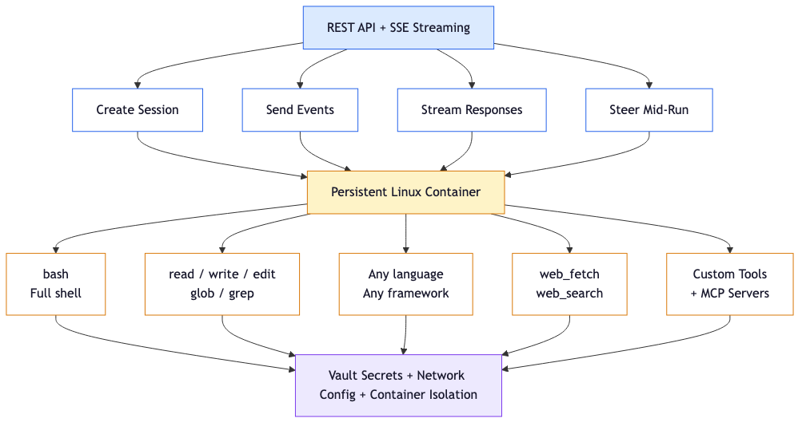
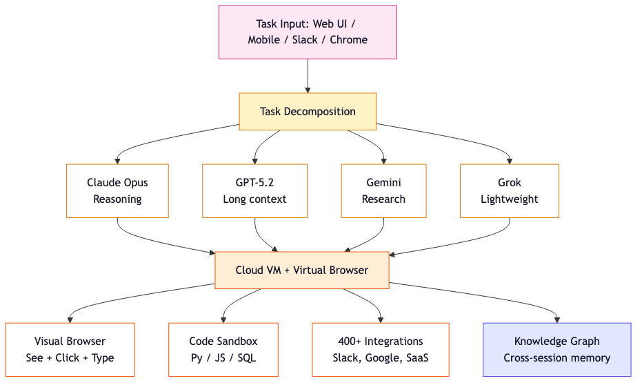
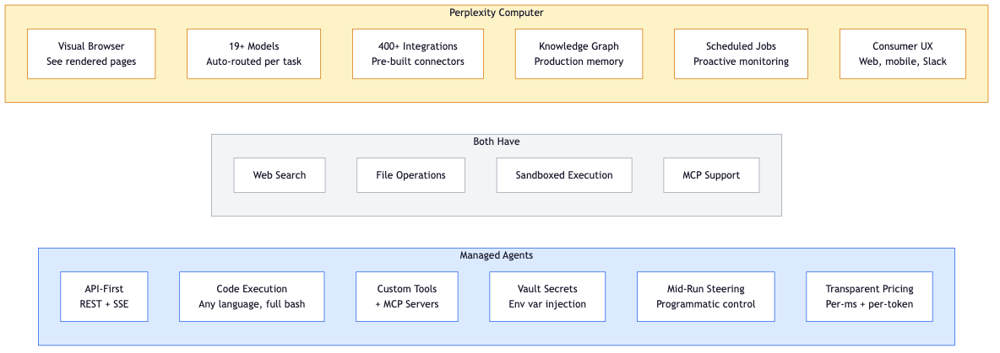

<!-- _class: lead -->

# Managed Agents vs Perplexity Computer

Which execution backend should Valor adopt?

*April 2026*

---

<!-- _class: lead -->

# Governing Thought

They solve **different problems**.

MA is a programmable execution engine.
Perplexity Computer is an autonomous digital worker.

For Valor: **MA is the backend. Perplexity is not.**

---

## What Are We Comparing?

| | Claude Managed Agents | Perplexity Computer |
|---|---|---|
| **Launched** | April 2026 (beta) | February 2026 |
| **What it is** | API-first containerized agent runtime | UI-first multi-model digital worker |
| **Primary interface** | REST API + SSE streaming | Web UI, mobile app, Slack |
| **How it works** | Runs code in Linux containers | Sees and clicks rendered web pages |
| **Models** | Claude family | 19+ models (Claude, GPT, Gemini, Grok) |
| **Pricing** | Per-ms + per-token + per-search | $200/mo subscription + opaque credits |
| **Target user** | Developers building agent systems | Knowledge workers automating tasks |

Two products that happen to both be called "AI agents" but share almost no overlap in architecture, audience, or use case.

---

## Managed Agents: The Developer's Backend



---

## Perplexity Computer: The Digital Worker



---

## Feature Comparison: What Each Brings



Common ground is narrow (web search, files, sandboxing, MCP). The unique capabilities point in opposite directions — MA toward **developer orchestration**, Perplexity toward **end-user automation**.

---

## Architecture: A Fork, Not a Spectrum

| Aspect | Managed Agents | Perplexity Computer |
|---|---|---|
| **Runtime** | Linux container | Cloud VM + virtual browser |
| **Agent sees** | Text, files, structured data | Rendered pixels (vision-language model) |
| **Agent acts** | Shell commands, file writes | Clicks, types, scrolls, navigates |
| **Isolation** | Per-session container | Per-task container + browser |
| **Persistence** | Environments reused; sessions ephemeral | Knowledge graph persists across tasks |
| **Networking** | Configurable (restricted/unrestricted) | Unrestricted web, sandboxed from internal |

MA is a **developer tool** -- it exposes a container. Perplexity Computer is a **digital worker** -- it exposes a virtual desktop.

---

## The Orchestration Gap

| Capability | Managed Agents | Perplexity Computer |
|---|---|---|
| **Task creation** | `POST /v1/sessions` | Web UI, mobile, Slack only |
| **Streaming** | SSE event stream | None (programmatic) |
| **Mid-execution steering** | `user.message` events | Not available |
| **Custom tool routing** | JSON schema, client-executed | No mechanism |
| **Event history** | Full retrieval via API | UI-only |
| **Session lifecycle** | create/stream/steer/archive | Submit task, get results |

```python
# MA: full programmatic control
session = client.beta.sessions.create(agent=agent.id, environment_id=env.id)
client.beta.sessions.events.send(session.id, events=[...])
with client.beta.sessions.events.stream(session.id) as stream:
    for event in stream: ...
```

Perplexity's **Agent API** is programmable but is a **separate product** -- it does not control Computer tasks.

---

## Tool Ecosystem

| Category | Managed Agents | Perplexity Computer |
|---|---|---|
| **Shell** | Full bash | Not documented |
| **File ops** | read/write/edit/glob/grep | FUSE filesystem |
| **Code execution** | Any language (container) | Python, JS, SQL (sandbox) |
| **Web search** | Text results | Multi-model research + citations |
| **Browser** | None built-in (install Playwright) | Full visual browser |
| **Custom tools** | JSON schema, client-executed | Via separate Agent API |
| **MCP servers** | Native support | Local + remote |
| **Integrations** | None (bring your own) | 400+ pre-built |
| **Package mgmt** | Pre-install in environment | Per-session install |

MA goes **deep** on development. Perplexity goes **wide** on business workflows.

---

## Web Browsing: Perplexity's One Advantage

| Capability | Managed Agents | Perplexity Computer |
|---|---|---|
| **Page rendering** | Text extraction only | Full visual (VLM) |
| **JS/SPA support** | Via Playwright in container | Native |
| **Form filling** | Via Playwright | Native visual interaction |
| **Screenshots** | Via Playwright | Native |
| **Setup required** | Install Chromium in environment | None |
| **Determinism** | High (programmatic control) | Lower (visual interpretation) |

**For Valor**, this gap matters little: BUILD/TEST need code tools, not browsers. Frontend testing uses Playwright in containers regardless. Research uses `web_search` + `web_fetch`.

---

## Code Execution: MA's Clear Win

| Aspect | Managed Agents | Perplexity Computer |
|---|---|---|
| **Languages** | Any (container) | Python, JS, SQL |
| **Shell access** | Full bash | Not documented |
| **Git** | Full (push/pull/branch via vault tokens) | Struggles (21K credits to push to GitHub) |
| **Test frameworks** | Any (pytest, jest, playwright) | Not designed for this |
| **Build tools** | Any (npm, pip, cargo, make) | Limited |
| **Environment** | Pre-baked, reusable | Reinstalled per session |

Perplexity Computer was built to automate business tasks, not write code. Using it for software development is like using a web browser to compile C++ -- technically possible, practically painful.

---

## Pricing: Predictable vs Opaque

**20 BUILD sessions/month (Valor's typical workload)**

| | Managed Agents | Perplexity Computer |
|---|---|---|
| Runtime | $3.20 | N/A |
| Tokens | $60-160 | Included in credits |
| Web searches | $1.00 | Included |
| **Monthly total** | **$65-165** | **$200-500+** |

MA billing is transparent: per-ms runtime + per-token + per-search.

Perplexity credits are opaque: no published per-task rates, complexity-based consumption. One documented case: a 40-minute codebase scan burned 21,000 credits (2x the monthly allotment).

---

## Memory Integration

| | Managed Agents | Perplexity Computer |
|---|---|---|
| **Built-in memory** | Research preview | Production knowledge graph |
| **External memory** | Custom tools query Redis, etc. | MCP connections |
| **Stealth injection** | Yes (via custom tool results) | No mechanism |
| **Post-session extraction** | Pull transcript via API | No programmatic access |

**For Valor's subconscious memory system**, MA is the only option:

1. Custom tools (run_tests, git_commit) route through Valor
2. Valor queries Redis for relevant memories
3. Returns tool results + injected `<thought>` blocks
4. Agent never knows -- subconscious by design

Perplexity Computer's memory is internal and inaccessible to external orchestrators.

---

## Valor Integration Assessment

### MA: High viability (2-3 week PoC)

- Worker creates MA sessions instead of local processes
- Vault replaces local `.env` for secrets
- Custom tools enable stealth memory injection
- SSE enables real-time monitoring + steering
- Post-session transcript extraction for memory learning

### Perplexity Computer: Not viable

- No API for task creation, streaming, or steering
- No custom tool injection
- No secret management
- No way to integrate Valor's memory system

### Perplexity Agent API: Supplementary only

- Useful as a research tool for PLAN/CRITIQUE stages
- Real-time web search with citations
- Not an execution backend

---

## Decision Matrix

| Criterion | Weight | MA | Perplexity Computer |
|---|---|---|---|
| Programmatic orchestration | 30% | 10 | 2 |
| Code execution | 20% | 10 | 5 |
| Cost predictability | 15% | 9 | 4 |
| Memory integration | 15% | 8 | 2 |
| Web browsing | 10% | 5 | 10 |
| Session management | 10% | 9 | 4 |
| **Weighted total** | **100%** | **8.9** | **3.7** |

The gap is not close. MA was designed for exactly what Valor needs. Perplexity Computer was designed for something else entirely.

---

## What to Watch

| Signal | Impact | Urgency |
|---|---|---|
| **Perplexity ships Computer API** | Would make Computer viable for orchestration | Watch |
| **MA visual browser tool** | Closes the web browsing gap entirely | Medium |
| **MA memory GA** | Simplifies memory architecture | High |
| **MA hook-equivalent API** | Makes subconscious memory fully portable | High |
| **Perplexity credit transparency** | Better cost comparison | Low |

### Trigger points

- **Perplexity Computer API**: re-evaluate for hybrid (MA for code, Computer for web research)
- **MA memory + hooks GA**: full migration to MA becomes viable
- **MA visual browser**: Perplexity Computer becomes irrelevant for Valor

---

<!-- _class: lead -->

# Recommendation

**Adopt MA** as Valor's execution backend for BUILD and TEST.

**Evaluate Perplexity Agent API** as a supplementary research tool.

**Do not adopt Perplexity Computer** -- it solves a different problem.

The moat is orchestration and memory, not execution.
