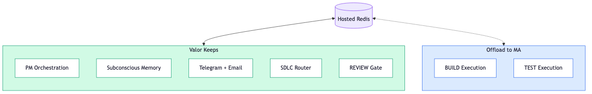
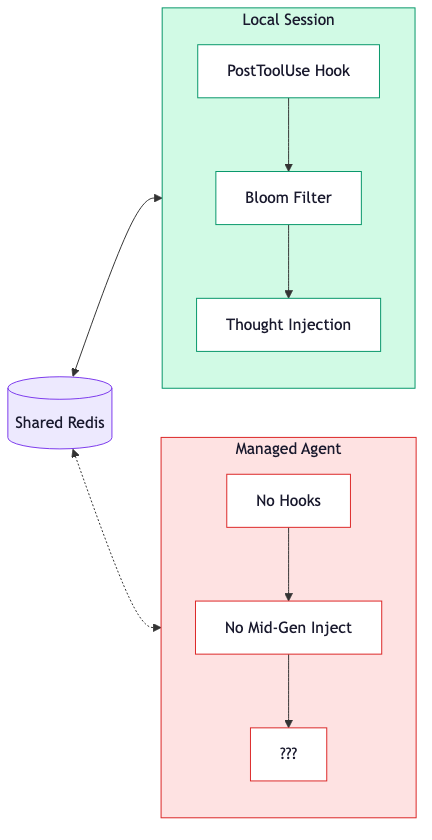
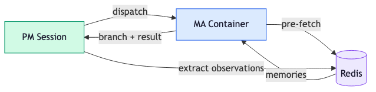

<!-- _class: lead -->

# Managed Agents x Valor

Action Plan: What to adopt, what to protect, what to test

*April 2026*

---

<!-- _class: lead -->

# Governing Thought

Valor orchestrates. MA executes.

Adopt MA for the **hands**. Keep the **brain** local.

Hosted Redis is the bridge.

---

## The Strategic Split



**Valor keeps** what MA cannot do: orchestration, memory, multi-channel delivery, the SDLC pipeline, and the final human-facing review gate.

**MA replaces** what Valor does poorly: sandboxed execution, environment management, crash recovery, scaling.

---

## Why BUILD and TEST

| | BUILD | TEST | Everything else |
|---|---|---|---|
| **Duration** | Minutes to hours | Minutes | Seconds |
| **Self-contained?** | Takes plan in, branch out | Takes branch in, results out | Needs conversation context |
| **Benefits from sandbox?** | No local env pollution | Hermetic, no port conflicts | Not enough to matter |
| **Sensitive?** | No (code only) | No | MERGE/DEPLOY touch infra |

BUILD is the clear winner. TEST follows naturally. The other 6 stages are fast, conversational, or security-sensitive.

---

## Environments Persist, Sessions Don't

```python
# Created ONCE — pre-baked with deps
environment = client.beta.environments.create(
    name="valor-fullstack",
    config={"type": "cloud", "networking": {"type": "unrestricted"}},
)

# Created PER TASK — starts fast, clean every time
session = client.beta.sessions.create(
    agent=build_agent.id,
    environment_id=environment.id,
    vault_ids=[github_vault.id, redis_vault.id],
)
```

Pre-bake Chromium, Playwright, Python deps into the environment. No rebuild per session. Secrets injected via vault — never in context.

---

## Headless Browser in Containers

MA containers can run headless Chromium. May be **more** reliable than local:

| Scenario | Container | Local |
|---|---|---|
| Backend unit/integration | Clean env | Works |
| Frontend unit (jsdom) | Clean env | Works |
| Frontend E2E (headless) | No port conflicts, no state leaks | Port collisions, background noise |
| Screenshot self-validation | Claude reads its own screenshots | Same |
| Mobile native | Not supported | Simulator only |

**The rule**: MA runs tests + screenshots. Valor's REVIEW gate does the final visual check before merge. Never let a managed agent approve its own frontend work.

---

<!-- _class: lead -->

# The Hard Problem

Subconscious memory doesn't port to Managed Agents.

---

## Memory Portability Gap



**Locally**, the PostToolUse hook fires on every tool call. Bloom filter checks relevance. `<thought>` blocks inject into context. The agent never decides to recall — it just happens.

**In MA**, there are no hooks. No mid-generation injection. The API is request-response: once a turn starts, you can't insert tokens.

This is the **gating technical risk** for the hybrid architecture.

---

## The Injection Spectrum


| Point | Mechanism | Subconscious? | Available in MA? |
|---|---|---|---|
| **Pre-Session** | Memories in system prompt | Yes | Yes |
| **Between Turns** | `user.message` when idle | Yes | Yes (but only at turn boundaries) |
| **Tool Result** | Append `<thought>` to results | Yes | Only for custom tools |
| **Mid-Generation** | Inject during model output | Yes (local hooks) | **No** |

We can't replicate the local experience exactly. But we can get close — if we control the right tool results.

---

## Stealth Injection via Workflow Tools

The agent MUST call certain tools as part of its job: `run_tests`, `git_commit`, `submit_work`. These aren't memory tools — they're workflow tools that happen to route through Valor.

When the agent calls `run_tests`, Valor executes the tests, queries Redis for relevant memories, and returns test results **+ `<thought>` blocks**. The agent sees verbose output. It doesn't know some of that output is injected memory. **Subconscious by design.**

> Open question: Can `user.message` be sent during `running` state? If yes, we get true mid-turn steering and the workflow tool approach becomes a bonus, not the only path.

---

## The Session Lifecycle



1. **PM pre-fetches** relevant memories into the MA session's first message
2. **MA executes** BUILD/TEST with access to hosted Redis
3. **Workflow tools** route through Valor for stealth memory injection
4. **Post-session**, Valor pulls the transcript and extracts new observations
5. **New memories** feed back to Redis — available to all future sessions

The memory system becomes a **shared brain** across both execution environments.

---

## Quick Wins

### 1. Move to hosted Redis now

Not contingent on MA adoption. Unblocks multi-machine memory sharing today. Every improvement to Redis-based memory increases strategic value regardless of execution backend.

### 2. Stop investing in worktree edge cases

Worktree isolation, process management, crash recovery — all replaced by MA containers. Redirect effort to orchestration and memory quality.

> Neither of these requires writing a single line of MA integration code. They're good decisions independent of the MA timeline.

---

## Experiment Pipeline

| | Experiment | Success Gate | Blocks |
|---|---|---|---|
| **A** | Create MA environment with Chromium + Playwright + Python | Cold start < 30s | B |
| **B** | Run a real BUILD task, profile tool calls per turn | Avg < 5 calls/turn | C |
| **C** | Send `user.message` during `running` state | Mid-turn injection works | E |
| **D** | MA container connects to hosted Redis, verify memory search | < 50ms p95 latency | E |
| **E** | Full BUILD offload with pre-fetch + stealth injection + post-extraction | Quality matches local | Ship |

**A-B** validate the platform. **C** is the critical fork — determines steering architecture. **D** validates the shared brain. **E** is end-to-end proof.

*Sequential: each gates the next.*

---

## What to Watch

| Signal | What it means for us | Urgency |
|---|---|---|
| **`user.message` during `running`** | Unlocks true external steering — no need for workflow tool proxying | Test in Exp C |
| **MA Memory (research preview)** | Could replace our Redis memory system entirely | Watch closely |
| **MA Multi-agent (research preview)** | Could subsume PM/Dev session split | Medium |
| **Hook-equivalent API** | Makes subconscious memory fully portable | High — the real unlock |
| **Pricing changes** | Long BUILD sessions at $0.08/hr + tokens | Monitor |

> **Re-architecture trigger:** Memory stores GA + hook-equivalent API. Until both ship, Valor's memory is the moat.

---

<!-- _class: lead -->

# Summary

**Now**: Hosted Redis + stop worktree investment

**Next**: Experiments A through E, sequential

**Watch**: Hook API + Memory stores = migration trigger

The moat is orchestration and memory, not execution.
