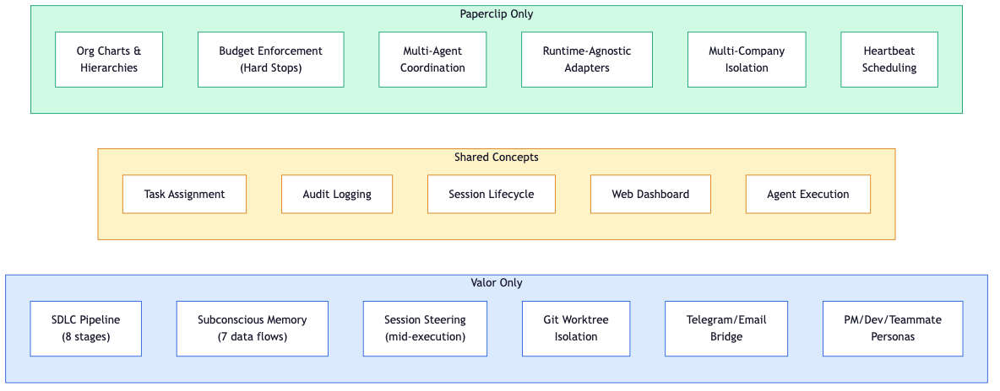

<!-- _class: lead -->

# Valor vs Paperclip

Vertical SDLC teammate or horizontal agent control plane?

*April 2026*

---

<!-- _class: lead -->

# Governing Thought

They solve **different problems at different layers**.

Valor is a vertically integrated development teammate.
Paperclip is a horizontally integrated agent management layer.

**Not competitive -- complementary.**

---

## What Are We Comparing?

| | Valor AI System | Paperclip |
|---|---|---|
| **Launched** | 2025 (private, iterative) | March 4, 2026 (open source) |
| **What it is** | SDLC automation system | Multi-agent control plane |
| **Primary interface** | Telegram, Email, CLI | React dashboard, REST API |
| **How it works** | PM/Dev/Teammate session orchestration | Heartbeat-scheduled agent coordination |
| **Models** | Claude (Sonnet, Haiku) | Any (adapter model) |
| **Pricing** | Claude API costs only | Free (MIT) + your infrastructure |
| **Target user** | Solo developer / small team | Multi-agent company operators |
| **GitHub stars** | Private repo | 42,000+ |

---

## Architecture: Vertical Stack vs Horizontal Layer

| Dimension | Valor | Paperclip |
|-----------|-------|-----------|
| **Language** | Python | TypeScript / Node.js |
| **Database** | Redis (Popoto ORM) | PostgreSQL |
| **Process model** | Bridge + Worker | Single Node.js server |
| **Agent execution** | Claude CLI harness | Adapter-dispatched heartbeats |
| **Agent identity** | PM / Dev / Teammate sessions | Org chart roles with job titles |
| **Task model** | 8-stage SDLC pipeline with gates | Goal-aligned task hierarchy |
| **Communication** | Telegram, Email bridges | Task comments, tickets |

Valor knows what a PR review is. Paperclip knows what an org chart is. Neither replaces the other.

---

## Feature Comparison

Overlap is narrow: task assignment, audit logging, session lifecycle, dashboards. The unique capabilities point in opposite directions.

---

## SDLC Pipeline: Valor's Domain Expertise

| Stage | Valor | Paperclip |
|-------|-------|-----------|
| **Plan** | /do-plan with investigation, spike resolution | Generic task creation |
| **Critique** | Parallel war-room critics | N/A |
| **Build** | Dev session with worktree isolation | Via agent adapter |
| **Test** | /do-test with parallel dispatch | Via agent adapter |
| **Patch** | Loop-back on failure, transcript resume | N/A |
| **Review** | /do-pr-review with screenshots | N/A |
| **Docs** | /do-docs with semantic impact finder | N/A |
| **Merge** | Gate enforcement, post-merge learning | N/A |

Paperclip tasks are check-in/check-out. Valor stages have **loop-back**, **gate enforcement**, and **quality escalation**.

---

## Memory and Learning

| Capability | Valor | Paperclip |
|-----------|-------|-----------|
| Memory retrieval | BM25 + RRF fusion, bloom filter | None |
| Stealth injection | `<thought>` blocks via additionalContext | N/A |
| Post-session extraction | Haiku categorization (4 types) | N/A |
| Outcome detection | LLM-judged acted/dismissed | N/A |
| Dismissal decay | Importance * 0.7 after 3 dismissals | N/A |
| Knowledge indexing | Per-chunk embeddings, work-vault | N/A |
| Post-merge learning | PR takeaway extraction (importance 7.0) | N/A |

Valor's memory system is its **strongest differentiator**. Paperclip has no memory or learning -- agents bring their own.

---

## Governance and Budget Control

| Capability | Valor | Paperclip |
|-----------|-------|-----------|
| Budget enforcement | None | Per-agent monthly limits, 80% warn, 100% stop |
| Approval gates | PM read-only hooks | Board-level approval workflow |
| Audit trail | Correlation IDs, session events | Append-only immutable log |
| Multi-tenant | Single operator | Multi-company isolation |
| Config safety | Git versioning | Versioned config with rollback |
| Cost visibility | Per-session model selection | Per-agent/task/project/goal breakdown |

Governance is **Paperclip's strongest differentiator**. Valor has no budget enforcement or approval workflow.

---

## Session Management

| Aspect | Valor | Paperclip |
|--------|-------|-----------|
| **Lifecycle states** | 11 states with CAS conflict detection | Task checkout / heartbeat cycle |
| **Recovery** | 8 mechanisms, zombie detection, stale cleanup | Checkpoint-based (basic) |
| **Steering** | Mid-execution Redis message injection | Not documented |
| **Concurrency** | Global semaphore + worker-key serialization | Single-assignee atomic checkout |
| **Resume** | Transcript resume via session UUID | Context reload per heartbeat |
| **Parent-child** | PM spawns Dev, tracks hierarchy | Org chart hierarchy |

Valor sessions are **long-running and steerable**. Paperclip sessions are **periodic and stateless**.

---

## OpenClaw: The Third Piece

| Aspect | Valor | OpenClaw | Paperclip |
|--------|-------|----------|-----------|
| **Focus** | SDLC | Autonomous agent | Orchestration |
| **Agents** | PM/Dev/Teammate | 1 per instance | Many, any type |
| **Memory** | 7 flows, BM25+RRF | Pluggable backends | None |
| **Comms** | Telegram, Email | Telegram, WhatsApp, Discord | Task comments |
| **Governance** | PM hooks | Self-directed | Board control |
| **License** | Private | Open source | MIT |

**Canonical AI company stack:** Paperclip (control plane) + OpenClaw (customer-facing agents) + Valor (software development). Each plays a distinct role.

---

## Integration Assessment

| Option | Effort | Value | Timing |
|--------|--------|-------|--------|
| **A: Paperclip governs Valor** | High -- custom adapter needed | Multi-project budget visibility, approval gates | When managing 5+ projects |
| **B: Adopt Paperclip patterns** | Medium -- extend PM hooks | Budget enforcement, goal tracing, audit log | Now |
| **C: Wait and monitor** | None | Avoid early-adopter pain | Default |

**Recommended: Option B now, Option A later.**

Cherry-pick: budget enforcement, goal-aligned tracing, immutable audit log. Build natively in Valor's PM session architecture.

---

## Decision Matrix

| Criterion | Weight | Valor | Paperclip |
|-----------|--------|-------|-----------|
| SDLC capability | 25% | **10** | 1 |
| Memory / learning | 20% | **10** | 0 |
| Multi-agent coordination | 15% | 3 | **9** |
| Budget governance | 10% | 1 | **9** |
| Session management | 10% | **9** | 5 |
| Ecosystem breadth | 10% | 4 | **8** |
| Maturity | 10% | **8** | 3 |
| **Weighted total** | | **7.2** | **4.2** |

For SDLC automation: Valor. For multi-agent orchestration: Paperclip. For both: use both.

---

## What to Watch

- **Paperclip adapter ecosystem** -- a Claude Code adapter would lower integration cost
- **Clipmart templates** -- pre-built company templates for rapid adoption
- **OpenClaw + Paperclip** -- the reference "agent inside control plane" pattern
- **Anthropic Managed Agents** -- may gain org features that overlap with Paperclip
- **Regulatory environment** -- "zero-human company" framing attracts scrutiny

> Paperclip is 6 weeks old and growing fast. The adapter ecosystem will determine whether integration is worth the engineering cost or whether adopting its patterns natively is the better path.

---

<!-- _class: lead -->

# Summary

**Valor** = deep, vertical, SDLC-native, memory-rich

**Paperclip** = broad, horizontal, governance-first, runtime-agnostic

**Action:** Adopt budget + governance patterns now. Integrate later if multi-project scale demands it.

