# Podcast Episode Workflow — Dependency & Parallelism Diagram

## Mermaid Flow Diagram

```mermaid
flowchart TD
    S((Start)) --> s1_1[Determine episode details]

    subgraph P1[Phase 1: Setup]
        s1_1 --> s1_2[Check existing directory]
        s1_2 --> s1_3[Run setup_episode.py]
        s1_3 --> s1_4[Verify setup complete]
    end

    s1_4 --> s2_1[Create Perplexity prompt]

    subgraph P2[Phase 2: Academic Foundation]
        s2_1 --> s2_2[Save to logs/prompts.md]
        s2_2 --> s2_3[Run Perplexity API 30-120s]
        s2_3 --> s2_4[Save p2-perplexity.md]
    end

    s2_4 --> s3_1[Generate Perplexity digest]

    subgraph P3[Phase 3: Question Discovery]
        s3_1 --> s3_2[Analyze gaps and contradictions]
        s3_2 --> s3_3[Generate targeted prompts x4]
    end

    s3_3 --> s4_1[Display manual prompts]
    s3_3 --> s4_2[Create placeholder files]
    s3_3 --> s4_3[GPT-Researcher 6-20 min]
    s3_3 --> s4_4[Gemini Deep Research 3-10 min]

    subgraph P4[Phase 4: Targeted Followup PARALLEL]
        s4_1 --> s4_5[USER: paste Claude + Grok]
        s4_2
        s4_3
        s4_4
    end

    s4_2 --> s5_fork[All research complete]
    s4_3 --> s5_fork
    s4_4 --> s5_fork
    s4_5 --> s5_fork

    s5_fork --> s5_1a[Digest: perplexity]
    s5_fork --> s5_1b[Digest: chatgpt]
    s5_fork --> s5_1c[Digest: gemini]
    s5_fork --> s5_1d[Digest: claude]
    s5_fork --> s5_1e[Digest: grok]

    subgraph P5[Phase 5: Cross-Validation]
        s5_1a --> s5_join[All digests ready]
        s5_1b --> s5_join
        s5_1c --> s5_join
        s5_1d --> s5_join
        s5_1e --> s5_join
        s5_join --> s5_2[Cross-validate findings]
        s5_2 --> s5_3[Verification matrix]
    end

    s5_3 --> s6_1[Create p3-briefing.md]

    subgraph P6[Phase 6: Master Briefing]
        s6_1 --> s6_2[GATE: Verify Wave 1]
        s6_1 --> s6_3[Update sources.md]
    end

    s6_2 --> s7_1[Invoke synthesis-writer]
    s6_3 --> s7_1

    subgraph P7[Phase 7: Synthesis]
        s7_1 --> s7_2[Create report.md 15-25KB]
        s7_2 --> s7_3[GATE: Verify report quality]
    end

    s7_3 --> s8_1[Invoke episode-planner]

    subgraph P8[Phase 8: Episode Planning]
        s8_1 --> s8_2[Create content_plan.md]
        s8_2 --> s8_3[GATE: Verify Wave 2]
    end

    s8_3 --> s9_1[Verify 5 source files]

    subgraph P9[Phase 9: Audio Generation]
        s9_1 --> s9_2[Run NotebookLM API]
        s9_2 --> s9_3[Download MP3 5-15 min]
    end

    s9_3 --> s10_1[Transcribe with Whisper 5-10 min]

    subgraph P10[Phase 10: Audio Processing]
        s10_1 --> s10_2[Create chapter markers]
        s10_2 --> s10_3[Embed chapters via ffmpeg]
        s10_3 --> s10_4[Verify all outputs]
    end

    s10_4 --> s11_1[Generate cover art]
    s10_4 --> s11_2[Create metadata]
    s10_4 --> s11_3[Generate companion resources]

    subgraph P11[Phase 11: Publishing PARALLEL]
        s11_1 --> s11_join[All assets ready]
        s11_2 --> s11_join
        s11_3 --> s11_join
        s11_join --> s11_4[Run publish_episode]
        s11_4 --> s11_5[GATE: Verify Wave 4/5]
    end

    s11_5 --> s12_1[Review changes]

    subgraph P12[Phase 12: Commit and Push]
        s12_1 --> s12_2[Stage files + feed.xml]
        s12_2 --> s12_3[Commit]
        s12_3 --> s12_4[Push to GitHub]
        s12_4 --> s12_5[Verify episode live 2-3 min]
    end

    s12_5 --> E((Done))
```



## Legend

| Color | Meaning |
|-------|---------|
| **Dark gray** | Serial step (must run in order) |
| **Blue** | Parallel step (can run simultaneously with siblings) |
| **Green** | Automated agent/API (no user action) |
| **Amber** | User wait/input required |
| **Red** | Quality gate (blocks if requirements unmet) |
| **Diamond** | Fork/join point for parallel execution |

## Critical Path (Longest Serial Chain)

The **critical path** determines minimum wall-clock time:

```
Setup → Perplexity (30-120s) → Question Discovery → GPT-Researcher (6-20 min)
→ Cross-Validation → Master Briefing → Synthesis → Episode Planning
→ Audio Generation (5-15 min) → Transcription (5-10 min)
→ Publishing → Commit & Push → Deploy (2-3 min)
```

**Estimated minimum:** ~45-75 minutes (mostly waiting on APIs and audio generation)

## Parallel Execution Opportunities

### 1. Phase 4 — Research Tools (biggest time saver)
```
                  ┌─→ GPT-Researcher (6-20 min) ──────┐
3.3 Prompts ready ├─→ Gemini Deep Research (3-10 min) ─┤→ Phase 5
                  ├─→ User: Claude (manual) ───────────┤
                  └─→ User: Grok (manual) ─────────────┘
```
All 4 tools run simultaneously. The bottleneck is whichever finishes last (usually GPT-Researcher or the user's manual submissions).

### 2. Phase 5 — Research Digests
```
           ┌─→ digest: p2-perplexity ─┐
           ├─→ digest: p2-chatgpt ────┤
All p2s ───├─→ digest: p2-gemini ─────┤→ Cross-validator
           ├─→ digest: p2-claude ─────┤
           └─→ digest: p2-grok ───────┘
```
5 digest agents run in parallel, then feed into a single cross-validator.

### 3. Phase 6 — Briefing Outputs
```
              ┌─→ 6.2 Verify Wave 1 ──┐
6.1 Briefing ─┤                        ├→ Phase 7
              └─→ 6.3 Update sources ──┘
```
Verification and source update can happen concurrently.

### 4. Phase 11 — Publishing Assets
```
              ┌─→ 11.1 Cover art ──────────────┐
10.4 Audio ───├─→ 11.2 Metadata ───────────────┤→ 11.4 publish_episode
              └─→ 11.3 Companion resources ────┘
```
Cover art, metadata, and companion resources all generate independently.

## Steps Requiring User Action

| Step | Action | Can work in parallel? |
|------|--------|----------------------|
| 4.5 | Paste Claude + Grok research results | Yes — while GPT-Researcher + Gemini run |
| 9.2-9.3 | Manual NotebookLM (fallback only) | No — blocking wait |
| 12.4 | Approve git push | No — final step |

## Quality Gates (Blocking Checkpoints)

| Gate | Phase | What's Checked | Blocks |
|------|-------|---------------|--------|
| Wave 1 | 6.2 | Depth analysis, story bank, counterpoints, actionability | Phase 7 |
| Report QA | 7.3 | 15-25KB, narrative structure, citations | Phase 8 |
| Wave 2 | 8.3 | Structure map, counterpoints, depth budget, signposting | Phase 9 |
| Wave 4/5 | 11.5 | Description, resources, CTA, feed validity | Phase 12 |
