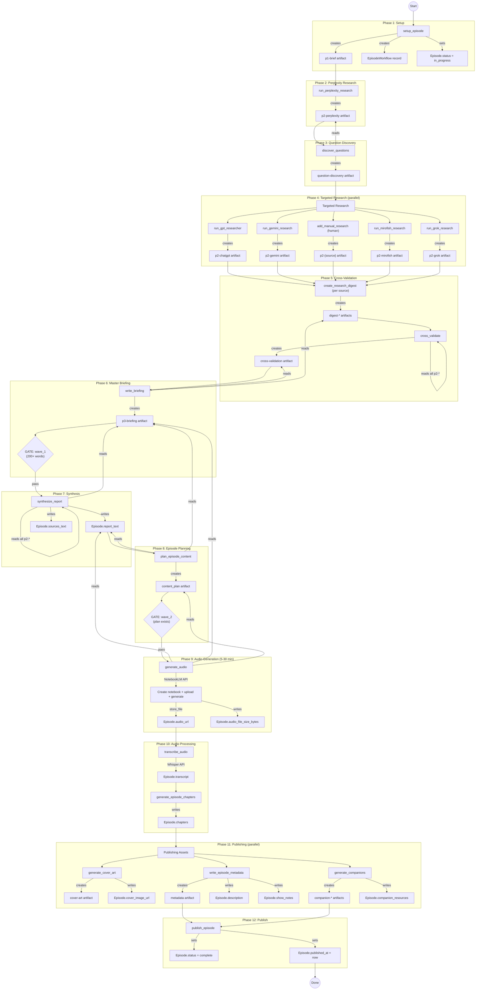
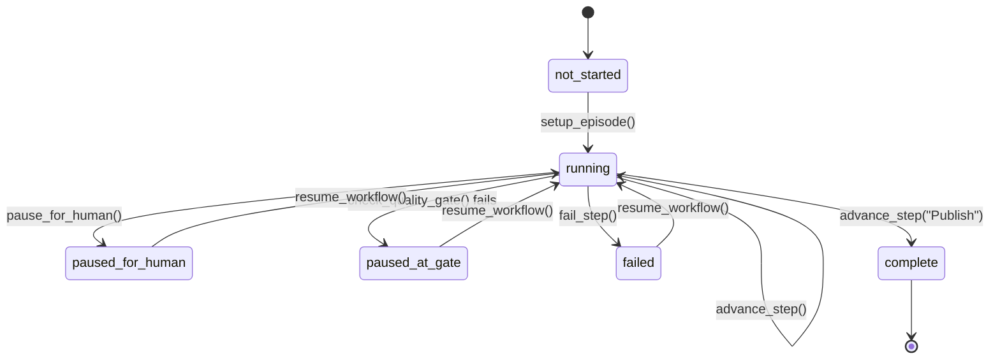

# Podcast Episode Workflow -- DB-Backed Flow

> **Business context:** See [Podcasting](~/work-vault/Cuttlefish/Podcasting.md) in the work vault for product overview and key integrations.

## Data Flow Diagram



## Workflow State Machine



## Database Writes Per Phase

| Phase | Artifacts Created | Episode Fields Written | Workflow Transition |
|-------|-------------------|----------------------|---------------------|
| 1 Setup | `p1-brief` | `status` | pending -> running |
| 2 Perplexity | `p2-perplexity` | -- | advance to step 2 |
| 3 Question Discovery | `question-discovery` | -- | advance to step 3 |
| 4 Targeted Research | `p2-chatgpt`, `p2-gemini`, `p2-grok`, `p2-mirofish`, `p2-{source}`, `digest-*` | -- | advance to step 4 |
| 5 Cross-Validation | `cross-validation` | -- | advance to step 5 |
| 6 Master Briefing | `p3-briefing` | -- | advance to step 6 + wave_1 gate |
| 7 Synthesis | -- | `report_text`, `sources_text` | advance to step 7 |
| 8 Episode Planning | `content_plan` | -- | advance to step 8 + wave_2 gate |
| 9 Audio Generation | -- | `audio_url`, `audio_file_size_bytes` | advance to step 9 |
| 10 Audio Processing | -- | `transcript`, `chapters` | advance to step 10 |
| 11 Publishing | `metadata`, `companion-summary`, `companion-checklist`, `companion-frameworks` | `description`, `show_notes`, `companion_resources` | advance to step 11 |
| 12 Publish | -- | `status`, `published_at` | running -> complete |

## Quality Gates

| Gate | Location | Check | Blocks |
|------|----------|-------|--------|
| `wave_1` | After Phase 6 | `p3-briefing` exists with 200+ words | Phase 7 (Synthesis) |
| `wave_2` | After Phase 8 | `content_plan` artifact exists | Phase 9 (Audio Generation) |

## Human-in-the-Loop Pause Points

| Trigger | Reason | Resumes When |
|---------|--------|-------------|
| Phase 3 | Perplexity research skipped or failed; manual paste panel shown | User pastes Perplexity result via `PastePerplexityResearchView`; Question Discovery re-enqueued |
| Phase 4 | Automated research complete; review and optionally add manual/Grok research or retry failed sources | Per-source retry via `RetryResearchSourceView`, or `resume_workflow()` |
| Phase 6 | Wave 1 quality gate failure | Human reviews briefing, triggers retry |
| Phase 8 | Wave 2 quality gate failure | Human reviews plan, triggers retry |
| Phase 11 | Cover art not automated | Cover art manually uploaded |
| Any phase | Unrecoverable error | Human investigates and calls `resume_workflow()` |

## Critical Path

```
Setup -> Perplexity (30-120s) -> Question Discovery -> Targeted Research (6-20 min)
-> Cross-Validation -> Master Briefing -> Synthesis -> Episode Planning
-> Audio Generation (5-30 min) -> Transcription (5-10 min) -> Chapters
-> Metadata + Companions -> Publish
```

**Estimated minimum wall-clock time:** 45-75 minutes (dominated by API wait times for research tools, NotebookLM audio generation, and Whisper transcription).

## Parallel Execution Opportunities

**Phase 4 -- Research tools:** GPT-Researcher, Gemini, Together, Claude, Grok, and MiroFish run concurrently. Fan-in uses threshold-based advancement: all tasks must resolve (non-empty content) and at least one must succeed. Failed sources write `[FAILED: error]` artifacts and can be retried individually.

**Phase 5 -- Research digests:** One `create_research_digest` call per `p2-*` artifact, all independent.

**Phase 11 -- Publishing assets:** Cover art, metadata, and companion resources generate independently.
